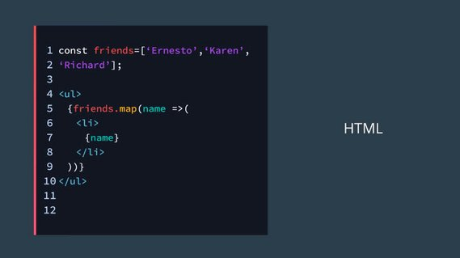
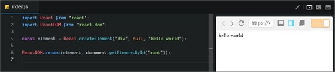
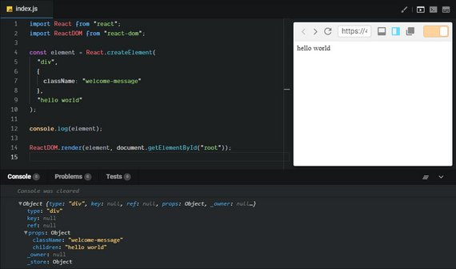
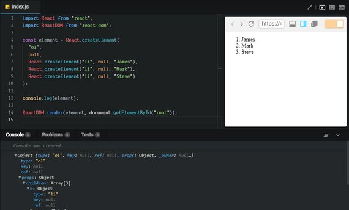
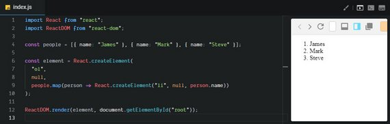
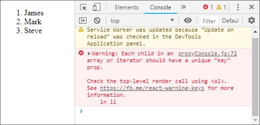
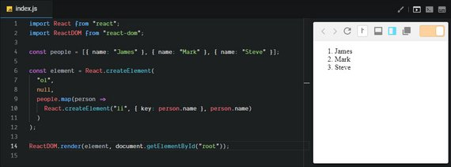

<!-- markdownlint-disable MD022 MD032 -->
<!-- # React Nanodegree -->
# React Fundamentals

[<-- back to React Nanodegree homepage](../index.html)

<!-- ### Links
#### Resources
- [Create Amazing Forms by Pete LePage](https://goo.gl/i0vY1M) - input types, datalist, labels, autocomplete attributes, autofill pitfalls, real-time validation

#### Samples
- [Slider sample](../exercises/wf4-9/index.html) - Uses both mouse and touch events -->

---

## 1. Why React
### 1.1 Introduction
[](../assets/images/rf1.jpg)

Before we actually dive into the syntax of React, let's take a step back and talk about what makes React special.

- It's compositional model
- It's declarative nature
- The way data flows through a Component
- That React is really just JavaScript

### 1.2 What is Composition
#### Benefits of Composition
Because the concept of composition is such a large part of what makes React awesome and incredible to work with, let's dig into it a little bit. Remember that composition is just combining simple functions together to create complex functions. There are a couple of key ingredients here that we don't want to lose track of. These ingredients are:

- simple functions
- combined to create another function

Composition is built from simple functions. Let's look at an example:

```js
function getProfileLink (username) {
 return 'https://github.com/' + username
}
```

This function is ridiculously simple, isn't it? It's just one line! Similarly, the `getProfilePic` function is also just a single line:

```js
function getProfilePic (username) {
 return 'https://github.com/' + username + '.png?size=200'
}
```

These are definitely simple functions, so to compose them, we'd just *combine* them together inside another function:

```js
function getProfileData (username) {
 return {
   pic: getProfilePic(username),
   link: getProfileLink(username)
 }
}
```

Now we *could* have written `getProfileData` *without* composition by providing the data directly:

```js
function getProfileData (username) {
 return {
 pic: 'https://github.com/' + username + '.png?size=200',
 link: 'https://github.com/' + username
 }
}
```

There's nothing technically wrong with this at all; this is entirely accurate JavaScript code. But this *isn't* composition. There are also a couple of potential issues with this version which  isn't using composition. If the user's link to GitHub is needed somewhere else, then duplicate code would be needed. A good function should follow the "DOT" rule:

> *Do One Thing*

This function is doing a couple of different (however minor) things; it's creating two different URLs, storing them as properties on an object, and then returning that object. In the composed version, each function just does one thing:

- `getProfileLink` – just builds up a string of the user's GitHub profile link
- `getProfilePic` – just builds up a string the user's GitHub profile picture
- `getProfileData` – returns a new object

#### React & Composition
React makes use of the power of composition, heavily! React builds up pieces of a UI using **components**. Let's take a look at some pseudo code for an example. Here are three different components:

```html
<Page />
<Article />
<Sidebar />
```

Now let's take these *simple* components, combine them together, and create a more complex component (aka, composition in action!):

```html
<Page>
 <Article />
 <Sidebar />
</Page>
```

Now the Page component has the Article and Sidebar components inside. This is just like the earlier example where getProfileData had getProfileLink and getProfilePic inside it.

We'll dig into components soon, but just know that composition plays a huge part in building React components.

#### Composition Recap
Composition occurs when simple functions are combined together to create more complex functions. Think of each function as a single building block that does one thing (DOT). When you combine these simple functions together to form a more complex function, this is **composition**.

##### Further Research
- [Compose me That: Function Composition in JavaScript](https://www.linkedin.com/pulse/compose-me-function-composition-javascript-kevin-greene)
- [Functional JavaScript: Function Composition For Every Day Use](https://hackernoon.com/javascript-functional-composition-for-every-day-use-22421ef65a10)

### 1.3 Declarative Code
#### Imperative Code
A lot of JavaScript is **imperative code**. If you don't know what "imperative" means here, then you might be scratching your head a bit. According to the dictionary, "imperative" means:

> *expressing a command; commanding*

When JavaScript code is written *imperatively*, we tell JavaScript **how** we want something done. Think of it as if we're giving JavaScript commands on exactly what steps it should take. For example, I give you the humble `for` loop:

```js
const people = ['Amanda', 'Farrin', 'Geoff', 'Karen', 'Richard', 'Tyler']
const excitedPeople = []

for (let i = 0; i < people.length; i++) {
 excitedPeople[i] = people[i] + '!'
}
```

If you've worked with JavaScript any length of time, then this should be pretty straightforward. We're looping through each item in the `people` array, adding an exclamation mark to their name, and storing the new string in the `excitedPeople` array. Pretty simple, right?

This is imperative code, though. We're commanding JavaScript what to do at every single step. We have to give it commands to:

- set an initial value for the iterator - (`let i = 0`)
- tell the `for` loop when it needs to stop - (`i < people.length`)
- get the person at the current position and add an exclamation mark - (`people[i] + '!'`)
- store the data in the `i`th position in the other array - (`excitedPeople[i]`)
- increment the `i` variable by one - (`i++`)

Remember the example of keeping the air temperature at 71º? In my old car, I would turn the knob to get the cold air flowing. But if it got too cold, then I'd turn the knob up higher. Eventually, it would get too warm, and I'd have to turn the knob down a bit, again. I'd have to manage the temperature myself with every little change. Doesn't this sound like an imperative situation to you? I have to manually do multiple steps. It's not ideal, so let's improve things!

#### Declarative Code
In contrast to imperative code, we've got **declarative** code. With declarative code, we don't code up all of the steps to get us to the end result. Instead, we *declare* what we want done, and JavaScript will take care of doing it. We tell JavaScript **what** we want done. This explanation is a bit abstract, so let's look at an example. Let's take the imperative `for` loop code we were just looking at and refactor it to be more declarative.

With the imperative code we were performing all of the steps to get to the end result. What _is_ the end result that we actually want, though? Well, our starting point was just an array of names:

```js
const people = ['Amanda', 'Farrin', 'Geoff', 'Karen', 'Richard', 'Tyler']
```

The end goal that we want is an array of the same names but where each name ends with an exclamation mark:

```js
["Amanda!", "Farrin!", "Geoff!", "Karen!", "Richard!", "Tyler!"]
```

To get us from the starting point to the end, we'll just use JavaScript's .map() function to declare what we want done.

```js
const excitedPeople = people.map(name => name + '!')
```

That's it! Notice that with this code we haven't:

- created an iterator object
- told the code when it should stop running
- used the iterator to access a specific item in the `people` array
- stored each new string in the `excitedPeople` array

...all of those steps are taken care of by JavaScript's `.map()` Array method.

> .map() and .filter()
>
> A bit rusty on JavaScript's .map() and .filter() Array methods? Or perhaps they're brand new to you. In either case, we'll be diving into them in the React is "just JavaScript" section. Hold tight!

#### React is Declarative
We'll get to writing React code very soon, but let's take another glimpse at it to show how it's declarative.

```jsx
<button onClick={activateTeleporter}>Activate Teleporter</button>
```

It might seem odd, but this is valid React code and should be pretty easy to understand. Notice that there's just an `onClick` attribute on the button...we aren't using `.addEventListener()` to set up event handling with all of the steps involved to set it up. Instead, we're just declaring that we want the `activateTeleporter` function to run when the button is clicked.

#### Declarative Code Recap
*Imperative* code instructs JavaScript on **how** it should perform each step. With *declarative* code, we tell JavaScript **what** we want to be done, and let JavaScript take care of performing the steps.

React is declarative because we write the code that we want, and React is in charge of taking our declared code and performing all of the JavaScript/DOM steps to get us to our desired result.

##### 1.3 Further Research

- Tyler's [Imperative vs Declarative Programming](https://tylermcginnis.com/imperative-vs-declarative-programming/) blog post
- [Difference between declarative and imperative in React.js?](https://stackoverflow.com/questions/33655534/difference-between-declarative-and-imperative-in-react-js) from StackOverflow

### 1.4 Unidirectional Data Flow
Before React, one popular technique for managing state changes in an app over time, was to use data bindings,
so that when data changes in one place, those changes are automatically reflected in other places in the app.

Any part of the app that had that data could also change it. But, as the app grows this technique makes it difficult to determine how a change in one place automatically and implicitly affects the rest of the app.

React uses an explicit method for passing data between components that makes it a lot easier to track changes to the state, and how they affect other places of the app.

This is called unidirectional data flow because the data flows one way from parent elements down to children.

#### Data-Binding In Other Frameworks
Front-end frameworks like [Angular](https://angular.io/) and [Ember](https://emberjs.com/) make use of two-way data bindings. In two-way data binding, the data is kept in sync throughout the app no matter where it is updated. If a model changes the data, then the data updates in the view. Alternatively, if the user changes the data in the view, then the data is updated in the model. Two-way data binding sounds really powerful, but it can make the application harder to reason about and know where the data is actually being updated.

##### 1.4 Further Research

- [Angular's two-way data binding](https://angular.io/guide/template-syntax#two-way)
- [Ember's two-way data binding](https://guides.emberjs.com/v2.13.0/object-model/bindings/)

#### React's Data-flow
Data moves differently with React's unidirectional data flow. In React, the data flows from the parent component to a child component.

[](../assets/images/rf2.jpg)<br>
*Data flows down from parent component to child component. Data updates are sent to the parent component where the parent performs the actual change.*

In the image above, we have two components:

- a parent component
- a child component

The data lives in the parent component and is passed down to the child component. Even though the data lives in the parent component, both the parent and the child components can use the data. However, if the data must be updated, then only the parent component should perform the update. If the child component needs to make a change to the data, then it would send the updated data to the parent component where the change will actually be made. Once the change *is* made in the parent component, the child component will be passed the data (that has just been updated!).

Now, this might seem like extra work, but having the data flow in one direction and having one place where the data is modified makes it much easier to understand how the application works.

#### 1.4 Quiz
##### Question 1 of 2
A `FlightPlanner` component stores the information for booking a flight. It also contains `DatePicker` and `DestinationPicker` as child components. Here's what the code might look like:

```html
<FlightPlanner>
 <DatePicker />
 <DestinationPicker />
</FlightPlanner>
```

If this were a React application, which component should be in charge of making updates to the data? Check all that apply.

- [x] `FlightPlanner`
- [ ] `DatePicker`
- [ ] `DestinationPicker`


Now let's say that the `FlightPlanner` component has two child components: `LocationPicker` and `DatePicker`. `LocationPicker` itself is a parent component that has two child components: `OriginPicker` and `DestinationPicker`.

##### Question 2 of 2
If the following sample code were a React application, which of the following components should be in charge of making updates to data? Check all that apply.

```html
<FlightPlanner>

 <LocationPicker>
  <OriginPicker />
  <DestinationPicker />
 </LocationPicker>

 <DatePicker />

</FlightPlanner>
```

- [x] `FlightPlanner` - is the parent component and stores all of the flight data, any changes to the data should be made by this component.
- [ ] `DatePicker` - receives the data from its parent
- [x] `LocationPicker` - is a parent component, it would make sense that it would handle all changes for its child components.
- [ ] `OriginPicker` - receives the data from its parent
- [ ] `DestinationPicker` - receives the data from its parent

#### Data Flow in React Recap
In React, data flows in only one direction, from parent to child. If data is shared between sibling child components, then the data should be stored in the parent component and passed to both of the child components that need it.

### 1.5 React is Just JavaScript
[](../assets/images/rf3.jpg)

#### It's Just JavaScript
One of the great things about React is that a lot of what you'll be using is regular JavaScript. To make sure you're ready to move forward, please take a look at the following code:

```js
const shelf1 = [{name: 'name1', shelf: 'a'},{name: 'name2', shelf: 'a'}];
const shelf2 = [{name: 'name3', shelf: 'b'},{name: 'name4', shelf: 'b'}];
const allBooks = [...shelf1, ...shelf2];

const filter = books => shelf => books.filter(b => {
  return b.shelf === shelf;
});

const filterBy = filter(allBooks);
const booksOnShelf = filterBy('b');
```

If *any* of the code above looks confusing, or if you simply need a refresher on E6, please go through [our ES6 course](https://classroom.udacity.com/courses/ud356) before moving forward.

Here's a couple links for a quick refresher.

- [Udacity ES6 course - Syntax notes](https://james-priest.github.io/100-days-of-code-log-r2/ES6-Syntax.html) - destructuring, spread, & rest operators
- [Currying and ES6 Arrow Functions](http://codekirei.com/posts/currying-with-arrow-functions/) - with double arrow functions

Over the past couple of years, functional programming has had a large impact on the JavaScript ecosystem and community. Functional programming is an advanced topic in JavaScript and fills hundreds of books. It's too complex to delve into the benefits of functional programming (we've got to get to React content, right?!?). 

React builds on a lot of the techniques of functional programming...techniques that you'll learn as you go through this program. However, there are a couple of important JavaScript functions that are vital to functional programming that we should look at. These are the Array's `.map()` and `.filter()` methods.

#### Array's .map() Method
If you're not familiar with JavaScript's [Array .map() method](https://developer.mozilla.org/en-US/docs/Web/JavaScript/Reference/Global_Objects/Array/map), it gets called on an existing array and returns a new array based on what is returned from the function that's passed as an argument. Let's take a look:

```js
const names = ['Karen', 'Richard', 'Tyler'];

const nameLengths = names.map( name => name.length );
```

Let's go over what's happening here. The .map() method works on arrays, so we have to have an array to start with:

```js
const names = ['Karen', 'Richard', 'Tyler'];
```

We call `.map()` on the `names` array and pass it a function as an argument:

```js
names.map( name => name.length );
```

The arrow function that's passed to `.map()` gets called *for each item* in the `names` array! The arrow function receives the first name in the array, stores it in the `name` variable and returns its length. Then it does that again for the remaining two names.

`.map()` returns a new array with the values that are returned from the arrow function:

```js
const nameLengths = names.map( name => name.length );
```

So `nameLengths` will be a new array `[5, 7, 5]`. This is important to understand; **the .map() method returns a new array, it does not modify the original array.**

This was just a brief overview of how the `.map()` method works. For a deeper dive, check out [.map() on MDN](https://developer.mozilla.org/en-US/docs/Web/JavaScript/Reference/Global_Objects/Array/map).

#### .map() Quiz
Use the provided music data array and the `.map()` method to create a new array that contains items in the format:

```html
<album-name> by <artist> sold <sales> copies
```

Store the new array in an `albumSalesStrings` array. So the first item in the `albumSalesStrings` array should be "25 by Adele sold 1731000 copies"

```js
/* Using .map()
 *
 * Using the musicData array and .map():
 *   - return a string for each item in the array in the following format
 *     <album-name> by <artist> sold <sales> copies
 *   - store the returned data in a new albumSalesStrings variable
 *
 * Note:
 *   - do not delete the musicData variable
 *   - do not alter any of the musicData content
 *   - do not format the sales number, leave it as a long string of digits
 */

const musicData = [
    { artist: 'Adele', name: '25', sales: 1731000 },
    { artist: 'Drake', name: 'Views', sales: 1608000 },
    { artist: 'Beyonce', name: 'Lemonade', sales: 1554000 },
    { artist: 'Chris Stapleton', name: 'Traveller', sales: 1085000 },
    { artist: 'Pentatonix', name: 'A Pentatonix Christmas', sales: 904000 },
    { artist: 'Original Broadway Cast Recording', 
      name: 'Hamilton: An American Musical', sales: 820000 },
    { artist: 'Twenty One Pilots', name: 'Blurryface', sales: 738000 },
    { artist: 'Prince', name: 'The Very Best of Prince', sales: 668000 },
    { artist: 'Rihanna', name: 'Anti', sales: 603000 },
    { artist: 'Justin Bieber', name: 'Purpose', sales: 554000 }
];

// SOLUTION
const albumSalesStrings = 
  musicData.map(obj => `${obj.name} by ${obj.artist} sold ${obj.sales} copies`);

console.log(albumSalesStrings);
```

#### Array's .filter() Method
JavaScript's [Array .filter() method](https://developer.mozilla.org/en-US/docs/Web/JavaScript/Reference/Global_Objects/Array/filter) is similar to the `.map()` method:

- it is called on an array
- it takes a function as an argument
- it returns a new array

The difference is that the function passed to `.filter()` is used as a test, and only items in the array that pass the test are included in the new array. Let's take a look at an example:

```js
const names = ['Karen', 'Richard', 'Tyler'];

const shortNames = names.filter( name => name.length < 6 );
```

Just as before, we have the starting array:

```js
const names = ['Karen', 'Richard', 'Tyler'];
```

We call `.filter()` on the `names` array and pass it a function as an argument:

```js
names.filter( name => name.length < 6 );
```

Again, just like with `.map()` the arrow function that's passed to `.filter()` gets called *for each item* in the `names` array. The first item (i.e. 'Karen') is stored in the `name` variable. Then the test is performed - this is what's doing the actual filtering. It checks the length of the name. If it's 6 or greater, then it's skipped (and not included in the new array!). But if the length of the name is less than 6, then `name.length < 6` returns true and the name _is_ included in the new array!

And lastly, just like with `.map()` the `.filter()` method returns a new array instead of modifying the original array:

```js
const shortNames = names.filter( name => name.length < 6 );
```

So `shortNames` will be the new array `['Karen', 'Tyler']`. Notice that it only has two names in it now, because 'Richard' is 7 characters and was filtered out.

This was just a brief overview of how the `.filter()` method works. For a deeper dive, check out [.filter() on MDN](https://developer.mozilla.org/en-US/docs/Web/JavaScript/Reference/Global_Objects/Array/filter).

#### .filter() Quiz
Use the provided music data array and the `.filter()` method to create a new array that only contains albums with names between 10 and 25 characters long. Store the new array in a variable called `results`.

```js
/* Using .filter()
 *
 * Using the musicData array and .filter():
 *   - return only album objects where the album's name is
 *     10 characters long, 25 characters long, or anywhere in between
 *   - store the returned data in a new `results` variable
 *
 * Note:
 *   - do not delete the musicData variable
 *   - do not alter any of the musicData content
 */

const musicData = [
    { artist: 'Adele', name: '25', sales: 1731000 },
    { artist: 'Drake', name: 'Views', sales: 1608000 },
    { artist: 'Beyonce', name: 'Lemonade', sales: 1554000 },
    { artist: 'Chris Stapleton', name: 'Traveller', sales: 1085000 },
    { artist: 'Pentatonix', name: 'A Pentatonix Christmas', sales: 904000 },
    { artist: 'Original Broadway Cast Recording', 
      name: 'Hamilton: An American Musical', sales: 820000 },
    { artist: 'Twenty One Pilots', name: 'Blurryface', sales: 738000 },
    { artist: 'Prince', name: 'The Very Best of Prince', sales: 668000 },
    { artist: 'Rihanna', name: 'Anti', sales: 603000 },
    { artist: 'Justin Bieber', name: 'Purpose', sales: 554000 }
];

// SOLUTION
const results =
  musicData.filter(album => album.name.length >= 10 && album.name.length <= 25);

console.log(results);
```

#### Combining .map() And .filter() Together
What makes `.map()` and `.filter()` so powerful is that they can be combined. Because both methods return arrays, we can chain the method calls together so that the returned data from one can be a new array for the next.

```js
const names = ['Karen', 'Richard', 'Tyler'];

const shortNamesLengths =
  names.filter( name => name.length < 6 ).map( name => name.length );
```

To break it down, the `names` array is filtered, which returns a new array, but then `.map()` is called on that new array, and returns a new array of its own! This new array that's returned from `.map()` is what's stored in shortNamesLengths.

#### .filter() First!
On a side note, you'll want to run things in this order - `.filter()` first and then `.map()`. Because `.map()` runs the function once for each item in the array, it will be faster if the array were already filtered.

#### .filter() and .map() Quiz
Using the same music data, use `.filter()` and `.map()` to filter and map over the list and store the result in a variable named `popular`. Use `.filter()` to filter the list down to just the albums that have sold over 1,000,000 copies. Then chain `.map()` onto the returned array to create a new array that contains items in the format:

```html
<artist> is a great performer
```

The first item in the `popular` array will be 'Adele is a great performer'.

```js
/* Combining .filter() and .map()
 *
 * Using the musicData array, .filter, and .map():
 *   - filter the musicData array down to just the albums that have 
 *     sold over 1,000,000 copies
 *   - on the array returned from .filter(), call .map()
 *   - use .map() to return a string for each item in the array in the
 *     following format: "<artist> is a great performer"
 *   - store the array returned form .map() in a new "popular" variable
 *
 * Note:
 *   - do not delete the musicData variable
 *   - do not alter any of the musicData content
 */

const musicData = [
    { artist: 'Adele', name: '25', sales: 1731000 },
    { artist: 'Drake', name: 'Views', sales: 1608000 },
    { artist: 'Beyonce', name: 'Lemonade', sales: 1554000 },
    { artist: 'Chris Stapleton', name: 'Traveller', sales: 1085000 },
    { artist: 'Pentatonix', name: 'A Pentatonix Christmas', sales: 904000 },
    { artist: 'Original Broadway Cast Recording', 
      name: 'Hamilton: An American Musical', sales: 820000 },
    { artist: 'Twenty One Pilots', name: 'Blurryface', sales: 738000 },
    { artist: 'Prince', name: 'The Very Best of Prince', sales: 668000 },
    { artist: 'Rihanna', name: 'Anti', sales: 603000 },
    { artist: 'Justin Bieber', name: 'Purpose', sales: 554000 }
];

const popular = musicData
  .filter(album => album.sales > 1000000)
  .map(album => `${album.artist} is a great performer`);

console.log(popular);

```

#### React is Just JavaScript Recap
React builds on what you already know - JavaScript! You don't have to learn a special template library or a new way of doing things.

Two of the main methods that you'll be using quite a lot are:

- `.map()`
- `.filter()`

It's important that you're comfortable using these methods, so take some time to practice using them. Why not look through some of your existing code and try converting your `for` loops to `.map()` calls or see if you can remove any `if` statements by using `.filter()`.

### 1.6 Recap
Let's recap on some of the things we covered in this lesson on why React is great:

- its compositional model
- its declarative nature
- the way data flows from parent to child
- and that React is really just JavaScript

#### Lesson Challenge

Read these 3 articles that cover some of the essentials of React: 

- [Virtual DOM](https://facebook.github.io/react/docs/optimizing-performance.html#avoid-reconciliation)
- [The Diffing Algorithm](https://facebook.github.io/react/docs/reconciliation.html#the-diffing-algorithm)
- [How Virtual-DOM and diffing works in React](https://medium.com/@gethylgeorge/how-virtual-dom-and-diffing-works-in-react-6fc805f9f84e)

Answer the following questions (in your own words) and share your answers with your Study Group.

1. What is the “Virtual DOM”?
2. Explain what makes React performant.
3. Explain the Diffing Algorithm to someone who does not have any programming experience.

## 2. Rendering UI w/ React
### 2.1 Rendering UI Intro
[](../assets/images/rf4.jpg)

React uses JavaScript objects to create React elements. We'll use these React elements to describe what we want the page to look like, and React will be in charge of generating the DOM nodes to achieve the result.

Recall from the previous lesson the difference between imperative and declarative code. The React code that we write is declarative because we aren't telling React *what* to do; instead, we're writing React elements that describe what the page should look like, and React does all of the implementation work to get it done.

Enough theory, let's get to it and create some elements!

### 2.2 Elements and JSX
#### Watch First
We'll be looking at using React's `.createElement()` method in the next couple of videos. For starters, here is its signature:

```js
React.createElement( /* type */, /* props */, /* content */ );
```

We'll take a deep dive into what all that entails in just a bit! We'll start things out with a project that's already set up. For now, don't worry about creating a project or coding along. There will be plenty of hands-on work for you to do soon enough!

We'll start building our in-class project, Contacts App, in the next section. If you would like to code along for the next few videos, you can use this [React Sandbox](https://codesandbox.io/s/new).

> #### 💡 Trying Out React Code 💡
>React is an extension of JavaScript (i.e., a JavaScript library), but it isn't built into your browser. You wouldn't be able to test out React code samples in your browser console the way you would if you were learning JavaScript. In just a bit, we'll see how to install and use a React environment!

#### React.createElement

```js
import React from "react";
import ReactDOM from "react-dom";

const element = React.createElement("div",  null, "hello world");

ReactDOM.render(element, document.getElementById("root"));
```

[](../assets/images/rf5.jpg)

#### ReactDOM
One thing to keep in mind is that we could be rendering out to different destinations.  For that reason, ReactDOM was split out of the React library. Some other destinations include:

- render on the server
- native devices
- VR environments

[](../assets/images/rf6.jpg)

#### Rendering Elements onto the DOM
In the previous video, we used ReactDOM's `render()` method to render our element onto a particular area of a page. In particular, we rendered the element onto a DOM node called `root`. But where did this root come from?

Apps built with React typically have a single `root` DOM node. For example, an HTML file may contain a `<div>` with the following:

```html
<div id="root"></div>
```

By passing this DOM node into `getElementById()`, React will end up controlling the entirety of its contents. Another way to think about this is that this particular `<div>` will serve as a "hook" for our React app; this is the area where React will take over and render our UI!

#### Question 1 of 3
What will `myBio` hold when the following code is run?

```js
import React from 'react';

const myBio = React.createElement('div', null, 'Hi, I love porcupines.');
```

- [ ] a reference to a DOM node
- [ ] a DOM node itself
- [x] a JavaScript object
- [ ] a JavaScript class

#### DOM nodes - className

```js
import React from "react";
import ReactDOM from "react-dom";

const element = React.createElement(
  "div",
  {
    className: "welcome-message"
  },
  "hello world"
);

console.log(element);

ReactDOM.render(element, document.getElementById("root"));

```

[](../assets/images/rf7.jpg)

When we're creating these React elements we must remember that we are describing DOM nodes not HTML elements. For that reason we must use things like 'className' rather than 'class' since 'class' is a reserved word.

> Virtual DOM  - objects that describe real DOM nodes
>
> When we call `React.createElement` we haven't actually created anything in the DOM yet. It's not until we cal `render()` that the browser actually creates a real DOM element.

#### Question 2 of 3
React allows a lot of HTML attributes to be passed along to the React element. Look through [all supported HTML attributes](https://facebook.github.io/react/docs/dom-elements.html#all-supported-html-attributes) in the React docs and select which of the following attributes are allowed:

- [x] poster
- [x] id
- [x] marginWidth
- [ ] for - ('for' is a reserved word so instead we can use 'htmlFor')

I just used React's `.createElement()` method to construct a "React element". The `.createElement()` method has the following signature:

```js
React.createElement( /* type */, /* props */, /* content */ ); 
```

Let's break down what each item can be:

- `type` – either a string or a React Component
  
  This can be a string of any existing HTML element (e.g. `'p'`, `'span'`, or `'header'`) or you could pass a React *component* (we'll be creating components with JSX, in just a moment).
- `props` – either `null` or an object
  
  This is an object of HTML attributes and custom data about the element.
- `content` – `null`, a string, a React Element, or a React Component
  
  Anything that you pass here will be the content of the rendered element. This can include plain text, JavaScript code, other React elements, etc.

#### Nested Elements

```js
import React from "react";
import ReactDOM from "react-dom";

const element = React.createElement(
  "ol",
  null,
  React.createElement("li", null, "James"),
  React.createElement("li", null, "Mark"),
  React.createElement("li", null, "Steve")
);

console.log(element);

ReactDOM.render(element, document.getElementById("root"));

```

[](../assets/images/rf8.jpg)

#### List Data
Now, what we currently have is fine but most of the time when you need a list, you'll probably have the items in an array somewhere.

Instead of writing out child elements one by one, React lets us provide an array of elements to use as children. This makes it easier to work with existing arrays of data.

So, let's say we have an array here of people that we want to dynamically generate these list items from this array. We could just map over the people array and for each person, we will generate a list item.

And instead of hard-coding the we will just use `person.name` to get the same result.

```js
import React from "react";
import ReactDOM from "react-dom";

const people = [
  { name: 'James' },
  { name: 'Mark' },
  { name: 'Steve' }
];

const element = React.createElement(
  "ol",
  null,
  people.map((person) => (
    React.createElement('li', null, person.name)
  ))
);

ReactDOM.render(element, document.getElementById("root"));
```

[](../assets/images/rf9.jpg)

The thing I like about using JavaScript to generate these elements is that I didn't need any special syntax to map over the array. Instead, I just used array.map.

I didn't need a templating language to give me some 'repeat' or 'mapping' or 'each' syntax to loop over the array. I can use JavaScript which I already know.

Another thing that's interesting here is that this person object was already in scope. So, I didn't need a templating language to give me that concept of scope. I just use the person object in the JavaScript function scope. There's nothing new to learn here.

Now one thing to note, when you're using an array as children is that React is going to complain if you don't give it a key.

If we look at the console here in the browser, you'll see a warning. 

> Each child in an array or iterator should have a unique "key" prop. Check the top-level render call using ol.

[](../assets/images/rf10.jpg)

What does that mean? Well, remember, when we added the class name to the div, the second argument which we assigned a `null` to, is for props to our component.

So, let's give this item a unique key prop. Something that is unique about each of these objects. In this case, the name would work because that's unique for each of the objects.

```js
import React from "react";
import ReactDOM from "react-dom";

const people = [{ name: "James" }, { name: "Mark" }, { name: "Steve" }];

const element = React.createElement(
  "ol",
  null,
  people.map(person =>
    React.createElement("li", { key: person.name }, person.name)
  )
);

ReactDOM.render(element, document.getElementById("root"));
```

[](../assets/images/rf11.jpg)

So, you'll notice here that the warning goes away. Now, we're not going to go too deep  nto the key prop in this lesson. But know that if you are mapping over an array with React and you're creating elements for each item in that array, each element needs its own unique key prop.

#### .createElement() Returns only One Root Element
Recall that `React.createElement();` creates a single React element of a particular type. We'd normally pass in a tag such as a `<div>` or a `<span>` to represent that type, but the content argument can be *another* React element.

Consider the following example:

```js
const element = React.createElement('div', null,
 React.createElement('strong', null, 'Hello world!')
);
```

Here, "Hello world!" will be wrapped in a `<div>` when this React element renders as HTML. **While we can indeed nest React elements, remember the overall call just returns a single element.**

#### JSX
Now that we've learned how to create elements and how to nest them, it can get pretty tedious if we're just using these nested create element calls to create large portions of our app.

What we need is an HTML-like syntax that we can use in our JavaScript.

This is exactly what JSX does.

> JSX is a syntax extension to JavaScript, that lets us write JavaScript code that looks a little bit more like HTML, making it more concise and easier to follow. Let's check it out.

```jsx
import React from 'react';
import ReactDOM from 'react-dom';
import './styles.css';

const people = [{ name: 'James' }, { name: 'Mark' }, { name: 'Steve' }];

const element = (
  <ol>
    <li>{people[0].name}</li>
  </ol>
);

ReactDOM.render(element, document.getElementById('app'));
```

Whenever we want JSX to evaluate some JavaScript for us, we have to wrap that piece of JavaScript in curly braces. This could be any JavaScript expression you want including some math, a ternary, or any other valid JavaScript.

Let's create our list again. Everything between curly braces is JavaScript and everything between angle brackets is JSX. The code alternates between the two but is much more concise than the nested `createElement` calls.

```jsx
import React from 'react';
import ReactDOM from 'react-dom';
import './styles.css';

const people = [{ name: 'James' }, { name: 'Mark' }, { name: 'Steve' }];

const element = (
  <ol>
    {people.map(person => (
      <li key={person.name}>{person.name}</li>
    ))}
  </ol>
);

ReactDOM.render(element, document.getElementById('app'));
```

As we said earlier whenever we give React an array, we need to give a unique key prop to each one of the repeating elements, list item in this case.

You'll notice it looks like we're assigning values to HTML attributes. We do this by opening up a JavaScript expression and using `person.name` as the value of the key prop.

Another thing to note is that event though we're using JSX which is nice and concise, this code gets compiled down to real JavaScript using  `createElement` inside our 'bundle.js'.

#### Question 3 of 3
Consider the following example in JSX:

```jsx
const greeting = (
 <div className='greeting'>
 <h2>Hello world!</h2>
 </div>
);
```

If we want to output the same HTML, what goes into 1, 2, and 3 when calling `createElement()`?

```js
const greeting = React.createElement(
 __1__,
 { className: 'greeting' },
 React.createElement(
 __2__,
 {},
 __3__
 )
);
```

- [ ] 'h2', 'div', 'Hello world!'
- [ ] 'div', 'h2', 'Hello world!'
- [x] 'div', 'h2', 'Hello world!'
- [ ] 'Hello world', 'div', 'h2'

#### JSX returns *One* main element, too
When writing JSX, keep in mind that it must only return a single element. This element may have any number of descendants, but there must be a single root element wrapping your overall JSX (typically a `<div>` or a `<span>`). Check out the following example:

```jsx
const message = (
 <div>
   <h1>All About JSX:</h1>
   <ul>
     <li>JSX</li>
     <li>is</li>
     <li>awesome!</li>
   </ul>
 </div>
);
```

See how there's only one `<div>` element in the code above and that all other JSX is nested inside it? This is how you have to write it if you want multiple elements. To be completely clear, the following is incorrect and will cause an error:

```jsx
const message = (
 <h1>All About JSX:</h1>
 <ul>
 <li>JSX</li>
 <li>is</li>
 <li>awesome!</li>
 </ul>
);
```

In this example, we have two sibling elements that are both at the root level (i.e. `<h1>` and `<ul>`) . This won't work and will give the error:

Syntax error: Adjacent JSX elements must be wrapped in an enclosing tag

Since we know that JSX is really just a syntax extension for `.createElement()`, this makes sense; `.createElement()` takes in only one tag name (as a string) as its first argument.

#### Intro to Components
So far we've seen how `.createElement()` and JSX can help us produce some HTML. Typically, though, we'll use one of React's key features, Components, to construct our UI. Components refer to *reusable* pieces of code ultimately responsible for returning HTML to be rendered onto the page. More often than not, you'll see React components written with JSX.

Since React's main focus is to streamline building our app's UI, there is only one method that is absolutely required in any React component class: `render()`.

React provides a base component class that we can use to group many elements together and use them as if they were one element.

You could think about React components as the factories that we use to create React elements. So, by building custom components or classes, we can easily generate our own custom elements.

Let's go ahead and build our first component class!

```jsx
import React from 'react';
import ReactDOM from 'react-dom';
import './styles.css';

class ContactList extends React.Component {
  render() {
    const people = [{ name: 'Greg' }, { name: 'Mark' }, { name: 'Steve' }];

    return (
      <ol>
        {people.map(person => (
          <li key={person.name}>{person.name}</li>
        ))}
      </ol>
    );
  }
}

ReactDOM.render(<ContactList />, document.getElementById('app'));
```

> #### 💡 Declaring Components in React 💡
> In the previous video, we defined the ContactList component like so:
>
> ```js
> class ContactList extends React.Component {
>   // ...
> }
> ```
>
> In other words, we are defining a component that's really just a JavaScript class that inherits from React.Component.
> 
> In real-world use (and throughout this course), you may also see declarations like:
>
> ```js
> class ContactList extends Component {
>   // ...
> }
> ```
>
> Both ways are functionally the same, but be sure your module imports match accordingly! That is, if you choose to declare components like the example directly above, your import from React will now look like:
>
> ```js
> import React, { Component } from 'react';
> ```

#### Creating Elements Recap
In the end, remember that React is only concerned with the View layer of our app. This is what the user sees and interacts with. As such, we can use `.createElement()` to render HTML onto a document. More often than not, however, you'll use a syntax extension to describe what your UI should look like. This syntax extension is known as JSX, and just looks similar to plain HTML written right into a JavaScript file. The JSX gets transpiled to React's `.createElement()` method that outputs HTML to be rendered in the browser.

A great mindset to have when building React apps is to think in components. Components represent the modularity and reusability of React. You can think of your component classes as factories that produce instances of components. These component classes should follow the single responsibility principle and just "do one thing". If it manages too many different tasks, it may be a good idea to decompose your component into smaller subcomponents.

##### Further Research

- [Rendering Elements](https://facebook.github.io/react/docs/rendering-elements.html) from the React docs

### 2.3 Create React App
Skip past these older instruction to see how [Create React App](https://github.com/facebook/create-react-app) is installed on newer versions of node.js.

> #### Old instructions (for reference)
> ##### 💡Before Installing create-react-app💡
> If you already have Node.js on your machine, it might be a good idea to upgrade or reinstall to make sure you have the latest version. Keep in mind that Node.js now comes with npm by default.
>
> ##### MacOS
> 1. Install Homebrew by running
> ```bash
> /usr/bin/ruby -e "$curl -fsSL
> https://raw.githubusercontent.com/Homebrew/install/master/install)"
> ```
>   in the terminal
> 2. Check that it was installed by running `brew --version`. You should see the version number that was installed.
> 3. Run `brew install node`.
> 4. Run `node --version`.
> 5. Check that npm was installed as well by running `npm --version`.
> 6. Run `brew install yarn --without-node`.
> 7. Run `npm --version`.
> 8. Run `yarn install && yarn --version`
>
> ##### Windows
> 1. Please download the [Node.js Installer](https://nodejs.org/en/download/), go through the installation process, and restart your computer once you're done.
> 2. Please follow the yarn [installation instructions](https://yarnpkg.com/lang/en/docs/install).
> 3. Run `yarn --version` to make sure yarn has been successfully installed.
>
> ##### Linux
> 1. Please follow [these instructions](https://www.ostechnix.com/install-node-js-linux) to install [Node.js](https://nodejs.org/en/download/).
> 2. Run `sudo apt-get install -y build-essential`.
> 3. Please follow the yarn [installation instructions](https://yarnpkg.com/lang/en/docs/install).
> 4. Run `yarn --version` to make sure yarn has been successfully installed.
>
> #### Install create-react-app globally
> Install Create React App (through the command-line with [npm](https://www.npmjs.com/get-npm)).
> ```bash
> npm install -g create-react-app
> ```
>
> If get permission errors, check out [this article on global package installs](https://docs.npmjs.com/getting-started/fixing-npm-permissions) in the npm documentation.
>
> Note that to find out where global packages are installed, you can run
> ```bash
> npm list -g --depth=0
> ```
> in your console (more information [here](https://stackoverflow.com/questions/5926672/where-does-npm-install-packages)).

#### What is Create React App
JSX is awesome, but it does need to be transpiled into regular JavaScript before reaching the browser. Typically this is done with two tools.

- [Babel](https://github.com/babel/babel) - a transpiler which converts JSX & ES6 to vanilla JavaScript
- [Webpack](https://github.com/webpack/webpack) - a build tool which bundles all our assets (JavaScript, CSS, images, etc.) for web projects

To streamline this initial configuration, Facebook published [Create React App](https://github.com/facebook/create-react-app) to manage the setup for us!

This tool is incredibly helpful to get started in building a React app, as it sets up everything we need with *zero configuration*!

The [Create React App - Quick Overview](https://github.com/facebook/create-react-app#quick-overview) shows how to use this tool to scaffold a React project without having to do a global install which was detailed in the old instructions.

#### Scaffolding Your React App
Let's do the following:

```bash
npx create-react-app contacts
cd contacts
npm start
```

Now, create-react-app installs `react`, `react-dom`, and the `react-scripts` package.

React-scripts encapsulates a lot of powerful libraries.

- It installs Babel so we can use the latest JavaScript syntax as well as JSX.
- It also installs Webpack, so we can generate the build
- It installs Webpack dev server, which gives us the auto-reload behavior we've seen up until this point.

As with all abstractions, you can peel back the layers on react-scripts one at a time, if you really want to see what's under the hood. But for now, `create-react-app` is a great way to get started quickly with the latest technologies without having to put in all the time needed to learn them before you get started with React.

##### The Yarn Package Manager
Both in the following video and in the output of create-react-app, we're told to use `yarn start` to start the development server.

[Yarn](https://yarnpkg.com/) is a package manager that's similar to NPM. Yarn was created from the ground up by Facebook to improve on some key aspects that were slow or lacking in NPM.

If you don't want to install Yarn, you don't have to! What's great about it is that almost every use of yarn can be swapped with npm and everything will work just fine! So if the command is `yarn start`, you can use `npm start` to run the same command.

#### create-react-app Recap
Facebook's `create-react-app` is a command-line tool that scaffolds a React application.

Using this, there is no need to install or configure module bundlers like Webpack, or transpilers like Babel. These come preconfigured (and hidden) with `create-react-app`, so you can jump right into building your app!

Check out these links for more info about create-react-app:

- [create-react-app](https://github.com/facebookincubator/create-react-app) on GitHub
- [create-react-app Release Post](https://facebook.github.io/react/blog/2016/07/22/create-apps-with-no-configuration.html) from the React blog
- [Updates to create-react-app](https://facebook.github.io/react/blog/2017/05/18/whats-new-in-create-react-app.html) from the React blog

### 2.4 Composing with Components
Earlier, we said that components are the building blocks of React. But what is actually meant by that?

If you look at the API and documentation for React, they're relatively small. The vast majority of React's API is all about components. They are the main unit of encapsulation that React gives us.

Components are great, because they help us break down the UI into smaller pieces. These pieces have clear responsibilities and well-defined interfaces. This is valuable when building a large app, because it lets us work on tiny pieces of the app without inadvertently affecting the rest of it.

Another great thing about components, is that they encourage us to build applications using composition instead of inheritance.

So, let's talk a little bit about what it means to use composition to build user interfaces and how React let's us do that.

We open up the index.js and paste in the `<ContactList />` component. And instead of rendering everything inside of the App, I'm going to render it the ContactList.

```jsx
import React from 'react';
import ReactDOM from 'react-dom';

class ContactList extends React.Component {
  render() {
    const people = this.props.contacts;

    return (
      <ol>
        {people.map(person => (
          <li key={person.name}>{person.name}</li>
        ))}
      </ol>
    );
  }
}

function App() {
  return (
    <div className="App">
      <ContactList />
      <ContactList />
      <ContactList />
    </div>
  );
}

const rootElement = document.getElementById('root');
ReactDOM.render(<App />, rootElement);
```

We can already see how easy it is to create our own custom elements as we've talked about before, and compose them together. We can take the ContactList and put it right inside the application.

Encapsulating many elements inside of a component gives us a few advantages.

For one, it's really easy to reuse all of those elements. For example, if I wanted multiple copies of the ContactsLists, I could just copy and paste this line three times and get three identical copies of those elements.

Another nice property of these components is that they have a very clean interface so I can configure different components differently just by giving them different props.

Take for example, our ContactList. Let's say, in the first ContactList I want to show three names and in the second contact list, I want to show a completely different set of contacts.

So what I would actually like to do is to be able to configure these ContactLists independently of one another. We can do this with the use of  prop that we pass each ContactList component.

```jsx
import React from 'react';
import ReactDOM from 'react-dom';

class ContactList extends React.Component {
  render() {
    const people = this.props.contacts;

    return (
      <ol>
        {people.map(person => (
          <li key={person.name}>{person.name}</li>
        ))}
      </ol>
    );
  }
}

function App() {
  return (
    <div className="App">
      <ContactList
        contacts={[{ name: 'James' }, { name: 'Mark' }, { name: 'Steven' }]}
      />
      <ContactList
        contacts={[{ name: 'Evi' }, { name: 'Sarah' }, { name: 'Susan' }]}
      />
      <ContactList
        contacts={[{ name: 'Spot' }, { name: 'Rover' }, { name: 'Fido' }]}
      />
    </div>
  );
}

const rootElement = document.getElementById('root');
ReactDOM.render(<App />, rootElement);
```

You can see we were able to reuse the elements from ContactList but configure them completely separately. This makes it really easy to reuse  these components by just passing in little bits of configuration via the props.

These two principles,

- the ability to encapsulate a bunch of elements in a component
- the ability to easily reuse each component by being able to configure each one differently and independently via props

are two really important and fundamental keys to understanding the composition model of React.

#### Favor Composition Over Inheritance
You might have heard before that it’s better to “favor composition over inheritance”. This is a principle that I believe is difficult to learn today. Many of the most popular programming languages make extensive use of inheritance, and it has carried over into popular UI frameworks like the Android and iOS SDKs.

In contrast, React uses composition to build user interfaces. Yes, we extend React.Component, but we never extend it more than once. Instead of extending base components to add more UI or behavior, we compose elements in different ways using nesting and props. You ultimately want your UI components to be independent, focused, and reusable.

So if you’ve never understood what it means to “favor composition over inheritance” you’ll definitely learn using React!

### 2.5 Component Recap
The principles we've discussed in this lesson are absolutely fundamental to getting the most out of a React.

Just to recap...

1. We learned about how JSX just uses JavaScript to let us describe the UI by creating elements instead of writing these rigid string templates.
2. We also learned how to encapsulate groups of elements in React components, and how to build larger portions of the UI by composing those components together.
  > - Components let you split the UI into independent, reusable pieces, and think about each piece in isolation.
  >
  > - Conceptually, components are like JavaScript functions. They accept arbitrary inputs (called “props”) and return React elements describing what should appear on the screen.

3. We also installed Create React App, and used it to get a quick start on using the latest technologies commonly used to create a modern React application.

But React's code we use in encapsulation story gets really interesting in the next lesson where we talk about how each of these little components can hold, and manage it's own state.