<!-- markdownlint-disable MD022 MD024 MD025 MD032 MD033 -->
# React Native

[<-- back to React Nanodegree homepage](../index.html)

<!-- 
### Links
#### Resources
- [Create Amazing Forms by Pete LePage](https://goo.gl/i0vY1M) - input types, datalist, labels, autocomplete attributes, autofill pitfalls, real-time validation

#### Samples
- [Slider sample](../exercises/wf4-9/index.html) - Uses both mouse and touch events
-->

---

## 1. React Native

[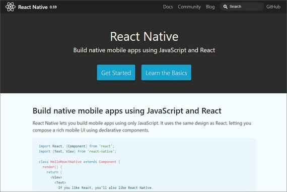](../assets/images/rn2.jpg)<br>
<span class="center bold">React Native</span>

### 1.1 Course Intro
Welcome! This course covers the React Native framework. Here's a quick breakdown of what the course looks like:

#### 1.1.1 Course Map

- **Lesson 1** illustrates the benefits of using React Native to build native applications, as well as how to set up an effective dev environment.
- **Lesson 2** compares the main ideological and API differences between React and React Native.
- **Lesson 3** details styling and layout patterns for React Native applications.
- **Lesson 4** examines routing patterns and strategies.
- **Lesson 5** introduces native functionality (e.g., geolocation, notifications, etc.) and preparation of applications for the app store.

#### 1.1.2 In-Class Project
During this course, you'll follow along and create a daily fitness-tracking application, [UdaciFitness](https://github.com/udacity/reactnd-UdaciFitness-complete). You'll tie in what you've learned from React Fundamentals as well as React & Redux, then leverage React Native to create a fully functional mobile application!

### 1.2 What is React Native

[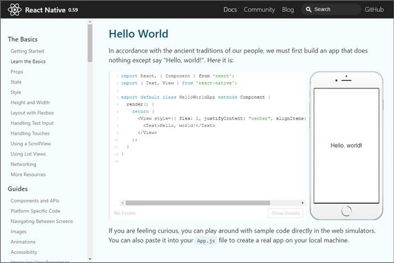](../assets/images/rn3.jpg)<br>
<span class="center bold">React Native code</span>

React Native allows you to use React to build native iOS and Android applications. Companies like Walmart, Airbnb, and Tesla are all using React Native in some capacity on their mobile applications.

In my opinion though, React Native is even more beneficial to smaller startups.

Instead of having a web team, an iOS team, and an Android team, with React Native, you can just have a single UI team. This not only saves the organization a lot of money but also developer hours as well.

You may have heard the phrase, "Write Once, Run Anywhere". The idea of this is that it would be nice if you could use a single code base on the web,
on iOS, and on Android.

In practice though, this is pretty difficult. This is because each of those platforms have such a unique experience.

Unlike write once, run anywhere, React Native's motto is, "Learn Once, Write Anywhere."

Once you learn React, you should be able to take those same principles and not only build UI for the web, but also for native platforms like iOS and Android.

So instead of sharing the same codebase amongst all the different platforms, we're sharing the same principles. Things like component composition and declarative UI.

#### 1.2.1 React Native under the Hood
When React was first introduced, a big selling point was the [Virtual DOM](https://reactjs.org/docs/faq-internals.html). The idea is pretty standard in most UI libraries now, but when it first came out, it was groundbreaking! We can look at what exactly the Virtual DOM is by breaking down the process of what happens when you call `setState()`.

The first thing React does when `setState()` is called is merge the object passed to `setState()` into the current state of the component. This will kick off a process called [reconciliation](https://reactjs.org/docs/reconciliation.html). The end goal of reconciliation is to update the UI based on this new state in the most efficient way possible. To do this, React will construct a new tree of React elements (which you can think of as an object representation of your UI). Once it has this new tree, React will "diff" it against the previous element tree in order to figure out how the UI should change in response to the new state. By doing this, React will then know the exact changes which occurred, and by knowing exactly what changes occurred, it will able to minimize its footprint on the UI by only making updates where absolutely necessary.

This process of creating an object representation of the DOM is the whole idea behind the "Virtual DOM". Now, what if instead of targeting and rendering to the DOM, we need to target and render to another platform -- say iOS or Android. Theoretically, the DOM is just an implementation detail. Besides the name itself (which, in my opinion, was more of a marketing ploy than anything), there's nothing that couples the idea of the Virtual DOM to the actual DOM. This is the exact idea behind React Native. Instead of rendering to the web's DOM, React Native renders to native iOS or Android views. This allows us to build native iOS and Android applications just by using React Native.

#### 1.2.2 Quiz Question
How does the **learn once, write anywhere** approach influence development?

- [x] Learning React allows us to use the same principles to develop for both web and native platforms
- [ ] React development more closely follows "write once, run anywhere," so we don't need to develop distinct apps for each platform
- [ ] React Native development shares exactly the same codebase as other React platforms
- [x] The same set of engineers should be able to develop for whichever platform they choose without needing to learn fundamentally different technologies

#### 1.2.3 Summary
React Native's "learn once, write anywhere" approach allows us to use the same principles that we know to develop for both web and native platforms. After all, under the hood, many of the same principles of the Virtual DOM, reconciliation, and diffing algorithm apply whether it's a web application built with React or a mobile application built with React Native.

Further Research
- [Bridging in React Native](https://tadeuzagallo.com/blog/react-native-bridge/)
- [12 Common Questions from Working with React Native](https://medium.com/dailyjs/12-common-questions-about-react-native-74fc9ba49b17)

### 1.3 Dev Environment Setup
When we build our app throughout this course, we'll be building it for both Android and iOS. One of the puzzles at hand is that we'll need to support two separate development environments: iOS uses [Xcode](https://developer.apple.com/xcode/), and Android uses [Android Studio](https://developer.android.com/studio/index.html). This introduces a lot of complexity into this course; after all, both Xcode and Android Studio could probably each be their own set of courses!

#### 1.3.1 Expo-CLI
Luckily for us, there's a tool we can use that will allow us to develop for both Android and iOS without ever opening up Android Studio or Xcode. It was called Create React Native App but is now called [Expo CLI](https://expo.io/learn). It's similar to Create React App in that all you have to do is install the CLI via NPM. Then, via the CLI, you can easily scaffold a brand new React Native project.

Just like Create React App, there are pros and cons to using Expo. First, the pros.

##### Expo Pros
The obvious one is that Expo minimizes the amount of time it takes to create a "hello world" application. The fact that you can run a command in your terminal and 15 seconds later have a project that run on both Android and iOS using JavaScript is pretty incredible. Next, and we'll look deeper into this one later on, Expo allows you to easily develop on your own device. This way, any changes you make in your text editor will instantly show on the app running on your local phone. Next, and this is something I mentioned earlier, with Expo you just need one build tool. You don't have to worry about Xcode or Android Studio. Lastly, there's no lock in. Just like Create React App, you can "eject" at anytime.

Recap of pros:

- Less time to create an app
- Easily develop on your own device
- One build tool for both iOS and Android

##### Expo Cons
Now, there are some cons, and granted they're pretty minor, but they're good to be aware of. First, if you're building an app that's going to be added to an existing native iOS or Android application, Expo won't work. Second, if you need to build your own bridge between React Native and some native API that Expo doesn't expose (which is pretty rare), Expo won't work.

Isn't suitable for:

- Adding onto existing native iOS or Android app
- Using native os/device APIs that Expo doesn't already expose

#### 1.3.2 Install Expo
We can get started by installing Expo CLI globally.

```bash
npm install -g expo-cli
```

Expo is a set of tools, libraries and services you can use to build native iOS and Android apps without the need to use Android Studio or Xcode.

What's more: it even allows us to develop for iOS with Windows (or even Linux)!

With Expo, you can load and run projects with the same JavaScript you already know. There's no need to compile any native code. And much like Create React App, using Expo lets us get an application up and running with almost no configuration.

We'll be relying on Expo heavily in this course. First things first: you need to install Expo. Head to the app store and install the Expo mobile app for your device:

- [Expo on Google Play](https://play.google.com/store/apps/details?id=host.exp.exponent) (Android)
- [Expo on the App Store](https://itunes.apple.com/us/app/expo-client/id982107779) (iOS)

#### 1.3.3 Quiz Question
What is true about Expo?

- [x] Expo is a set of tools and services that allow use to build native (iOS and Android) applications with JavaScript
- [ ] Using Expo requires compiling native code
- [x] Much like Create React App, Expo allows us to quickly build and scaffold a starter application
- [x] Expo makes it easy to build mobile applications without having to write native code (e.g. Swift, Objective C, Java)

#### 1.3.4 Expo Snack
[Expo Snack](https://snack.expo.io/) is a browser-based dev environment similar to CodePen or CodeSandbox. It allows you to develop and test right in the browser.

[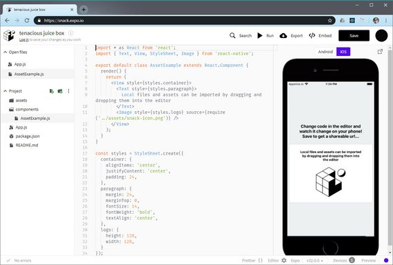](../assets/images/rn1.jpg)<br>
<span class="center bold">Expo Snack UI</span>

#### 1.3.5 Installing Simulators
A Mac is needed to develop iOS apps but Android apps can be developed on Mac, Linux, & Windows.

In order to install iPhone or Android simulators we can refer to the
following React Native docs.

- [React Native - Getting Started](https://facebook.github.io/react-native/docs/getting-started) - "React Native CLU Quickstart" tab

#### 1.3.6 The Environment
When creating an app with Expo, what type of support should you expect?

- ES5 and ES6 support
- Object Spread Operator
- Asynchronous functions
- JSX
- Flow
- Fetch API

#### 1.3.7 Create Expo App
In order to start a new app we issue the following command

```bash
expo init reactnd-udacifitness
```

Then to run the app we do the following:

```bash
cd reactnd-udacifitness
npm start
```

In order to run this with an Android emulator we need to:

- Open Android Studio
- Open Virtual Device Manager
- Create & Start a device
- Turn on Developer mode & USB Debugging in the device's Settings

> #### Expo on Windows 10 with WSL
>
> There seems to be an error on Windows 10 with running expo on WSL. This causes the network to loose connectivity.
>
> The workaround was to run Expo in Cmd Console.
>
> - [GitHub Fix #1](https://github.com/expo/expo-cli/issues/99#issuecomment-472591763)
> - [GitHub Fix #2](https://github.com/Microsoft/WSL/issues/2913#issuecomment-471277845)

#### 1.3.8 Summary
Expo is similar to Create React App in that it scaffolds and builds a starter application with minimal configuration. This allows us to have an app up and running without the need for Xcode or Android Studio! Some of the benefits include:

- Minimal "time to 'Hello World'"
- Development on your own device via Expo
- A single build tool
- No lock-in (i.e., ejection at any time)

You can also set up simulators to aid in development as well. But regardless of which platform we choose to develop for (iOS, Android), and which environment we're in (Mac, Windows, Linux) -- we're just building with the same old JavaScript that we're used to!

### 1.4 Using the Debugger
#### 1.4.1 How to Debug
As we've mentioned before, perhaps one of the best things about React Native is that it takes the development experience you're used to on the web, and brings it all to native development.

Things like live reloading and debugging just work out of the box. Let's take a deeper dive into some of these features -- first with debugging!

Once Android emulator is installed properly and running we can start our Expo project.

```bash
npm start
```

That will open Expo Developer Tools.

[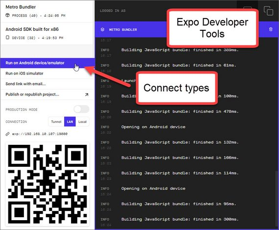](../assets/images/rn4.jpg)<br>
<span class="center bold">Expo Developer Tools</span>

Next we click "Run on Android device/emulator". This will open up the app in the emulator.

We can then open the Developer Debug Menu and select from the following options

- **Reload** - reloads app
- **Start Remote JS Debugging** - enables debugging in Chrome DevTools
- **Enable Live Reload** - reloads on code save
- **Enable Hot Reloading** - preserves state on reload
- **Toggle Inspector** - shows element inspector
- **Show Perf Monitor** - perf monitor
- **Start/Stop Sampling Profiler** - profiler

[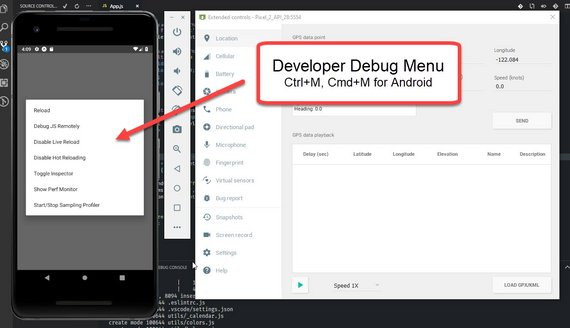](../assets/images/rn5.jpg)<br>
<span class="center bold">Developer Debug Menu in Android</span>

The debug items we'll use the most are:

- Reload
- Start Remote JS Debugging
- Toggle Inspector

Here are some links to additional info

- [Expo Docs - Debugging](https://docs.expo.io/versions/v32.0.0/workflow/debugging/) - Debugging JavaScript, HTTP, Redux, etc.
- [React DevTools](https://github.com/facebook/react-devtools/tree/master/packages/react-devtools) - Standalone DevTools app for React & React Native
- [React Native Debugger](https://github.com/jhen0409/react-native-debugger) - Includes
  - Remote JS Debugger
  - React Inspector
  - Redux DevTools

If we need to Reload the app we can just type R key twice.

#### 1.4.2 Quiz Question
How should you access the in-app developer menu? Select all that apply:

- [ ] Change a setting in the Expo mobile app
- [ ] Choose **Debug** from the notification drawer
- [x] Shake your phone
- [x] Select **Shake Gesture** in the simulator
- [x] Press Cmd+D in iOS simulator or Cmd+M in Android emulator

#### 1.4.3 Summary
What's great about React Native development is that it takes much of what you're used to from web development and takes it to native development. Accessing the in-app developer menu allows you to reload your JavaScript code, debug remotely via Developer Tools, and even display an in-app inspector.

##### To Debug
All you have to do is shake your phone, or press:

- ⌘D in the iOS simulator
- ⌘M in the Android simulator

##### To Refresh
To refresh the app, just:

- Double-tap “R” on your keyboard (if using the simulator)
- Shake the phone, then select “Refresh”

## 2. React vs React Native
### 2.1 Intro
In this lesson, we'll look at how the web, iOS, and Android all differ from one another from both a user interface perspective and a user experience perspective.

We'll look at the components that React Native comes with, and last, we'll add Redux into a React Native application.

### 2.2 Web vs. Native
From a technological standpoint, React Native does a great job of letting you take your experiences on the web to build native applications.

What's critical to understand is that the experiences you're developing for on mobile are fundamentally different than on the web.

Not only are native apps different than web apps, but iOS apps are different than Android apps. If you took an Android Style app and put it on iOS, it would just feel weird.

In this lesson, we're going to cover the subtle differences you need to watch out for when building for the web, iOS and Android.

#### 2.2.1 Additional differences
Native applications look and "feel" different because they are fundamentally different. Even though we're using the same React principles that you've learned throughout this program, keep in mind that this is no longer the web! While some of these distinctions are more apparent (e.g., the development process, access to native features, how users get updates, etc.), there are some key differences that we'll be taking a deep dive into during this course.

For one, native apps often leverage **animations** to help create a great user experience. Animations such as button effects, screen transitions, and other visual feedback may be subtle, but they support continuity and guidance in the apps you build. They all function to dynamically tell a story about how your application works. Without animations, an application can feel like just a collection of static screens. For now, stay tuned; we'll be checking out animations in-depth during Lesson 5.

Another key difference between native and web applications is in **navigation**. Recall that React Router's `Route` component allows us to map a URL to a specific UI component. In React Native, routers function as a stack; that is, individual screens are "pushed" and "popped" as needed. We'll look at routing more closely later in Lesson 4.

#### 2.2.2 Android vs. iOS
Not only are there fundamental differences between native apps and web apps, you'll also find differences between how native platforms (iOS and Android) look and feel as well. Perhaps the most apparent are the distinct design philosophies on each platform: Android apps utilize Google's [Material Design](https://material.io/guidelines/material-design/introduction.html), while iOS apps take advantage of Apple's [Human Interface Design](https://developer.apple.com/ios/human-interface-guidelines/overview/themes/). When designing mobile applications, it's important to your users that an iOS app feels like an iOS app, and an Android app feels like an Android app.

Navigation between screens feels distinct between Android and iOS as well. Android devices have access to a **navigation bar** at the bottom of the screen, which allows users to go back to the previous screen (among other features). On iOS, the approach is different: there is no such universal navigation bar! When building the UI for an iOS application, it is important to include a back button (perhaps on a custom [navigation bar](https://developer.apple.com/ios/human-interface-guidelines/bars/navigation-bars/)) to help guide users through your app.

One more key difference between Android and iOS involves tab navigation. iOS apps include [tab bars](https://developer.apple.com/ios/human-interface-guidelines/bars/tab-bars/) at the bottom of the app's screen, allowing for convenient access to different portions of the app. Likewise, Android apps include them as well; however tabs are distinctly located [at the top of the screen](https://material.io/guidelines/components/tabs.html). Both allow access to high-level content, and we'll explore React Native's **TabNavigator** in closer detail in Lesson 4.

#### 2.2.3 Quiz Question
What is true about web applications or native applications? Select all that apply:

- [ ] Web applications tend to be characterized by more animations than in native applications
- [x] Tabs in native iOS applications are generally expected to be found at the bottom of the device screen
- [ ] Each screen in a native application is actually just a URL mapped to a UI component
- [ ] Native iOS applications can leverage a universal "back" button

#### 2.2.4 Summary
When developing your React Native projects, keep in mind that you're designing for a different experience than that of web applications. Mobile applications look and feel different due to fundamental differences, such as subtle animations that build a sense of continuity for your users. Differences exist between Android and iOS as well, especially in their design philosophies and navigation. We'll look at some fundamental components that make up React Natives apps in the next section!

- [iOS  Interface Essentials](https://developer.apple.com/ios/human-interface-guidelines/overview/interface-essentials/)
- [Material Design Navigation](https://material.io/design/navigation/understanding-navigation.html)

### 2.3 Common RN Components
When you're developing for the web, you automatically have access to every element in the HTML specification. This includes elements like `div` and `span`.

In React Native, it is similar, except instead of using elements provided by the HTML spec, you'll use components provided by React Native. Components like `view` and `text`.

In this lesson, we'll be covering some of the most common React Native components you might come across. Some of these we'll use in the Udacity fitness project, others we won't. But they're all good to know.

When writing HTML, we're used to using `<div>` and `<span>` tags to define sections or to contain other elements on the page. In React Native, a similar principle applies, but this time we're using React Native's `<View>` component to build the application UI. Just like HTML's `<div>`, `<View>` components can accommodate several props (e.g. style), and can even be nested inside other `<View>` components!

`<Text>` works just how you'd expect, as well. Its main objective is to, by no surprise, render text in the application. Just like `<View>`, styling and nesting capabilities apply to `<Text>` components, as well.

The two most common components in RN are

- `<View>`
- `<Text>`

### 2.4 Triathlon Tracker Project
This is the project we will be building as we learn React Native.

[](../assets/images/rn6.jpg)<br>
<span class="center bold">Triathlon Tracker</span>

### 2.5 Icons
Right out of the box, Expo offers support for thousands of vector icons to use in your applications. Check out the link for a complete list.

- [Expo vector icon directory](https://expo.github.io/vector-icons)

Whichever icon set you choose, just be sure that it fits the overall look and feel of your application (e.g., using platform-specific icons).

[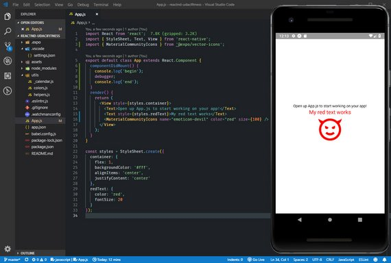](../assets/images/rn7.jpg)<br>
<span class="center bold">Icon</span>

```jsx
// App.js
import React from 'react';
import { StyleSheet, Text, View } from 'react-native';
import { MaterialCommunityIcons } from '@expo/vector-icons';

export default class App extends React.Component {
  componentDidMount() {
    console.log('begin');
    debugger;
    console.log('end');
  }
  render() {
    return (
      <View style={styles.container}>
        <Text>Open up App.js to start working on your app!</Text>
        <Text style={styles.redText}>My red text works</Text>
        <MaterialCommunityIcons name="emoticon-devil" color="red" size={100} />
      </View>
    );
  }
}

const styles = StyleSheet.create({
  container: {
    flex: 1,
    backgroundColor: '#fff',
    alignItems: 'center',
    justifyContent: 'center'
  },
  redText: {
    color: 'red',
    fontSize: 20
  }
});
```

### 2.6 AddEntry Component
The next step is to create the AddEntry component and add it to App.js.  We also update our helpers.js component with a `getMetricMetaInfo()` method.

This will begin to scaffold our app. For now we will just render a bike icon to our screen.

[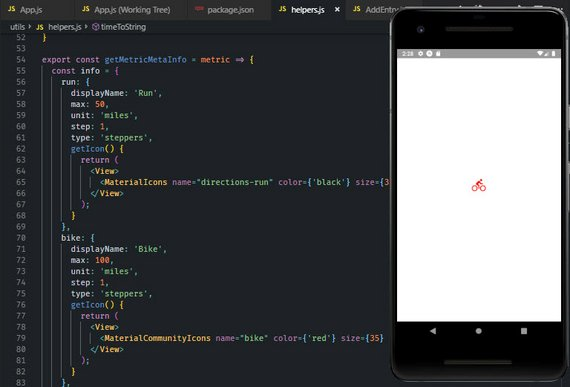](../assets/images/rn8.jpg)<br>
<span class="center bold">AddEntry Component</span>

#### 2.6.1 AddEntry Component
This file is located at '/components/AddEntry.js'.

```jsx
// AddEntry.js
import React, { Component } from 'react';
import { View, Text } from 'react-native';
import { getMetricMetaInfo } from '../utils/helpers';

export default class AddEntry extends Component {
  render() {
    return <View>{getMetricMetaInfo('bike').getIcon()}</View>;
  }
}
```

#### 2.6.2 Helper Method
This file is located at '/utils/helper.js'.

```jsx
// helper.js
...
export const getMetricMetaInfo = metric => {
  const info = {
    run: {
      displayName: 'Run',
      max: 50,
      unit: 'miles',
      step: 1,
      type: 'steppers',
      getIcon() {
        return (
          <View>
            <MaterialIcons name="directions-run" color={'green'} size={65} />
          </View>
        );
      }
    },
    bike: {
      displayName: 'Bike',
      max: 100,
      unit: 'miles',
      step: 1,
      type: 'steppers',
      getIcon() {
        return (
          <View>
            <MaterialCommunityIcons name="bike" color={'red'} size={65} />
          </View>
        );
      }
    },
    swim: {
      displayName: 'Swim',
      max: 9900,
      unit: 'meters',
      step: 100,
      type: 'steppers',
      getIcon() {
        return (
          <View>
            <MaterialCommunityIcons name="swim" color={'blue'} size={65} />
          </View>
        );
      }
    },
    sleep: {
      displayName: 'Sleep',
      max: 24,
      unit: 'hours',
      step: 1,
      type: 'slider',
      getIcon() {
        return (
          <View>
            <FontAwesome name="bed" color={'black'} size={65} />
          </View>
        );
      }
    },
    eat: {
      displayName: 'Eat',
      max: 10,
      unit: 'rating',
      step: 1,
      type: 'slider',
      getIcon() {
        return (
          <View>
            <MaterialCommunityIcons name="food" color={'orange'} size={65} />
          </View>
        );
      }
    }
  };

  return typeof metric === 'undefined' ? info : info[metric];
};
```

#### 2.6.3 App Component
This file is located at '/App.js'.

```jsx
// App.js
import React from 'react';
import { StyleSheet, View } from 'react-native';
import AddEntry from './components/AddEntry';

export default class App extends React.Component {
  componentDidMount() {
    console.log('begin');
    debugger;
    console.log('end');
  }
  render() {
    return (
      <View style={styles.container}>
        <AddEntry />
      </View>
    );
  }
}

const styles = StyleSheet.create({
  container: {
    flex: 1,
    backgroundColor: '#fff',
    alignItems: 'center',
    justifyContent: 'center'
  }
});
```

### 2.7 Stepper & Slider Stubs
Next we add two control components to AddEntry. These are the UdaciSlider and UdaciStepper components.

For now each will be a stub that we bring into AddEntry.

[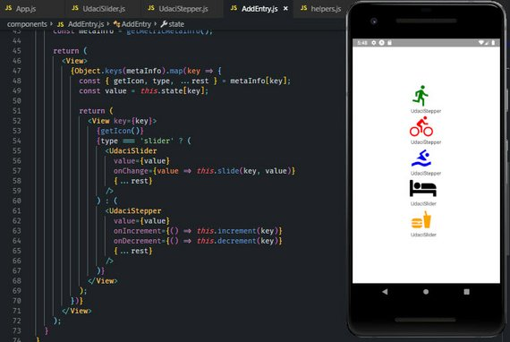](../assets/images/rn9.jpg)<br>
<span class="center bold">AddEntry with Slider & Stepper Components</span>

#### 2.7.1 UdaciSlider Component
Located in '/components/UdaciSlider.js'.

```jsx
// UdaciSlider.js
import React, { Component } from 'react';
import { Text, View } from 'react-native';

export default class UdaciSlider extends Component {
  render() {
    return (
      <View>
        <Text> UdaciSlider </Text>
      </View>
    );
  }
}
```

#### 2.7.2 UdaciStepper Component
Located in '/components/UdaciStepper.js'.

```jsx
// UdaciStepper.js
import React, { Component } from 'react';
import { Text, View } from 'react-native';

export default class UdaciStepper extends Component {
  render() {
    return (
      <View>
        <Text> UdaciStepper </Text>
      </View>
    );
  }
}
```

#### 2.7.3 AddEntry Component
Located in '/components/AddEntry.js'.

```jsx
// AddEntry.js
...
import UdaciSlider from './UdaciSlider';
import UdaciStepper from './UdaciStepper';

export default class AddEntry extends Component {
  ...
  render() {
    const metaInfo = getMetricMetaInfo();

    return (
      <View>
        {Object.keys(metaInfo).map(key => {
          const { getIcon, type, ...rest } = metaInfo[key];
          const value = this.state[key];

          return (
            <View key={key}>
              {getIcon()}
              {type === 'slider' ? (
                <UdaciSlider
                  value={value}
                  onChange={value => this.slide(key, value)}
                  {...rest}
                />
              ) : (
                <UdaciStepper
                  value={value}
                  onIncrement={() => this.increment(key)}
                  onDecrement={() => this.decrement(key)}
                  {...rest}
                />
              )}
            </View>
          );
        })}
      </View>
    );
  }
}
```

### 2.8 DateHeader Component
Next we add the DateHeader component which will be included in a few different places.

[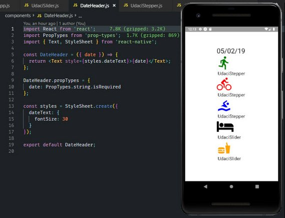](../assets/images/rn10.jpg)<br>
<span class="center bold">DateHeader component</span>

#### 2.8.1 DateHeader
Located in '/components/DateHeader.js'.

```jsx
// DateHeader.js
import React from 'react';
import PropTypes from 'prop-types';
import { Text, StyleSheet } from 'react-native';

const DateHeader = ({ date }) => {
  return <Text style={styles.dateText}>{date}</Text>;
};

DateHeader.propTypes = {
  date: PropTypes.string.isRequired
};

const styles = StyleSheet.create({
  dateText: {
    fontSize: 30
  }
});

export default DateHeader;
```

#### 3.8.2 AddEntry.js
Located in '/components/AddEntry.js'.

```jsx
// AddEntry.js
import DateHeader from './DateHeader';

export default class AddEntry extends Component {
  render() {
    const metaInfo = getMetricMetaInfo();

    return (
      <View>
        <DateHeader date={new Date().toLocaleDateString()} />
        ...
      </View>
    );
  }
}
```

### 2.9 Touchables
Users mainly interact with web apps with clicks. In the world of mobile apps, however, several different touch gestures are used to navigate through the app: tapping a button, swiping to scroll through a list, and so on.

React Native offers a number of components to handle "tapping gestures," or what is called **Touchables**. Let's take a look at them in detail in the following video:

- `Button`
- `TouchableHighlight`
- `TouchableOpacity`
- `TouchableNativeFeedback`
- `TouchableWithoutFeedback`

#### 2.9.1 TouchableHighlight

```jsx
import React from 'react';
import {
  StyleSheet,
  View,
  Text,
  TouchableHighlight,
} from 'react-native';
import AddEntry from './components/AddEntry';

export default class App extends React.Component {
  handlePress = () => {
    alert('hello!');
  };
  render() {
    return (
      <View style={styles.container}>
        <TouchableHighlight
          style={styles.btn}
          onPress={this.handlePress}
          underlayColor="#d4271b"
        >
          <Text style={styles.btnText}>Touchable Highlight</Text>
        </TouchableHighlight>
      </View>
    );
  }
}

const styles = StyleSheet.create({
  container: {
    flex: 1,
    backgroundColor: '#fff',
    marginLeft: 10,
    marginRight: 10,
    alignItems: 'center',
    justifyContent: 'center'
  },
  btn: {
    backgroundColor: '#E53224',
    padding: 10,
    paddingLeft: 50,
    paddingRight: 50,
    justifyContent: 'center',
    alignItems: 'center',
    borderRadius: 5
  },
  btnText: {
    color: '#fff'
  }
});
```

#### 2.9.2 TouchableOpacity

```jsx
import React from 'react';
import {
  StyleSheet,
  View,
  Text,
  TouchableOpacity,
} from 'react-native';
import AddEntry from './components/AddEntry';

export default class App extends React.Component {
  handlePress = () => {
    alert('hello!');
  };
  render() {
    return (
      <View style={styles.container}>
        <TouchableOpacity style={styles.btn} onPress={this.handlePress}>
          <Text style={styles.btnText}>Touchable Highlight</Text>
        </TouchableOpacity>
      </View>
    );
  }
}
...
```

#### 2.9.3 TouchableWithoutFeedback

```jsx
import React from 'react';
import {
  StyleSheet,
  View,
  Text,
  TouchableWithoutFeedback
} from 'react-native';
import AddEntry from './components/AddEntry';

export default class App extends React.Component {
  handlePress = () => {
    alert('hello!');
  };
  render() {
    return (
      <View style={styles.container}>
        <TouchableWithoutFeedback onPress={this.handlePress}>
          <View style={styles.btn}>
            <Text style={styles.btnText}>Touchable Highlight</Text>
          </View>
        </TouchableWithoutFeedback>
      </View>
    );
  }
}
...
```

#### 2.9.4 TouchableNativeFeedback

```jsx
import React from 'react';
import {
  StyleSheet,
  View,
  Text,
  TouchableNativeFeedback,
} from 'react-native';
import AddEntry from './components/AddEntry';

export default class App extends React.Component {
  handlePress = () => {
    alert('hello!');
  };
  render() {
    return (
      <View style={styles.container}>
        <TouchableNativeFeedback
          onPress={this.handlePress}
          background={TouchableNativeFeedback.SelectableBackground()}
        >
          <View style={styles.btn}>
            <Text style={styles.btnText}>Touchable Highlight</Text>
          </View>
        </TouchableNativeFeedback>
      </View>
    );
  }
}
...
```

### 2.10 Update Components
Next we add in the Submit button and submit method.

#### 2.10.1 AddEntry SubmitBtn
Located in '/components/AddEntry.js'.

[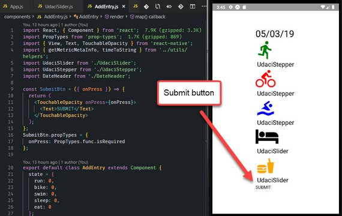](../assets/images/rn11.jpg)<br>
<span class="center bold">Submit Button</span>

```jsx
// AddEntry.js
import PropTypes from 'prop-types';
import { View, Text, TouchableOpacity } from 'react-native';
import { getMetricMetaInfo, timeToString } from '../utils/helpers';

const SubmitBtn = ({ onPress }) => {
  return (
    <TouchableOpacity onPress={onPress}>
      <Text>SUBMIT</Text>
    </TouchableOpacity>
  );
};
SubmitBtn.propTypes = {
  onPress: PropTypes.func.isRequired
};

export default class AddEntry extends Component {
  ...
  submit = () => {
    const key = timeToString();
    const entry = this.state;

    // Update Redux

    this.setState({
      run: 0,
      bike: 0,
      swim: 0,
      sleep: 0,
      eat: 0
    });

    // Navigate to home

    // Save to DB

    // Clear local notification
  };
  render() {
    ...
    return (
      <View>
      ...
      <SubmitBtn onPress={this.submit} />
      </View>
    );
  }
}
```

#### 2.10.2 Quiz Question
What is true about handling touches in React Native apps? Select all that apply:

- [ ] Unlike Buttons, Touchables already include some basic default styling
- [ ] Buttons look the same on iOS as they do on Android
- [x] Both Buttons and Touchables have access to an `onPress` prop
- [x] Touchables can be nested within Views, and Views can be nested within Touchables

#### 2.10.3 Slider Component
Now we'll work on the Slider component located in '/components/Slider.js'

[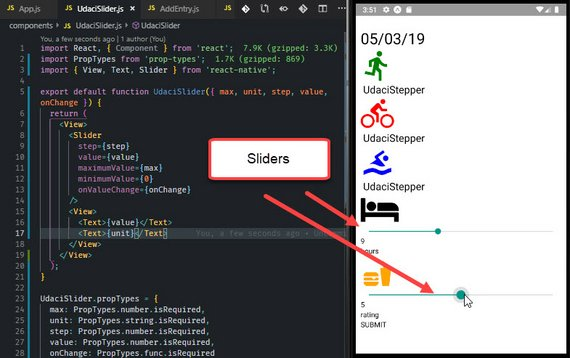](../assets/images/rn12.jpg)<br>
<span class="center bold">Slider components</span>

```jsx
// UdaciSlider.js
import React, { Component } from 'react';
import PropTypes from 'prop-types';
import { View, Text, Slider } from 'react-native';

export default function UdaciSlider({ max, unit, step, value, onChange }) {
  return (
    <View>
      <Slider
        step={step}
        value={value}
        maximumValue={max}
        minimumValue={0}
        onValueChange={onChange}
      />
      <View>
        <Text>{value}</Text>
        <Text>{unit}</Text>
      </View>
    </View>
  );
}

UdaciSlider.propTypes = {
  max: PropTypes.number.isRequired,
  unit: PropTypes.string.isRequired,
  step: PropTypes.number.isRequired,
  value: PropTypes.number.isRequired,
  onChange: PropTypes.func.isRequired
};
```

#### 2.10.4 Stepper Component
Now we'll work on the Stepper component located in '/components/Stepper.js'

[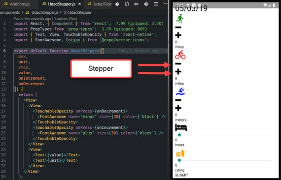](../assets/images/rn13.jpg)<br>
<span class="center bold">Stepper components</span>

```jsx
// UdaciStepper.js
import React, { Component } from 'react';
import PropTypes from 'prop-types';
import { Text, View, TouchableOpacity } from 'react-native';
import { FontAwesome, Entypo } from '@expo/vector-icons';

export default function UdaciStepper({
  max,
  unit,
  step,
  value,
  onIncrement,
  onDecrement
}) {
  return (
    <View>
      <View>
        <TouchableOpacity onPress={onDecrement}>
          <FontAwesome name="minus" size={30} color={'black'} />
        </TouchableOpacity>
        <TouchableOpacity onPress={onIncrement}>
          <FontAwesome name="plus" size={30} color={'black'} />
        </TouchableOpacity>
      </View>
      <View>
        <Text>{value}</Text>
        <Text>{unit}</Text>
      </View>
    </View>
  );
}

UdaciStepper.propTypes = {
  max: PropTypes.number.isRequired,
  unit: PropTypes.string.isRequired,
  step: PropTypes.number.isRequired,
  value: PropTypes.number.isRequired,
  onIncrement: PropTypes.func.isRequired,
  onDecrement: PropTypes.func.isRequired
};
```

#### 2.10.5 Update Icon in AddEntry
This will show a message when items are already logged for that day.

[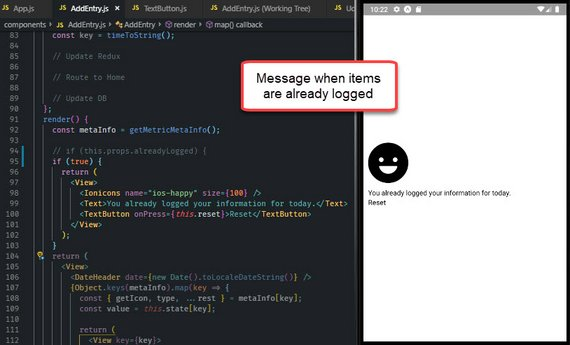](../assets/images/rn14.jpg)<br>
<span class="center bold">AddEntry Icon</span>

We start with '/components/TextButton.js'.

```jsx
// TextButton.js
import React from 'react';
import PropTypes from 'prop-types';
import { Text, TouchableOpacity } from 'react-native';

export default function TextButton({ children, onPress }) {
  return (
    <TouchableOpacity onPress={onPress}>
      <Text>{children}</Text>
    </TouchableOpacity>
  );
}

TextButton.propTypes = {
  children: PropTypes.string.isRequired,
  onPress: PropTypes.func.isRequired
};
```

Next we incorporate this in AddEntry which is located in 'components/AddEntry.js'.

```jsx
// AddEntry.js
import { Ionicons } from '@expo/vector-icons';
import TextButton from './TextButton';

export default class AddEntry extends Component {
  static propTypes = {
    alreadyLogged: PropTypes.bool
  };
  ...
  reset = () => {
    const key = timeToString();

    // Update Redux

    // Route to Home

    // Update DB
  };
  render() {
    const metaInfo = getMetricMetaInfo();

    if (this.props.alreadyLogged) {
      return (
        <View>
          <Ionicons name="ios-happy" size={100} />
          <Text>You already logged your information for today.</Text>
          <TextButton onPress={this.reset}>Reset</TextButton>
        </View>
      );
    }

    return (
      ...
    )
  }
}
```

### 2.11 Lists, Forms, Images
#### 2.11.1 Lists

[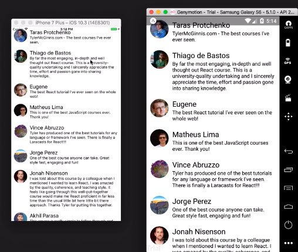](../assets/images/rn15.jpg)<br>
<span class="center bold">Lists</span>

React Native comes with a few ways to render lists. You'll probably run into `ScrollView` and `FlatList` components most commonly.

- ScrollView - renders all child components at once
- FlatList - renders only items visible on screen
- SectionList - renders on-screen items, but with headers

#### 2.11.2 Forms

[](../assets/images/rn16.jpg)<br>
<span class="center bold">Forms</span>

[](../assets/images/rn16.jpg)<br>
<span class="center bold">Forms</span>

Forms in React Native are just like the forms in React that you already know: the state of input form elements is controlled by the React component that renders that form. That is, form values are held in local component state, making state the "source of truth" for that form.

React Native provides a few basic components to use in your application's forms. We'll take a look at each of these more closely in the following video:

- `TextInput`
- `KeyboardAvoidingView`
- `Slider`
- `Switch`

#### 2.11.3 Quiz Question
What is true about `KeyboardAvoidingView`?

- [x] Without `KeyboardAvoidingView`, the keyboard will "pop-up", hiding text inputs
- [x] `KeyboardAvoidingView` can wrap around `TextInput` components
- [ ] `KeyboardAvoidingView` should always be contained within a `View` component
- [x] Padding can be adjusted via a prop on `KeyboardAvoidingView`

#### 2.11.4 Images
Image components can be local or remote.

```bash
// Local
<Image source={require('./image.png')} />
```

```bash
// Remote
<Image source={{uri: 'https://site.com/image.png'}} />
```

#### 2.11.5 Other Components
We've just seen some of the most important components built into React Native. These components will get you started with the essential functionalities in the apps that you build.

- [ActivityIndicator](https://facebook.github.io/react-native/docs/activityindicator.html) - circular loading indicator
- [Picker](https://facebook.github.io/react-native/docs/picker.html) - native picker component on iOS and Android.
- [WebView](https://facebook.github.io/react-native/docs/webview.html) - renders web content in a native view
- [Modal](https://facebook.github.io/react-native/docs/modal.html) - presents content above an enclosing view

Review the React Native documentation for a complete list.

- [Components and APIs Guide](https://facebook.github.io/react-native/docs/components-and-apis.html#components-and-apis).

Note that certain components are also platform-specific! Though you want to build cross-platform components with composition, reusing as much code as possible, it may make sense for certain elements to be different depending on your audience (i.e., iOS vs. Android).

#### 2.11.6 Summary
React Native provides a variety of built-in components for developing mobile applications.

While some support basic functionality in an application (e.g., text, images, lists), others offer more specialized functionality (e.g., pulling to refresh, displaying a loading indicator).

### 2.12 AsyncStorage
#### 2.12.1 Local Storage
In order to persist data in a web application, we'd normally store the data in some sort of database. This prevents app data from being lost between page refreshes.

Using `localStorage`, we can achieve a similar effect for the user by storing this data directly in their browser. Best of all -- data stored in localStorage has no expiration date. This means that even if a session ends data will not be lost!

Check out [Window.localStorage](https://developer.mozilla.org/en-US/docs/Web/API/Window/localStorage) on MDN for an overview.

#### 2.12.2 Example: Saving to localStorage
Let's say we're building a simple React and Redux application that lets users create and manage a list of tasks. Basic functionality allows users to add items to their task list, remove items, and mark items as completed.

Assuming much of this data is kept in the application's store, how would we go about persisting this data?

One way would be to save to `localStorage` each time that state is updated. That is, the store's state will be saved with each dispatch:

```jsx
// store.js

import { createStore } from 'redux';
import Reducer from '../reducers/reducer';

const configureStore = () => {
  const store = createStore(Reducer);

  store.subscribe(() => {
    localStorage.state = JSON.stringify(store.getState());
  });

  return store;
};

export default configureStore;
```

After the store is created, we call `store.subscribe()` and pass in a callback function. The callback effectively saves a JSON string of the store's state into `localStorage`.

By subscribing to the store right after it is created, we can save data related to all of the user's tasks right into the browser.

#### 2.12.3 AsyncStorage
React Native's version of `LocalStorage` is called `AsyncStorage`. It's similar to LocalStorage, except it's asynchronous.

What's nice about AsyncStorage is it's a JavaScript abstraction over the iOS and Android equivalents. So when using it, you don't need to worry about the different environments.

Similar to LocalStorage, AsyncStorage has three main methods:

- set item,
- remove item
- clear all

The React Native documentation on [AsyncStorage](https://facebook.github.io/react-native/docs/asyncstorage.html) mentions:

> *AsyncStorage is a simple, unencrypted, asynchronous, persistent, key-value storage system that is global to the app. It should be used instead of LocalStorage.*

In the next video, we'll see just how we can implement it into our app!

#### 2.12.4 Add API calls
The first thing to do is create the api file.  This is located in '/utils/api.js'.

```js
// api.js
import { AsyncStorage } from 'react-native';
import { CALENDAR_STORAGE_KEY } from './_calendar';

export function submitEntry({ entry, key }) {
  return AsyncStorage.mergeItem(
    CALENDAR_STORAGE_KEY,
    JSON.stringify({
      [key]: entry
    })
  );
}

export function removeEntry(key) {
  return AsyncStorage.getItem(CALENDAR_STORAGE_KEY).then(results => {
    const data = JSON.parse(results);
    data[key] = undefined;
    delete data[key];
    AsyncStorage.setItem(CALENDAR_STORAGE_KEY, JSON.stringify(data));
  });
}
```

Next we update the `submit` and `reset` methods in AddEntry.

```jsx
// AddEntry.js
import { submitEntry, removeEntry } from '../utils/api';

export default class AddEntry extends Component {
  submit = () => {
    const key = timeToString();
    const entry = this.state;

    // Update Redux

    this.setState({
      run: 0,
      bike: 0,
      swim: 0,
      sleep: 0,
      eat: 0
    });

    // Navigate to home

    submitEntry({ key, entry });

    // Clear local notification
  };
  reset = () => {
    const key = timeToString();

    // Update Redux

    // Route to Home

    removeEntry(key);
  };
  ...
}
```

#### 2.12.5 Summary
React Native's version of `localStorage` is `AsyncStorage`. Conveniently, since `AsyncStorage` is just an abstraction over iOS and Android equivalents, there's no need to consider the different environments.

We took a close look at these 3 methods available on `AsyncStorage`:

- `setItem`
- `mergeItem`
- `getItem`

Feel free to visit the [AsyncStorage documentation](https://facebook.github.io/react-native/docs/asyncstorage.html#methods) for a complete list.

### 2.13 Redux & React Native
#### 2.13.1 Adding Redux
Recall that Redux is a predictable state container for JavaScript applications. It is agnostic to any particular view library or framework, so not only can we use it with React, but we can integrate it into React Native applications, as well!

With its lean size and minimal dependencies, Redux is a great tool for React Native projects. And best of all: since React Native is still fundamentally just JavaScript, Redux can be added into projects the same way that we're used to. Let's check it out -- first, with building out actions!

#### 2.13.2 Actions
This is located at '/actions/index.js'.

```js
// index.js
export const RECEIVE_ENTRIES = 'RECEIVE_ENTRIES';
export const ADD_ENTRY = 'ADD_ENTRY';

export function receiveEntries(entries) {
  return {
    type: RECEIVE_ENTRIES,
    entries
  };
}

export function addEntry(entry) {
  return {
    type: ADD_ENTRY,
    entry
  };
}
```

#### 2.13.3 Reducers
This is located at '/reducers/index.js'.

```js
// index.js
import { RECEIVE_ENTRIES, ADD_ENTRY } from '../actions/index';

function entries(state = {}, action) {
  switch (action.type) {
    case RECEIVE_ENTRIES:
      return {
        ...state,
        ...action.entries
      };
    case ADD_ENTRY:
      return {
        ...state,
        ...action.entry
      };
    default:
      return state;
  }
}

export default entries;
```

#### 2.13.4 Create Store
First we have to add redux & react-redux.

```bash
npm install redux react-redux --save
```

Then we update App with Redux Provider component and createStore method. This is located in '/App.js'.

```jsx
// App.js
import { createStore } from 'redux';
import { Provider } from 'react-redux';
import reducer from './reducers';

export default class App extends React.Component {
  ...
  render() {
    return (
      <Provider store={createStore(reducer)}>
        <View style={styles.container}>
          <AddEntry />
        </View>
      </Provider>
    );
  }
}
...
```

#### 2.13.5 Connect AddEntry to Redux
Next we add a helper function and connect AddEntry to the store.

This is located in '/utils/helpers.js'.

```js
// helpers.js
...
export function getDailyReminderValue() {
  return {
    today: "👋 Don't forget to log your data today!"
  };
}
```

The next file is located in '/components/AddEntry.js'.

```jsx
// AddEntry.js
import {
  getMetricMetaInfo,
  timeToString,
  getDailyReminderValue
} from '../utils/helpers';
import { connect } from 'react-redux';
import { addEntry } from '../actions';

class AddEntry extends Component {
  static propTypes = {
    alreadyLogged: PropTypes.bool,
    addEntry: PropTypes.func.isRequired
  };
  ...
  submit = () => {
    const key = timeToString();
    const entry = this.state;

    // Update Redux
    this.props.addEntry({
      [key]: entry
    });

    ...
  };
  reset = () => {
    const key = timeToString();

    // Update Redux
    this.props.addEntry({
      [key]: getDailyReminderValue()
    });

    ...
  };
  ...
}

function mapStateToProps(state) {
  const key = timeToString();

  return {
    alreadyLogged: state[key] && typeof state[key].today === 'undefined'
  };
}

export default connect(
  mapStateToProps,
  { addEntry }
)(AddEntry);
```

#### 2.13.6 Resolve Error

[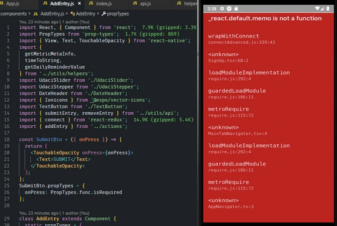](../assets/images/rn17.jpg)<br>
<span class="center bold">Compatibility Error</span>

This produced an error in expo. Due to package incompatibilities. I needed to do the following:

```bash
npm i react@16.5.0 react-redux@6.0.1
npm i schedule@0.4.0 --save-dev
```

Here are the write-ups on these:

- [Expo Forums](https://forums.expo.io/t/react-default-memo-is-not-a-function/21623/2) - This shows the proper package.json packages.
- [StackOverflow](https://stackoverflow.com/questions/55599755/error-when-using-connect-function-of-the-react-redux-library) - This shows the steps.

Made sure to clear cache and reload with Shift-R in Expo console.

#### 2.13.7 Summary
Remember that React Native is fundamentally still just JavaScript. As such, adding Redux to help manage application state will involve the very same principles and processes as adding Redux to a web application.

## 3. Styling & Layout
### 3.1 CSS in JS
Let's start with what typical styling of HTML looks like with CSS.

```html
<!-- index.css -->
.avatar {
  border-radius: 5px;
  margin: 10px;
  width: 48px;
  height: 48px;
}

<!-- // index.html -->
<div>
  
</div>
```

React Native works a little differently. First, all of the core components can accept a prop named `style`.

We can leverage this prop by styling with an inline JavaScript object.

```jsx
function Avatar ({ src }) {
  return (
    <View>
      <Image
        style={{borderRadius: 5, margin: 10, width: 48, height: 48}}
        source={{uri: 'https://tylermcginnis.com/glasses-300.png'}}
      />
    </View>
  );
}
```

In the above stateless functional component, style is set with an inline JavaScript object. Keep in mind that CSS in JavaScript is written in camelCase.

A better way to handle this is by using React Native's `StyleSheet` API.

```jsx
// Using StyleSheet API
import React from 'react';
import { StyleSheet, Text, View } from 'react-native';

export default class TextExample extends React.Component {
  render() {
    return (
      <View>
        <Text style={styles.greenLarge}>This is large green text!</Text>
        <Text style={styles.red}>This is smaller red text!</Text>
      </View>
    );
  }
}

const styles = StyleSheet.create({
  greenLarge: {
    color: 'green',
    fontWeight: 'bold',
    fontSize: 40
  },
  red: {
    color: 'red',
    padding: 30
  },
});
```

Here, an object containing styles is passed into `StyleSheet`'s `create` method. This is similar to using a JavaScript object but `StyleSheet` gives few performance and code quality benefits.

Here's the documentation's take.

> Code quality
>
> - By moving styles away from the render function, you're making the code easier to understand.
> - Naming the styles is a good way to add meaning to the low-level components in the render function.
>
> Performance
>
> - Making a stylesheet from a style object makes it possible to refer to it by ID instead of creating a new style object every time.
> - It also allows to send the style only once through the bridge. All subsequent uses are going to refer to an id (not implemented yet).

Another benefit is that `StyleSheet` validates the content within the style object as well. This means that should there be any errors in any properties or values in your style objects, the console will throw an error during compilation instead of at runtime.

#### 3.1.1 Additional Styling
If you wanted to implement more than one `style` to a component, the style prop can accept styles as an array:

```jsx
{
<Text style={[styles.red, styles.greenLarge]}>red, then greenLarge</Text>
}
```

The above `<Text>` component will render large green text, as the last style in the array will take precedence. This is a great way to inherit styles!

#### 3.1.2 Styling Libraries for CSS in JS
Styling in React is going through a renaissance period right now. There are many different styling libraries popping up and each has different tradeoffs. Two of the most popular are [Glamorous](https://github.com/robinpowered/glamorous-native) and [Styled Components](https://github.com/styled-components/styled-components).

The whole idea behind both of these libraries is that styling is a primary concern of the component, and therefore styling should be coupled with the component itself.

#### 3.1.3 Quiz Question
What is true about styling in React Native?

- [x] All of the core components accept a `style` property
- [ ] Styling React Native apps requires a special syntax to define styles that is unlike anything in traditional JavaScript
- [ ] Style names and values always match how they are used on the web (e.g., we need to use `background-color` in React Native)
- [x] The `StyleSheet` API allows us to define multiple styles in a single place
- [x] With React Native, applications are styled using JavaScript

#### 3.1.4 Summary
CSS in JS is a distinct approach to styling. The main idea is that styling is handled by JavaScript objects rather than traditional CSS.

Styles can be written inline or accessed via object variables, but React Native offers a `StyleSheet` API that provides a performant and compositional way to style components.

Now that we've seen React Native handle styling, how do we manage the layout of a mobile application? We'll take a look at CSS's flexbox in the next section to do just that!

Further Learning

- [How can I use CSS-in-JS securely?](https://reactarmory.com/answers/how-can-i-use-css-in-js-securely)

### 3.2 Flexbox Guide

[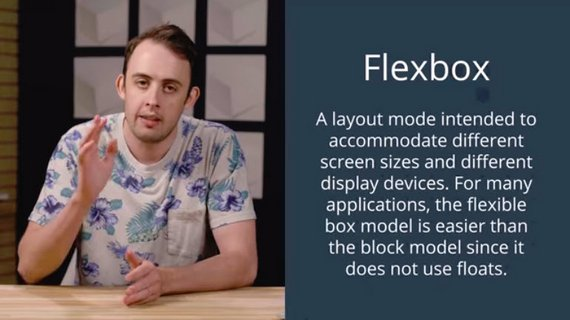](../assets/images/rn18.jpg)<br>
<span class="center bold">Flexbox model vs Block Model</span>

The goal of flexbox is to create a more efficient way to "lay out, align, and distribute space among items in a container, even when their size is unknown and/or dynamic". In a nutshell, flexbox is all about creating dynamic layouts.

The main idea of flexbox is that you give the parent element the ability to control the layout of all of their (immediate!) child elements rather than having each child element control its own layout. When you do this, the parent becomes a **flex container** while the child elements become **flex items**.

Here are the sections that will be covered.

- Flexbox Axis
- Flex Direction
- Justify Content
  - Flex-Start
  - Center
  - Flex-End
  - Space-Between
  - Space-Around
- Align Items
  - Flex-Start
  - Center
  - Flex-End
- Stretch
- Centering Content
- The Flex Property
- Aligning Individual Items

#### 3.2.1 Flexbox Axis
The most important concept to understand is that flexbox is all about two  axes. You'll have a **Main Axis** and a **Cross Axis**.

[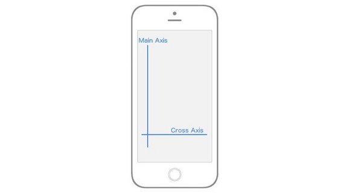](../assets/images/rn19.jpg)<br>
<span class="center bold">Main Axis and Cross Axis</span>

In React Native, by default, the **Main Axis** is vertical while the **Cross Axis** is horizontal. Everything from here on out is built upon this concept of a Main Axis and Cross Axis.

When I say "…which will align all the child elements along the Main Axis" that means that, by default, all the children of the parent element will be laid out vertically from top to bottom. If I say "…which will align the child elements along the Cross Axis" that means that, by default, all the children elements will be laid out horizontally from left to right.

The rest of flexbox is just deciding how you want to align, position, stretch, spread, shrink, center, wrap child elements along the Main and Cross axis.

#### 3.2.2 Flex Direction
You'll notice that I was very deliberate in mentioning the "default behavior" when it comes to the **Main Axis** and **Cross Axis**. That's because you can actually change which Axis is Main and which is Cross. That brings us to our first flexbox property, `flex-direction` (or `flexDirection` in React Native).

`flex-direction` has two values:

- `row`
- `column`

By default, every element in React Native has the `flexDirection: column` declaration. When an element has a `flex-direction` of `column`, its Main Axis is vertical and its Cross Axis is horizontal, just as we saw in the image above. However, if you give an element a `flexDirection: row` declaration, the axes switch. The Main axis becomes horizontal, while the Cross axis becomes vertical. Again, this is crucial because your entire layout is dependent on these two axes.

[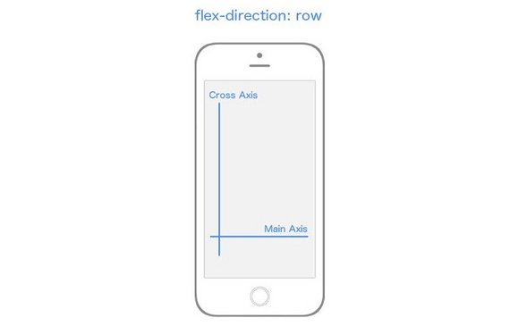](../assets/images/rn20.jpg)<br>
<span class="center bold">`flex-direction` changes which axis is the Main Axis</span>

#### 3.2.3 Justify Content
Now is when things start getting fun. Let's dive into the different properties and values we can use to align child elements along these axes. Let's focus entirely on the Main Axis, first.

In order to specify how children align themselves along the Main Axis, you'll use the `justifyContent` property. `justifyContent` has five different values you can use in order to change how the children align themselves along the Main Axis.

- `flex-start`
- `center`
- `flex-end`
- `space-around`
- `space-between`

If you want to follow along (which I highly recommend you do), create a new React Native project called "FlexboxExamples" and swap out your `App.js` code with the following:

```jsx
import React, { Component } from 'react'
import { StyleSheet, Text, View, AppRegistry } from 'react-native'

class FlexboxExamples extends Component {
  render() {
    return (
      <View style={styles.container}>
        <View style={styles.box}/>
        <View style={styles.box}/>
        <View style={styles.box}/>
      </View>
    )
  }
}

const styles = StyleSheet.create({
  container: {
    flex: 1,
  },
  box: {
    height: 50,
    width: 50,
    backgroundColor: '#e76e63',
    margin: 10,
  }
})

export default FlexboxExamples;
```

Note that with the code above, the only thing we'll be changing is the styling in the `container` object in the `styles` StyleSheet object. Ignore `flex: 1` for now.

##### Justify Content: Flex-Start

[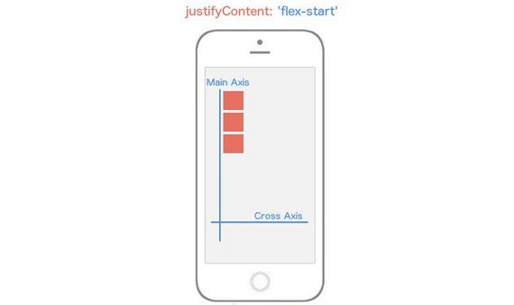](../assets/images/rn21.jpg)<br>
<span class="center bold">`justifyContent: flex-start`</span>

`justifyContent: 'flex-start'` will align every child element towards the start of the the Main Axis.

```js
container: {
  flex: 1,
  justifyContent: 'flex-start',
}
```

If you were still struggling with the importance of Main Axis and Cross Axis hopefully it just clicked. Because `flexDirection` defaults to `column`, and we're using `justifyContent` which targets the Main Axis, our child elements are going to align themselves towards the start of the Main Axis which is the top left and work their way down.

##### Justify Content: Center

[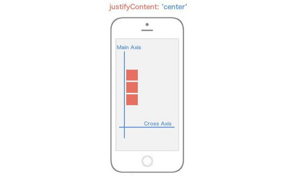](../assets/images/rn22.jpg)<br>
<span class="center bold">`justifyContent: center`</span>

`justifyContent: 'center'` will align every child element towards the center of the the Main Axis. ​

```js
container: {
  flex: 1,
  justifyContent: 'center',
}
```

##### Justify Content: Flex-End

[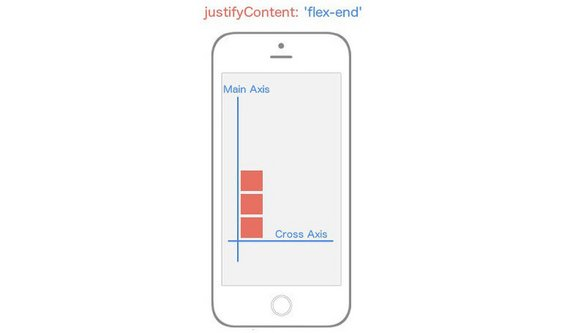](../assets/images/rn23.jpg)<br>
<span class="center bold">`justifyContent: flex-end`</span>

`justifyContent: 'flex-end'` will align every child element towards the end of the the Main Axis. ​

```js
container: {
  flex: 1,
  justifyContent: 'flex-end',
}
```

##### Justify Content: Space-Between

[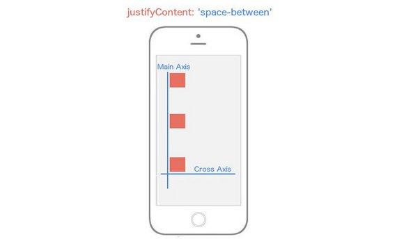](../assets/images/rn24.jpg)<br>
<span class="center bold">`justifyContent: space-between`</span>

`justifyContent: 'space-between'` will place flex items at both ends of Main Axis with space between the items.

```js
container: {
  flex: 1,
  justifyContent: 'space-between',
}
```

##### Justify Content: Space-Around

[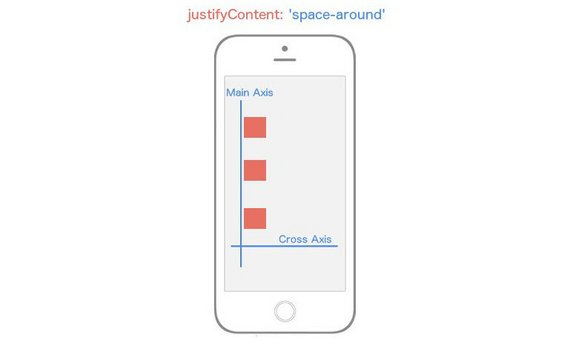](../assets/images/rn25.jpg)<br>
<span class="center bold">`justifyContent: space-around`</span>

`justifyContent: 'space-around'` will place flex items spaced equidistant along the Main Axis.

```js
container: {
  flex: 1,
  justifyContent: 'space-around',
}
```

Now think about what would happen if we changed the `flexDirection` of our container to `row` instead of the default value `column`.

Instead of our Main Axis being vertical, it's going to be horizontal. That means any child elements are going to align themselves horizontally rather than vertically.

```js
container: {
  flex: 1,
  flexDirection: 'row',
  justifyContent: 'space-around',
}
```

[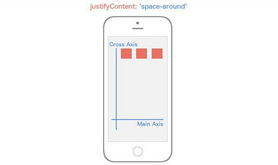](../assets/images/rn26.jpg)<br>
<span class="center bold">`flex-direction: row`</span>

Notice that all we changed was the value for `flexDirection`, and it drastically altered our layout. Now you're starting to see the real power of flexbox.

#### 3.2.4 Align Items (The Cross Axis)
Now let's turn our focus entirely to the Cross Axis. In order to specify how children align themselves along the Cross Axis, you'd use the `align-items` property.

You would think that `alignItems` has the exact same values as `justifyContent`. It's a reasonable guess, but you'd be wrong. This property has four different values you can use in order to change how the children align themselves among the Cross Axis.

- `flex-start`
- `center`
- `flex-end`
- `stretch`

##### Align Items - Flex-Start

[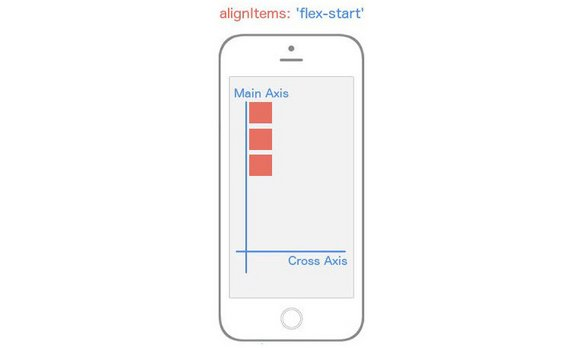](../assets/images/rn27.jpg)<br>
<span class="center bold">`alignItems: flex-start`</span>

`alignItems: 'flex-start'` will align every child element towards the start of the the Cross Axis. ​

```js
container: {
  flex: 1,
  alignItems: 'flex-start',
}
```

##### Align Items - Center

[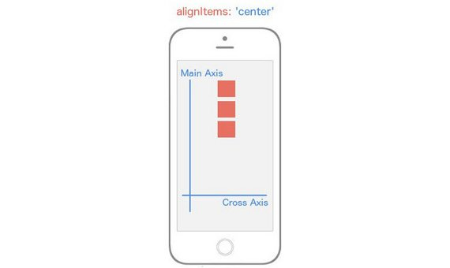](../assets/images/rn28.jpg)<br>
<span class="center bold">`alignItems: center`</span>

`alignItems: 'center'` will align every child element towards the center of the the Cross Axis. ​

```js
container: {
  flex: 1,
  alignItems: 'center',
}
```

##### Align Items - Flex-End

[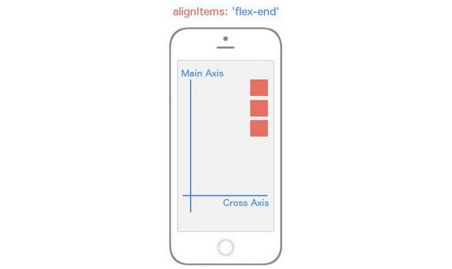](../assets/images/rn29.jpg)<br>
<span class="center bold">`alignItems: flex-end`</span>

`alignItems: 'flex-end'` will align every child element towards the end of the the Cross Axis. ​

```js
container: {
  flex: 1,
  alignItems: 'flex-end',
}
```

##### Align Items - Stretch

[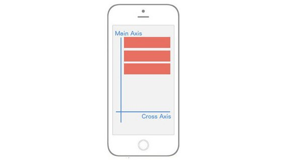](../assets/images/rn30.jpg)<br>
<span class="center bold">`alignItems: stretch`</span>

`alignItems: 'stretch'` will stretch every child element along the Cross Axis as long as the child element does not have a specified height (`flexDirection: row`) or width (`flexDirection: column`).

```js
container: {
  flex: 1,
  alignItems: 'stretch',
}
box: {
  height: 50,
  backgroundColor: '#e76e63',
  margin: 10,
}
```

Just when you thought you were getting the hang of it, flexbox throws a wrench in your brain. Whenever you set `alignItems` to `stretch`, each child element is going to stretch the full width or height of the parent container **as long as that child element doesn't have a width or a height**.

Notice in the box styling, I removed the `width: 50` because `flexDirection` is set to `column` by default meaning that flex items will be stretching horizontally (since we're using `alignItems`).

##### flexDirection: row & alignItems: stretch

[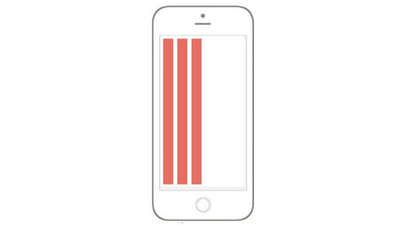](../assets/images/rn31.jpg)<br>
<span class="center bold">`flexDirection: row; alignItems: stretch`</span>

```js
const styles = StyleSheet.create({
  container: {
    flex: 1,
    alignItems: 'stretch',
    flexDirection: 'row',
  },
  box: {
    width: 50,
    backgroundColor: '#e76e63',
    margin: 10,
  }
})
```

Notice I've changed the `flexDirection` to `row`, and I've added back in `width: 50` and removed the `height: 50`.

Let's break this down. First, the Main Axis is now running horizontally since we added `flexDirection: row`. This means that `alignItems` will be aligning the items along the vertical axis. Because we've removed the height of the child elements and added `alignItems: stretch`, those elements are going to stretch along the vertical axis for the entire length of their parent component, which in this case is the whole view.

Up until this point, we've only had one flex container or parent element. Don't get it twisted though; if you create more nested flex containers, the exact same logic above is going to be true for those child elements (flex items) but instead of being relative to the whole view (as in our example), they'll position themselves according to the their parent component. Your entire UI will be built upon nesting flex containers.

At this point, you're essentially a red belt in React Native styling Karate. There are a few other flexbox features we need to look at, though.

You'll very quickly come to a realization that there are no percent-based styling in React Native. Though I agree it makes things a bit more difficult, everything you can do with percent-based styling you can do with flexbox. Remember the `flex: 1` declaration we used in all the examples above? That's the property that's going to allow us to do it. Interestingly enough there's no exact comparison for this feature in flexbox on the web, but it is similar to `flex-grow` if you know what that does.

As we've seen over and over, flexbox is concerned with giving control to the parent element to handle the layout of its children elements. The `flex` property is a bit different as it allows child elements to specify their height or width in comparison to their sibling elements. The best way to explain flex is to look at some examples.

##### Centering Content

[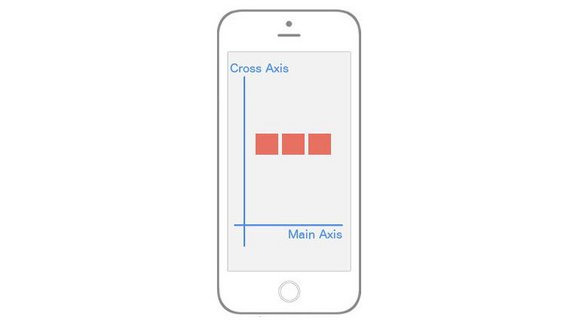](../assets/images/rn32.jpg)<br>
<span class="center bold">centering along both axes</span>

How would you implement that? Notice that our Main Axis is horizontal; this gives us a clue that we're using `flexDirection: row`. The boxes are in the center of both axes which means we're using `justifyContent: 'center'` and `alignItems: 'center'`.

```js
const styles = StyleSheet.create({
  container: {
    flex: 1,
    flexDirection: 'row',
    justifyContent: 'center',
    alignItems: 'center',
  },
  box: {
    width: 50,
    height: 50,
    backgroundColor: '#e76e63',
    margin: 10,
  }
})
```

##### The Flex Property

[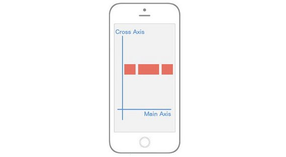](../assets/images/rn33.jpg)<br>
<span class="center bold">using `flex` property</span>

In the above image, it's exactly the same layout -- but now the middle section is twice as wide as its siblings! This is what the flex property allows us to do. Here’s the code:

```jsx
class FlexboxExamples extends Component {
  render() {
    return (
      <View style={styles.container}>
        <View style={[styles.box, {flex: 1}]}/>
        <View style={[styles.box, {flex: 2}]}/>
        <View style={[styles.box, {flex: 1}]}/>
      </View>
    )
  }
}

const styles = StyleSheet.create({
  container: {
    flex: 1,
    flexDirection: 'row',
    justifyContent: 'center',
    alignItems: 'center',
  },
  box: {
    width: 50,
    height: 50,
    backgroundColor: '#e76e63',
    margin: 10,
  }
})

export default FlexboxExamples;
```

Notice I didn't add any styles; I just made the middle sibling have `flex: 2` while the other siblings have `flex: 1`. This basically says "make sure that the middle sibling is twice as large along the Main Axis as the first and third children".

This is the reason why `flex` can replace percentages because usually a percent-based layout is just one where specific elements are relative to other elements, exactly like we're doing above. It's also important to note that if you place `flex: 1` on an element, that element is going to take up as much space as its parent takes up. That's why in most of our examples above because we want our "layout area" to be the size of the parent, which in our examples was the whole viewport.

##### Aligning Individual Flex Items

[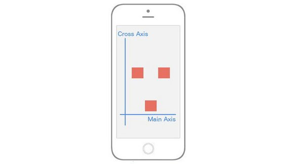](../assets/images/rn34.jpg)<br>
<span class="center bold">using `alignSelf` property</span>

It's as if the first and third element are centered both vertically and horizontally, but that second element has a mind of its own and is using `flex-end` along the Cross Axis.

To implement this, we'll need a way to have the child element override a specific positioning it received from its parent. Good news: that's exactly what `alignSelf` allows us to do!

Notice it begins with align, so just like `alignItems`, it's going to position itself along the Cross Axis. It also has the exact same options as `alignItems` (`flex-start`, `flex-end`, `center`, `stretch`).

The code to implement the image above is:

```jsx
class FlexboxExamples extends Component {
  render() {
    return (
      <View style={styles.container}>
        <View style={styles.box}/>
        <View style={[styles.box, {alignSelf: 'flex-end'}]}/>
        <View style={styles.box}/>
      </View>
    )
  }
}

const styles = StyleSheet.create({
  container: {
    flex: 1,
    flexDirection: 'row',
    justifyContent: 'center',
    alignItems: 'center',
  },
  box: {
    width: 50,
    height: 50,
    backgroundColor: '#e76e63',
    margin: 10,
  }
})

export default FlexboxExamples;
```

Note that all we've done is add `alignSelf: flex-end` to the second child element and that overrode what it was instructed to do by the parent (`alignItems: 'center'`).

If you've made it all the way through this, great work! I realize that was a lot to cover but I hope it's helped you get up and running with styling (and specifically flexbox) on React Native.

#### 3.2.5 Summary
React Native leverages a version of flexbox to build component layout. This is primarily due to flexbox's ability to provide consistent layouts across different screen sizes.

Flexbox containers comprise of two axes: a **main axis**, as well as a **cross axis**. Some of the more critical properties to consider when building layouts with flexbox include `flex-direction`, `justify-content`, and `align-items`. React Native's implementation of flexbox is a bit different, however. We'll see just how in the very next section!

### 3.3 Layout in React Native

[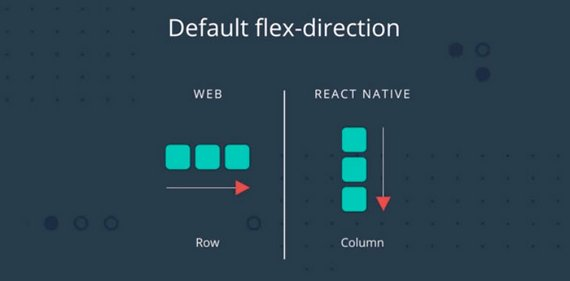](../assets/images/rn35.jpg)<br>
<span class="center bold">Default flex-direction</span>

#### 3.3.1 React Native's Flexbox Implementation
React Native implements flexbox for build layouts, but there are some key differences to keep in mind as you develop your applications. First, all containers in React Native are flex containers by default. Recall that in traditional CSS flexbox, you would normally define a flex container like so:

```js
/*example.css*/

.container {
  display: flex;
}
```

However, this is completely unnecessary in React Native! By default, everything is `display: flex`;. You can just use the defaults as they are, without adding different properties or writing extra code.

Another important distinction is how React Native handles `flex-direction`, a property that establishes the main axis (i.e., defining the direction in which flex items are placed). In web applications, items default to `row`. But since we're working on mobile devices, React Native sets the default to `column`, which lays out items vertically.

One more major difference you'll encounter is how the `flex` property is used. On the web, `flex` specifies how a flex item grows or shrinks to manage the space around it (along the main axis). In React Native, `flex` is generally used with flex items that are on the same level, but hold different `flex` values. For example:

```jsx
import React from 'react';
import { View } from 'react-native';

const FlexDemo = props => (
  <View style={{flex: 1}}>
    <View style={{flex: 1, backgroundColor: 'red'}} />
    <View style={{flex: 2, backgroundColor: 'green'}} />
    <View style={{flex: 3, backgroundColor: 'blue'}} />
  </View>
);

export default FlexDemo;
```

Here, `FlexDemo` is a stateless functional component which renders `<View>` components with different `flex` values. Its outermost container is set to `flex: 1`, which will expand the full available width along the main axis (i.e., the entire screen in this example). Its children `<View>` components will fill the space accordingly, rendering a `blue` background color that takes up three times as much space as `red` takes, and `green` that takes up exactly twice as much space as `red` takes.

[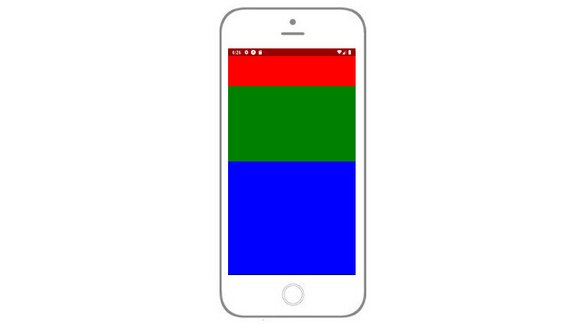](../assets/images/rn36.jpg)<br>
<span class="center bold">flex value container</span>

#### 3.3.2 Other Differences
In addition to the above, here is a list of defaults in other common CSS properties that React Native applies to components:

```css
box-sizing: border-box;
position: relative;
align-items: stretch;
flex-shrink: 0;
align-content: flex-start;
border: 0 solid black;
margin: 0;
padding: 0;
min-width: 0;
```

#### 3.3.3 Quiz Question
How does React Native's implementation of CSS flexbox differ from that on the web? Select all that apply:

- [x] Containers are flex containers by default in React Native (i.e. setting `display: flex` is not necessary)
- [x] In React Native, CSS properties are written in camelCase
- [ ] The defaults for `flex-direction` are the same in both React Native and on the web
- [x] Dimensions in React Native are unitless

#### 3.3.4 Icon Styling
Next we style the app icons.

[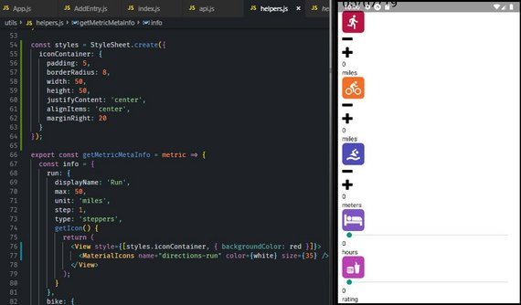](../assets/images/rn37.jpg)<br>
<span class="center bold">styled icons</span>

This is done in '/utils/helpers.js'.

```jsx
// helpers.js
import { View, StyleSheet } from 'react-native';
import { white, red, orange, blue, lightPurp, pink } from './colors';

const styles = StyleSheet.create({
  iconContainer: {
    padding: 5,
    borderRadius: 8,
    width: 50,
    height: 50,
    justifyContent: 'center',
    alignItems: 'center',
    marginRight: 20
  }
});

export const getMetricMetaInfo = metric => {
  const info = {
    run: {
      displayName: 'Run',
      max: 50,
      unit: 'miles',
      step: 1,
      type: 'steppers',
      getIcon() {
        return (
          <View style={[styles.iconContainer, { backgroundColor: red }]}>
            <MaterialIcons name="directions-run" color={white} size={35} />
          </View>
        );
      }
    },
    ...
  }
}
```

#### 3.3.5 App Layout

[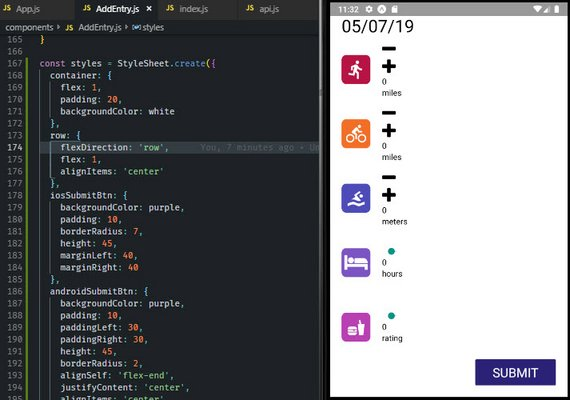](../assets/images/rn38.jpg)<br>
<span class="center bold">styled layout</span>

The next step was to update the layout in '/components/AddEntry.js'.

```jsx
import {
  View,
  Text,
  TouchableOpacity,
  Platform,
  StyleSheet
} from 'react-native';
import { white, purple } from '../utils/colors';

const SubmitBtn = ({ onPress }) => {
  return (
    <TouchableOpacity
      style={
        Platform.OS === 'ios' ? styles.iosSubmitBtn : styles.androidSubmitBtn
      }
      onPress={onPress}
    >
      <Text style={styles.submitBtnText}>SUBMIT</Text>
    </TouchableOpacity>
  );
};

class AddEntry extends Component {
  render() {
    const metaInfo = getMetricMetaInfo();

    if (this.props.alreadyLogged) {
      return (
        <View style={styles.center}>
          <Ionicons
            name={Platform.OS === 'ios' ? 'ios-happy' : 'md-happy'}
            size={100}
          />
          <Text>You already logged your information for today.</Text>
          <TextButton style={{ padding: 10 }} onPress={this.reset}>
            Reset
          </TextButton>
        </View>
      );
    }
    return (
      <View style={styles.container}>
        <DateHeader date={new Date().toLocaleDateString()} />
        {Object.keys(metaInfo).map(key => {
          const { getIcon, type, ...rest } = metaInfo[key];
          const value = this.state[key];

          return (
            <View key={key} style={styles.row}>
              {getIcon()}
              {type === 'slider' ? (
                <UdaciSlider
                  value={value}
                  onChange={value => this.slide(key, value)}
                  {...rest}
                />
              ) : (
                <UdaciStepper
                  value={value}
                  onIncrement={() => this.increment(key)}
                  onDecrement={() => this.decrement(key)}
                  {...rest}
                />
              )}
            </View>
          );
        })}
        <SubmitBtn onPress={this.submit} />
      </View>
    );
  }
}

const styles = StyleSheet.create({
  container: {
    flex: 1,
    padding: 20,
    backgroundColor: white
  },
  row: {
    flexDirection: 'row',
    flex: 1,
    alignItems: 'center'
  },
  iosSubmitBtn: {
    backgroundColor: purple,
    padding: 10,
    borderRadius: 7,
    height: 45,
    marginLeft: 40,
    marginRight: 40
  },
  androidSubmitBtn: {
    backgroundColor: purple,
    padding: 10,
    paddingLeft: 30,
    paddingRight: 30,
    height: 45,
    borderRadius: 2,
    alignSelf: 'flex-end',
    justifyContent: 'center',
    alignItems: 'center'
  },
  submitBtnText: {
    color: white,
    fontSize: 22,
    textAlign: 'center'
  },
  center: {
    flex: 1,
    justifyContent: 'center',
    alignItems: 'center',
    marginLeft: 30,
    marginRight: 30
  }
});
```

#### 3.3.6 UdaciStepper Style

[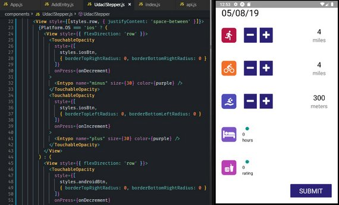](../assets/images/rn39.jpg)<br>
<span class="center bold">UdaciStepper style</span>

Next we update the stepper control located at '/components/UdaciStepper.js'.

```jsx
// UdaciStepper.js
import React, { Component } from 'react';
import PropTypes from 'prop-types';
import {
  Text,
  View,
  TouchableOpacity,
  Platform,
  StyleSheet
} from 'react-native';
import { FontAwesome, Entypo } from '@expo/vector-icons';
import { white, gray, purple } from '../utils/colors';

export default function UdaciStepper({
  max,
  unit,
  step,
  value,
  onIncrement,
  onDecrement
}) {
  return (
    <View style={[styles.row, { justifyContent: 'space-between' }]}>
      {Platform.OS === 'ios' ? (
        <View style={{ flexDirection: 'row' }}>
          <TouchableOpacity
            style={[
              styles.iosBtn,
              { borderTopRightRadius: 0, borderBottomRightRadius: 0 }
            ]}
            onPress={onDecrement}
          >
            <Entypo name="minus" size={30} color={purple} />
          </TouchableOpacity>
          <TouchableOpacity
            style={[
              styles.iosBtn,
              { borderTopLeftRadius: 0, borderBottomLeftRadius: 0 }
            ]}
            onPress={onIncrement}
          >
            <Entypo name="plus" size={30} color={purple} />
          </TouchableOpacity>
        </View>
      ) : (
        <View style={{ flexDirection: 'row' }}>
          <TouchableOpacity
            style={[
              styles.androidBtn,
              { borderTopRightRadius: 0, borderBottomRightRadius: 0 }
            ]}
            onPress={onDecrement}
          >
            <FontAwesome name="minus" size={30} color={white} />
          </TouchableOpacity>
          <TouchableOpacity
            style={[
              styles.androidBtn,
              { borderTopLeftRadius: 0, borderBottomLeftRadius: 0 }
            ]}
            onPress={onIncrement}
          >
            <FontAwesome name="plus" size={30} color={white} />
          </TouchableOpacity>
        </View>
      )}

      <View style={styles.metricCounter}>
        <Text style={{ fontSize: 24, textAlign: 'center' }}>{value}</Text>
        <Text style={{ fontSize: 18, color: gray }}>{unit}</Text>
      </View>
    </View>
  );
}

const styles = StyleSheet.create({
  row: {
    flex: 1,
    flexDirection: 'row',
    alignItems: 'center'
  },
  iosBtn: {
    backgroundColor: white,
    borderColor: purple,
    borderWidth: 1,
    borderRadius: 3,
    padding: 5,
    paddingLeft: 25,
    paddingRight: 25
  },
  androidBtn: {
    margin: 5,
    backgroundColor: purple,
    padding: 10,
    borderRadius: 2
  },
  metricCounter: {
    width: 85,
    justifyContent: 'center',
    alignItems: 'center'
  }
});
```

#### 3.3.7 UdaciSlider

[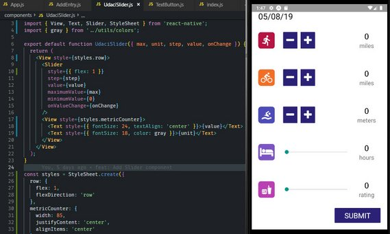](../assets/images/rn40.jpg)<br>
<span class="center bold">UdaciSlider style</span>

Next we update the slider control located at '/components/UdaciSlider.js'.

```jsx
// UdaciSlider.js
import React from 'react';
import PropTypes from 'prop-types';
import { View, Text, Slider, StyleSheet } from 'react-native';
import { gray } from '../utils/colors';

export default function UdaciSlider({ max, unit, step, value, onChange }) {
  return (
    <View style={styles.row}>
      <Slider
        style={{ flex: 1 }}
        step={step}
        value={value}
        maximumValue={max}
        minimumValue={0}
        onValueChange={onChange}
      />
      <View style={styles.metricCounter}>
        <Text style={{ fontSize: 24, textAlign: 'center' }}>{value}</Text>
        <Text style={{ fontSize: 18, color: gray }}>{unit}</Text>
      </View>
    </View>
  );
}

const styles = StyleSheet.create({
  row: {
    flex: 1,
    flexDirection: 'row'
  },
  metricCounter: {
    width: 85,
    justifyContent: 'center',
    alignItems: 'center'
  }
});
```

#### 3.3.8 TextButton

[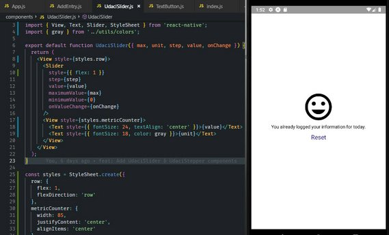](../assets/images/rn41.jpg)<br>
<span class="center bold">TextButton style</span>

Next we update the slider control located at '/components/TextButton.js'.

```jsx
// TextButton.js
import React from 'react';
import PropTypes from 'prop-types';
import { Text, TouchableOpacity, StyleSheet } from 'react-native';
import { purple } from '../utils/colors';

export default function TextButton({ children, onPress, style = {} }) {
  return (
    <TouchableOpacity onPress={onPress}>
      <Text style={[styles.reset, style]}>{children}</Text>
    </TouchableOpacity>
  );
}

const styles = StyleSheet.create({
  reset: {
    textAlign: 'center',
    color: purple,
    fontSize: 18
  }
});
```

### 3.4 Dimensions API
React Native also comes with [Dimensions](https://facebook.github.io/react-native/docs/dimensions.html), which allows you to select window's width and height in the user's device!

First, make sure you pull the API from React Native:

```js
import { Dimensions } from 'react-native';
```

Then, you can simply grab the window sizes with the Dimensions API's get method:

```js
const { width, height } = Dimensions.get('window');
```

Feel free to use these measurements to, for example, plan how your <View>s will look.

### 3.5 Calendar History

[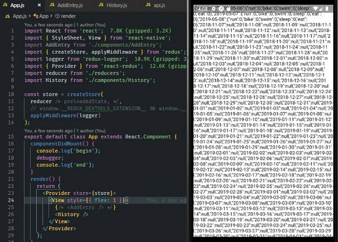](../assets/images/rn42.jpg)<br>
<span class="center bold">Raw API data</span>

Next I installed a logger to be able to tell what is happening with Redux.

```bash
npm i --save redux-logger
```

#### 3.5.1 Add Redux Logger
It required the following in '/App.js'.

```jsx
// App.js
import React from 'react';
import { StyleSheet, View } from 'react-native';
import AddEntry from './components/AddEntry';
import { createStore, applyMiddleware } from 'redux';
import logger from 'redux-logger';
import { Provider } from 'react-redux';
import reducer from './reducers';
import History from './components/History';

const store = createStore(
  reducer,
  applyMiddleware(logger)
);
export default class App extends React.Component {
  render() {
    return (
      <Provider store={store}>
        <View style={{ flex: 1 }}>
          {/* <AddEntry /> */}
          <History />
        </View>
      </Provider>
    );
  }
}
```

#### 3.5.2 Add API Method
The first thing we add is `formatCalendarResults` method into our api file. This happens in '/utils/api.js'.

```jsx
// api.js
import { AsyncStorage } from 'react-native';
import { CALENDAR_STORAGE_KEY, formatCalendarResults } from './_calendar';

export function fetchCalendarResults() {
  return AsyncStorage.getItem(CALENDAR_STORAGE_KEY).then(formatCalendarResults);
}
...
```

#### 3.5.3 Add Calendar History Component
Next we add the History component. This is located in '/components/History.js'.

```jsx
// History.js
import React, { Component } from 'react';
import { View, Text } from 'react-native';
import PropTypes from 'prop-types';
import { connect } from 'react-redux';
import { receiveEntries, addEntry } from '../actions';
import { timeToString, getDailyReminderValue } from '../utils/helpers';
import { fetchCalendarResults } from '../utils/api';

export class History extends Component {
  static propTypes = {
    dispatch: PropTypes.func.isRequired
  };
  componentDidMount() {
    const { dispatch } = this.props;

    fetchCalendarResults()
      .then(entries => dispatch(receiveEntries(entries)))
      .then(entries => {
        if (!entries[timeToString()]) {
          dispatch(
            addEntry({
              [timeToString()]: getDailyReminderValue()
            })
          );
        }
      });
  }
  render() {
    return (
      <View>
        <Text> {JSON.stringify(this.props)} </Text>
      </View>
    );
  }
}

const mapStateToProps = entries => ({ entries });

export default connect(mapStateToProps)(History);
```

### 3.6 Calendar Component

[](../assets/images/rn43.jpg)<br>
<span class="center bold">Calendar Control</span>

The fist thing to do is add the UdaciFitness Calendar Component.

```bash
npm i --save udacifitness-calendar
```

#### 3.6.1 Update History Component
Next we add the component to History. This is located in '/components/History.js'.

```jsx
// History.js
...
import UdaciFitnessCalendar from 'udacifitness-calendar';

export class History extends Component {
  ...
  renderItem = ({ today, ...metrics }, formattedDate, key) => (
    <View>
      {today ? (
        <Text>{JSON.stringify(today)}</Text>
      ) : (
        <Text>{JSON.stringify(metrics)}</Text>
      )}
    </View>
  );
  renderEmptyDate(formattedDate) {
    return (
      <View>
        <Text>No data for this day</Text>
      </View>
    );
  }
  render() {
    const { entries } = this.props;
    return (
      <UdaciFitnessCalendar
        items={entries}
        renderItem={this.renderItem}
        renderEmptyDate={this.renderEmptyDate}
      />
    );
  }
}
...
```

[](../assets/images/rn44.jpg)<br>
<span class="center bold">Calendar Control with data</span>

### 3.7 History Styling

[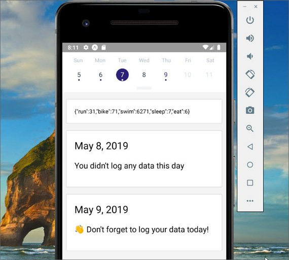](../assets/images/rn45.jpg)<br>
<span class="center bold">Styled entries</span>

The next thing we do is to style the history entries. This happens in '/components/History.js'.

```jsx
// History.js
import {
  View,
  Text,
  StyleSheet,
  Platform,
  TouchableOpacity
} from 'react-native';
import { white } from '../utils/colors';
import DateHeader from '../components/DateHeader';

export class History extends Component {
  renderItem = ({ today, ...metrics }, formattedDate, key) => (
    <View style={styles.item}>
      {today ? (
        <View>
          <DateHeader date={formattedDate} />
          <Text style={styles.noDataText}>{today}</Text>
        </View>
      ) : (
        <TouchableOpacity onPress={() => console.log('Pressed!')}>
          <Text>{JSON.stringify(metrics)}</Text>
        </TouchableOpacity>
      )}
    </View>
  );
  renderEmptyDate(formattedDate) {
    return (
      <View style={styles.item}>
        <DateHeader date={formattedDate} />
        <Text style={styles.noDataText}>You didn't log any data this day</Text>
      </View>
    );
  }
}

const styles = StyleSheet.create({
  item: {
    backgroundColor: white,
    borderRadius: Platform.OS === 'ios' ? 16 : 2,
    borderColor: 'lightgray',
    borderWidth: 1,
    borderStyle: 'solid',
    padding: 20,
    marginLeft: 10,
    marginRight: 10,
    marginTop: 17,
    justifyContent: 'center',
    shadowRadius: 3,
    shadowOpacity: 0.8,
    shadowColor: 'rgba(0,0,0,0.24)',
    shadowOffset: {
      width: 0,
      height: 3
    }
  },
  noDataText: {
    fontSize: 20,
    paddingTop: 20,
    paddingBottom: 20
  }
});
```

### 3.8 MetricCard Component

[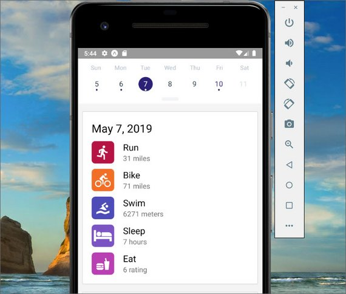](../assets/images/rn46a.jpg)<br>
<span class="center bold">MetricCard Component</span>

#### 3.8.1 MetricCard Component
Next we create a new component for displaying the metrics.  This is '/components/MetricCard.js'.

```jsx
// MetricCard.js
import React, { Component } from 'react';
import PropTypes from 'prop-types';
import { Text, StyleSheet, View } from 'react-native';
import DateHeader from './DateHeader';
import { getMetricMetaInfo } from '../utils/helpers';
import { gray } from '../utils/colors';

export default function MetricCard({ date, metrics }) {
  return (
    <View>
      {date && <DateHeader date={date} />}
      {Object.keys(metrics).map(metric => {
        const {
          getIcon,
          displayName,
          unit
        } = getMetricMetaInfo(metric);

        return (
          <View style={styles.metric} key={metric}>
            {getIcon()}
            <View>
              <Text style={{ fontSize: 20 }}>{displayName}</Text>
              <Text style={{ fontSize: 16, color: gray }}>
                {metrics[metric]} {unit}
              </Text>
            </View>
          </View>
        );
      })}
    </View>
  );
}

const styles = StyleSheet.create({
  metric: {
    flexDirection: 'row',
    marginTop: 12
  }
});

MetricCard.propTypes = {
  date: PropTypes.string,
  metrics: PropTypes.object.isRequired
};
```

#### 3.8.2 History Component
Next we add the MetricCard component into the History component.  This is '/components/History.js'.

```jsx
// History.js
...
import MetricCard from './MetricCard';

export class History extends Component {
  ...
  renderItem = ({ today, ...metrics }, formattedDate, key) => (
    <View style={styles.item}>
      {today ? (
        <View>
          <DateHeader date={formattedDate} />
          <Text style={styles.noDataText}>{today}</Text>
        </View>
      ) : (
        <TouchableOpacity onPress={() => console.log('Pressed!')}>
          <MetricCard date={formattedDate} metrics={metrics} />
        </TouchableOpacity>
      )}
    </View>
  );
  ...
}
```

#### 3.8.3 Loading Component
Next we add the AppLoading component. This happens in '/components/History.js'.

```jsx
// History.js
...
import { AppLoading } from 'expo';

export class History extends Component {
  ...
  state = {
    ready: false
  };
  componentDidMount() {
    const { dispatch } = this.props;

    fetchCalendarResults()
      .then(entries => dispatch(receiveEntries(entries)))
      .then(entries => {
        if (!entries[timeToString()]) {
          dispatch(
            addEntry({
              [timeToString()]: getDailyReminderValue()
            })
          );
        }
      })
      .then(() => this.setState({ ready: true }));
  }
  ...
  render() {
    const { entries } = this.props;
    const { ready } = this.state;

    if (ready === false) {
      return <AppLoading />;
    }

    return (
      ...
    )
  }
}
```

#### 3.8.4 Summary
React Native uses **flexbox** to manage layout in mobile applications. However, there are some minor distinctions between the official flexbox specification (i.e., CSS on the web) and React Native's own implementation. Most of these distinctions are just differences in default settings.

Since differences also exist in how Android and iOS applications should look and feel, React Native also offers a `Platform` API, which we can leverage to style each platform independently.

In the next section, we'll take a look at some common "gotchas" and best practices when styling components.

- [Understanding React Native flexbox layout](https://medium.com/the-react-native-log/understanding-react-native-flexbox-layout-7a528200afd4)
- [Platform Specific Code](https://facebook.github.io/react-native/docs/platform-specific-code.html) from the React Native docs

### 3.9 Stylesheet vs. Inline
Inline is simple but it can get messy quickly.

```jsx
// Inline styles
<View style={{
  borderRadius: 4,
  borderWidth: 0.5,
  borderColor: '#d6d7da',
}}>
  <Text style={[
    {fontSize: 19, fontWeight: 'bold'},
    props.isActive && { color: 'red' }
  ]}>
    Welcome
  </Text>
</View>
```

When we use `Stylesheet` we get the benefit of the code being easier to read and understand. It also allows us to name the styles.

```jsx
// Stylesheet API
var styles = StyleSheet.create({
  container: {
    borderRadius: 4,
    borderWidth: 0.5,
    borderColor: '#d6d7da',
  },
  title: {
    fontSize: 19,
    fontWeight: 'bold',
  },
  activeTitle: {
    color: 'red',
  },
});

<View style={styles.container}>
  <Text style={[styles.title, props.isActive && styles.activeTitle]} />
</View>
```

On top of quality benefits, there are also performance benefits as well. Making a stylesheet from a style object makes it possible to refer to it by ID instead of creating a new style object every render.

#### 3.9.1 Media Queries
One thing you may have noticed is that React Native (and specifically the StyleSheet API) doesn’t support media queries.

The reason for this is because, for the most part, you can design responsive grids with flexbox which will bypass the need to use media queries.

In the rare case where flexbox just won’t work for your specific needs, you can use the Dimensions API which we covered earlier to get similar results.

### 3.10 CSS in JS Libraries
Styling in React is going through a renaissance period right now. There are many different styling libraries popping up and each has different tradeoffs.

Two of the most popular are[Glamorous](https://github.com/robinpowered/glamorous-native) and [Styled Components](https://github.com/styled-components/styled-components).

The whole idea of both of these libraries is that styling is a primary concern of the component and because of that, should be coupled with the component itself.

[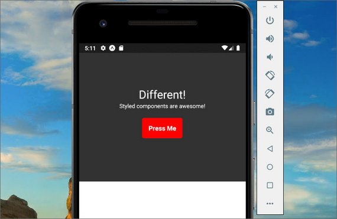](../assets/images/rn47.jpg)<br>
<span class="center bold">Style Components</span>

#### 3.10.1 Styled Components
Styled components uses ES6 template literal backtick. We are using this to contain our styles within our component.

```jsx
import React from 'react';
import { Text, View, TouchableOpacity } from 'react-native';
import styled from 'styled-components/native';

const CenterView = styled.View`
  flex: 1;
  align-items: center;
  justify-content: center;
  background: #333
`
const WelcomeText = styled.Text`
  color: white;
  font-size: 28;
`
const WelcomeBtn = styled.TouchableOpacity`
  width: 100px;
  height: 50px;
  background: red;
  border-radius: 5px;
  justify-content: center;
  align-items: center;
  font-size: 16;
  margin: 20px 0 0 0;
`
const WelcomeBtnText = styled.Text`
  font-size: 16;
  font-weight: bold;
  color: white;
`
const TextCopy = styled.Text`
  color: white
`

export default class App extends React.Component {
  render() {
    return (
      <View style={{flex:1}}>
        <CenterView>
          <WelcomeText>Different!</WelcomeText>
          <View>
            <TextCopy>Styled components are awesome!</TextCopy>
          </View>
          <WelcomeBtn onPress={() => alert('pressed!')}>
            <WelcomeBtnText>Press Me</WelcomeBtnText>
          </WelcomeBtn>
        </CenterView>
        <View style={{ flex: 1 }} />
      </View>
    );
  }
}
```

#### 3.10.2 Summary
In this section we took a deeper look into the benefits of the StyleSheet API as well as the Styled Components API and how it works on React Native.

## 4. Navigation
### 4.1 React Navigation

[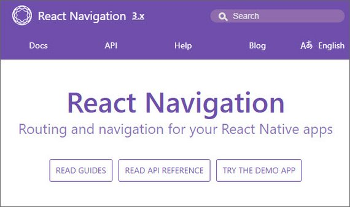](../assets/images/rn50.jpg)<br>
<span class="center bold">React Navigation</span>

In this lesson we'll learn about routing. There are many different solutions with different trade offs for React Native but the router that we're going to go with, is [React Navigation](https://reactnavigation.org/en/).

It was built by a team at Facebook and is the official routing solution for React Native.

React Navigation has gone through a few major revisions and is up to version 3.x now.

### 4.2 Routing with Native
[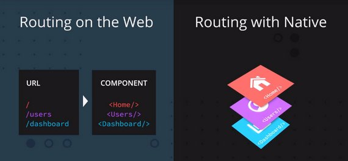](../assets/images/rn48.jpg)<br>
<span class="center bold">Routing with Native</span>

Routing on Native is a completely different paradigm than routing on the web. When you're routing on the web, typically what you're doing is you're mapping a URL to a specific component.

On Native, instead of mapping a URL to a component, the router keeps track of a route stack. You can think of it like an array of routes.

So when you navigate around your application, the router pushes and pops routes off the route stack.

### 4.3 Stack Navigator Test
The first thing I did was go through the [Fundamentals section of the React Navigation docs](https://reactnavigation.org/docs/en/getting-started.html).

[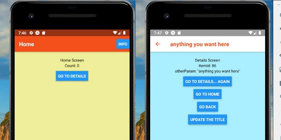](../assets/images/rn51.jpg)<br>
<span class="center bold">Home & Details Screens</span>

This showed me how to create a Home and Details screen with buttons that pushed and popped items off of the navigation stack.

```jsx
// HomeScreen.js
import React from 'react';
import { StyleSheet, Text, View, Button, Platform } from 'react-native';

class HomeScreen extends React.Component {
  static navigationOptions = {
    title: 'Home',
    headerRight: (
      <Button
        onPress={() => alert('This is a button!')}
        title="Info"
        color={Platform.OS === 'ios' ? '#fff' : null}
      />
    )
    headerStyle: {
      backgroundColor: '#f4511e'
    },
    headerTintColor: '#fff',
    headerTitleStyle: {
      fontWeight: 'bold'
    }
  };

  render() {
    return (
      <View style={[styles.container, { backgroundColor: '#ee9' }]}>
        <Text>Home Screen</Text>
        <Text>Count: {this.state.count}</Text>
        <View style={styles.btnContainer}>
          <Button
            title="Go to Details"
            onPress={() =>
              /* 1. Navigate to the Details route with params */
              this.props.navigation.navigate('Details', {
                itemId: 86,
                color: '#aef',
                otherParam: 'anything you want here'
              })
            }
          />
        </View>
      </View>
    );
  }
}
```

[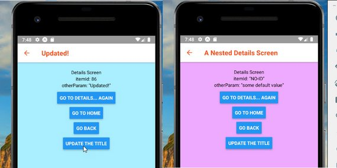](../assets/images/rn52.jpg)<br>
<span class="center bold">Details Screen</span>

```jsx
// DetailsScreen.js
import React from 'react';
import { StyleSheet, Text, View, Button, Platform } from 'react-native';

class DetailsScreen extends React.Component {
  static navigationOptions = ({ navigation, navigationOptions }) => {
    return {
      title: navigation.getParam('otherParam', 'A Nested Details Screen'),
      headerStyle: {
        backgroundColor: navigationOptions.headerTintColor
      },
      headerTintColor: navigationOptions.headerStyle.backgroundColor
    };
  };
  render() {
    /* 2. Get the param, provide a fallback value if not available */
    const { navigation } = this.props;
    const itemId = navigation.getParam('itemId', 'NO-ID');
    const color = navigation.getParam('color', '#fff');
    const otherParam = navigation.getParam('otherParam', 'some default value');

    return (
      <View
        style={[styles.container, styles.purple, { backgroundColor: color }]}
      >
        <Text>Details Screen</Text>
        <Text>itemId: {JSON.stringify(itemId)}</Text>
        <Text>otherParam: {JSON.stringify(otherParam)}</Text>
        <View style={styles.btnContainer}>
          <Button
            title="Go to Details... again"
            onPress={() => navigation.push('Details', { color: '#eaf' })}
          />
        </View>
        <View style={styles.btnContainer}>
          <Button
            title="Go to Home"
            onPress={() => navigation.navigate('Home')}
          />
        </View>
        <View style={styles.btnContainer}>
          <Button title="Go back" onPress={() => navigation.goBack()} />
        </View>
        <View style={styles.btnContainer}>
          <Button
            title="Update the title"
            onPress={() => navigation.setParams({ otherParam: 'Updated!' })}
          />
        </View>
      </View>
    );
  }
}
```

The Stack Navigator is then created with the following methods.

- createStackNavigator
- createAppContainer

```jsx
import React from 'react';
import { createStackNavigator, createAppContainer } from 'react-navigation';
import HomeScreen from './HomeScreen.js'
import DetailsScreen from './DetailsScreen.js'

const AppNavigator = createStackNavigator(
  {
    Home: HomeScreen,
    Details: DetailsScreen
  },
  {
    initialRouteName: 'Home',
    /* The header config from HomeScreen is now here */
    defaultNavigationOptions: {
      headerStyle: {
        backgroundColor: '#f4511e'
      },
      headerTintColor: '#fff',
      headerTitleStyle: {
        fontWeight: 'bold'
      }
    }
  }
);

const AppContainer = createAppContainer(AppNavigator);

export default class App extends React.Component {
  render() {
    return <AppContainer />;
  }
}
```

### 4.4 Tab Navigator
To introduce this new routing paradigm, let's take a look at React Navigation's tab navigator API.

In React Navigation v3.0 TabNavigator is deprecated in favor of `createBottomTabNavigator`.

`createMaterialTopTabNavigator` and `createMaterialBottomTabNavigator` are also available as options for Android. Please note that `createBottomTabNavigator` does not support the `animationEnabled` and `swipeEnabled` properties.

Let's see how we'd use Tab Navigator v3.

Say we have two basic functional components that just render some text, Hello and Goodbye:

```jsx
const Hello = () => (
  <View>
    <Text>Hello!</Text>
  </View>
);

const Goodbye = () => (
  <View>
    <Text>Goodbye!</Text>
  </View>
);
```

If we want to add two tabs for users to select (one rendering Hello, the other rendering Goodbye), first we'll need to install `react-navigation` and then import `createBottomTabNavigator`:

```bash
yarn add react-navigation
```

or

```bash
npm install --save react-navigation
```

Once this is done, we can pass an object into `createBottomTabNavigator` like so:

```jsx
import { createBottomTabNavigator } from 'react-navigation';

const Tabs = createBottomTabNavigator({
  Hello: {
    screen: Hello
  },
  Goodbye: {
    screen: Goodbye
  },
});
```

Inside the object, each key-and-value pair represents a single tab. The keys represent the name of the tab; this is what users will see and press. Note that a `screen` property is included as well; this is the component that is rendered when the tab is active.

Then what `createBottomTabNavigator` returns is actually a component! Since we have stored this in a `Tabs` variable, we can just render this as we would with any component:

```jsx
// App.js

// ...

export default class App extends React.Component {
  render() {
    return (
      <Tabs />
    );
  }
}
```

### 4.5 Implement Tabs
Next We'll add the tab navigation component to our Triathlon app.

[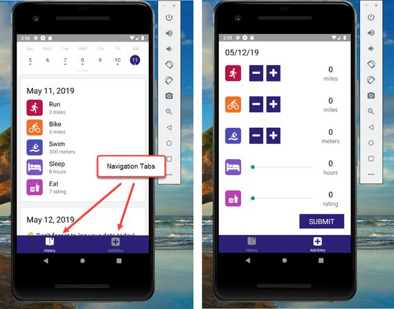](../assets/images/rn49.jpg)<br>
<span class="center bold">Tab Navigation</span>

#### 4.5.1 TabNavigator Component
This is created in '/navigation/TabNavigator.js'.

```jsx
// TabNavigator.js
import React from 'react';
import { Platform } from 'react-native';
import { createBottomTabNavigator } from 'react-navigation';
import History from '../components/History';
import AddEntry from '../components/AddEntry';
import { purple, white } from '../utils/colors';

export default createBottomTabNavigator(
  {
    History: History,
    AddEntry: AddEntry
  },
  {
    tabBarOptions: {
      activeTintColor: Platform.OS === 'ios' ? purple : white,
      style: {
        height: 56,
        backgroundColor: Platform.OS === 'ios' ? white : purple,
        shadowColor: 'rgba(0,0,0, 0.24)',
        shadowOffset: {
          width: 0,
          height: 3
        },
        shadowRadius: 6,
        shadowOpacity: 1
      }
    }
  }
);
```

#### 4.5.2 AppNavigator Component
This is created in '/navigator/AppNavigator.js'.

```jsx
// AppNavigator.js
import React from 'react';
import { createAppContainer } from 'react-navigation';
import TabNavigator from './TabNavigator';

export default createAppContainer(TabNavigator);
```

#### 4.5.3 History Component
This is located in 'components/History.js'.

```jsx
// History.js
...
import { AppLoading, Icon } from 'expo';

export class History extends Component {
  ...
  static navigationOptions = {
    tabBarLabel: 'History',
    tabBarIcon: ({ tintColor }) => (
      <Icon.Ionicons name="ios-bookmarks" size={30} color={tintColor} />
    )
  };
  ...
}
```

#### 4.5.4 AddEntry Component
This is located in 'components/AddEntry.js'.

```jsx
// AddEntry.js
...
import { Icon } from 'expo';

class AddEntry extends Component {
  ...
  static navigationOptions = {
    tabBarLabel: 'Add Entry',
    tabBarIcon: ({ tintColor }) => (
      <Icon.FontAwesome name="plus-square" size={30} color={tintColor} />
    )
  };
  ...
}
```

#### 4.5.5 App Component
This is located in '/App.js'.

```jsx
// App.js
...
import AppNavigator from './navigation/AppNavigator';

...
export default class App extends React.Component {
  render() {
    return (
      <Provider store={store}>
        <View style={styles.container}>
          <AppNavigator />
        </View>
      </Provider>
    );
  }
}
```

[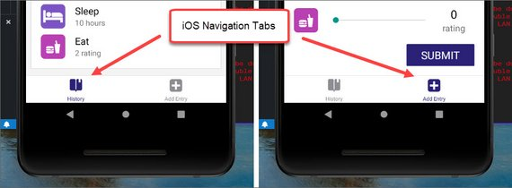](../assets/images/rn53.jpg)<br>
<span class="center bold">iOS Tab Navigation</span>

#### 4.5.6 Add Android Tabs
Next I added a separate set of config options for Android.

[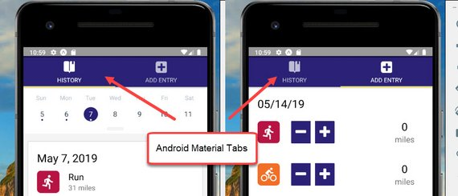](../assets/images/rn54.jpg)<br>
<span class="center bold">Material Tabs</span>

This is located at '/navigation/TabNavigator.js'.

```jsx
// TabNavigator.js
import React from 'react';
import { Platform } from 'react-native';
import { Icon } from 'expo';
import {
  createBottomTabNavigator,
  createMaterialTopTabNavigator
} from 'react-navigation';
import History from '../components/History';
import AddEntry from '../components/AddEntry';
import { purple, white } from '../utils/colors';

const isIOS = Platform.OS === 'ios' ? true : false;

const routeConfigs = {
  History: {
    screen: History,
    navigationOptions: {
      tabBarLabel: 'History',
      tabBarIcon: ({ tintColor }) => (
        <Icon.Ionicons
          name={isIOS ? 'ios-bookmarks' : 'md-bookmarks'}
          size={30}
          color={tintColor}
        />
      )
    }
  },
  AddEntry: {
    screen: AddEntry,
    navigationOptions: {
      tabBarLabel: 'Add Entry',
      tabBarIcon: ({ tintColor }) => (
        <Icon.FontAwesome name="plus-square" size={30} color={tintColor} />
      )
    }
  }
};

const tabNavigatorConfig = {
  navigationOptions: {
    header: null
  },
  defaultNavigationOptions: {
    bounces: true
  },
  tabBarOptions: {
    activeTintColor: isIOS ? purple : white,
    style: {
      height: isIOS ? 56 : 70,
      backgroundColor: isIOS ? white : purple,
      shadowColor: 'rgba(0,0,0, 0.24)',
      shadowOffset: {
        width: 0,
        height: 3
      },
      shadowRadius: 6,
      shadowOpacity: 1
    },
    labelStyle: {
      fontSize: isIOS ? 11 : 12
    },
    tabStyle: {
      marginTop: isIOS ? 0 : 5
    },
    showIcon: true
  }
};

const Tabs = isIOS
  ? createBottomTabNavigator(routeConfigs, tabNavigatorConfig)
  : createMaterialTopTabNavigator(routeConfigs, tabNavigatorConfig);

export default Tabs;
```

The last step was to remove the static `navigationOptions` methods from both AddEntry and History components.

#### 4.5.7 Quiz Question
What is true about the Tab Navigator?

- [ ] `createBottomTabNavigator` is provided by React Native.
- [x] The return value of `createBottomTabNavigator` is just a component that can be rendered like any other.
- [ ] Tab Navigator renders tabs that look identical in both Android and iOS.
- [x] Tab Navigator is fully customizable

### 4.6 StatusBar

[](../assets/images/rn55.jpg)<br>
<span class="center bold">Updated StatusBar</span>

Recall that so far, our application has been using arbitrary `padding` to account for the status bar at the top of the device's screen. Let's go ahead and change that! React Native actually provides a simple `StatusBar` component to customize how the status bar appears in an application.

Before we take a look at how to implement `StatusBar`, be sure to import it from `react-native`:

```bash
import { StatusBar } from 'react-native';
```

#### 4.6.1 StatusBar code
Next we update StatusBar in '/App.js'.

```jsx
// App.js
import React from 'react';
import PropTypes from 'prop-types';
import { StyleSheet, View, StatusBar } from 'react-native';
import { Constants } from 'expo';
import { purple } from './utils/colors';

...

function UdacityStatusBar({ backgroundColor, ...props }) {
  return (
    <View style={{ backgroundColor, height: Constants.statusBarHeight }}>
      <StatusBar translucent backgroundColor={backgroundColor} {...props} />
    </View>
  );
}
UdacityStatusBar.propTypes = {
  backgroundColor: PropTypes.string.isRequired
};

export default class App extends React.Component {
  render() {
    return (
      <Provider store={store}>
        <View style={styles.container}>
          <UdacityStatusBar backgroundColor={purple} barStyle="light-content" />
          <AppNavigator />
        </View>
      </Provider>
    );
  }
}

const styles = StyleSheet.create({
  container: {
    flex: 1
  }
});
```

### 4.7 Summary
React Navigation offers `createBottomTabNavigator` API that allows for navigation between different screens via individual tabs. Each tab is dedicated to rendering a specific component.

This section also detailed React Native's `StatusBar` component. `StatusBar` is relatively straightforward to use and is fully customizable -- we typically just set properties to change it!

In the next section, we'll take a look at React Navigator's Stack Navigator, which allows users to add and remove screens from a stack.

### 4.8 Stack Navigator
When pressing an item in an index view, we expect to go to a new screen with details on that item. React Navigation offers a navigator to do just that!

With a Stack Navigator, new screens are added and removed as a stack. This places screens on top of one another in a "last in, first out" manner, similar to Array's `push()` and `pop()` methods.

The way we create a Stack Navigator is to use the `createStackNavigator` method in which we pass in an object of different screens.

Here's a excerpt form the docs

> Each time you call push we add a new route to the navigation stack. When you call navigate, it first tries to find an existing route with that name, and only pushes a new route if there isn't yet one on the stack.
>
> Let's suppose that we actually want to add another details screen. This is pretty common in cases where you pass in some unique data to each route (more on that later when we talk about `params`). To do this, we can change `navigate` to `push`. This allows us to express the intent to add another route regardless of the existing navigation history.

#### 4.8.1 Stack Navigator Example
First, we import `createStackNavigator` from `react-navigation`. Say we have two basic components, Home and Dashboard:

```jsx
import { createStackNavigator } from 'react-navigation';

const Home = ({ navigation }) => (
  <View>
    <Text>This is the Home view</Text>
    <TouchableOpacity onPress={() => navigation.navigate('Dashboard')}>
      <Text>Press here for the Dashboard</Text>
    </TouchableOpacity>
  </View>
);

const Dashboard = () => (
  <View>
    <Text>This is the Dashboard</Text>
  </View>
);
```

Note that a `navigation` prop is passed to the stateless functional Home component, which allows navigation to another route.

Once this is done, we can pass an object into `createStackNavigator` similar to how we did for `createBottomTabNavigator`:

```jsx
const Stack = createStackNavigator({
  Home: {
    screen: Home
  },
  Dashboard: {
    screen: Dashboard
  }
})
```

The return value of passing an object into `createStackNavigator` is a component as well, and we can render it as such!

```jsx
// App.js

// ...

export default class App extends React.Component {
  render() {
    return (
      <Stack />
    );
  }
}
```

[Stack Navigator](https://reactnavigation.org/docs/en/stack-navigator.html) and [Tab Navigator](https://reactnavigation.org/docs/en/bottom-tab-navigator.html) often go hand-in-hand. Since they each return components, you'll often see one nested within the other. Let's see this in action as we implement this into UdaciFitness!

### 4.9 Add Stack/EntryDetail

[](../assets/images/rn57.jpg)<br>
<span class="center bold">EntryDetail Rest Button</span>

Now we're going to implement a Stack Navigator at the top level and then have our Tab Navigator as one of the items on the stack

#### 4.9.1 EntryDetail Component
We start by creating '/components/EntryDetail.js'

```jsx
// EntryDetail.js
import React, { Component } from 'react';
import { View, Text } from 'react-native';
import PropTypes from 'prop-types';

class EntryDetail extends Component {
  static propTypes = {
    navigation: PropTypes.object.isRequired
  };

  render() {
    return (
      <View>
        <Text>Entry Detail</Text>
        <Text>
          EntryId: {this.props.navigation.getParam('entryId', 'No Id')}
        </Text>
      </View>
    );
  }
}

export default EntryDetail;
```

#### 4.9.2 MainTabNavigator Navigation
Next we update TabNavigator.js to include a Stack Navigator. In addition, updated the name to MainTabNavigator.js to better reflect the component.

This is now '/navigation/MainTabNavigator.js'. The following is added.

```jsx
// MainTabNavigator.js
import {
  createBottomTabNavigator,
  createMaterialTopTabNavigator,
  createStackNavigator
} from 'react-navigation';
import EntryDetail from '../components/EntryDetail';

const Tabs = ...
...
const MainNavigator = createStackNavigator({
  Home: {
    screen: Tabs
  },
  EntryDetail: {
    screen: EntryDetail,
    navigationOptions: {
      headerTintColor: white,
      headerStyle: {
        backgroundColor: purple
      }
    }
  }
});

export default MainNavigator;
```

#### 4.9.3 AppNavigator Navigation
Then AppNavigator.js is updated to reference MainTabNavigator.js. This is in '/navigation/AppNavigator.js'.

```js
// AppNavigator.js
import React from 'react';
import { createAppContainer } from 'react-navigation';
import MainTabNavigator from './MainTabNavigator';

export default createAppContainer(MainTabNavigator);
```

#### 4.9.4 History Component
Lastly, we update the History Component so we can navigate to the EntryDetail.js screen when an entry is clicked from the History screen.

This is located at '/components/History.js'.

```jsx
// History.js

export class History extends Component {
  static propTypes = {
    dispatch: PropTypes.func.isRequired,
    entries: PropTypes.object.isRequired,
    navigation: PropTypes.object.isRequired
  };
  ...
  renderItem = ({ today, ...metrics }, formattedDate, key) => (
    <View style={styles.item}>
      {today ? (
        <View>
          <DateHeader date={formattedDate} />
          <Text style={styles.noDataText}>{today}</Text>
        </View>
      ) : (
        <TouchableOpacity
          onPress={() =>
            this.props.navigation.navigate('EntryDetail', { entryId: key })
          }
        >
          <MetricCard date={formattedDate} metrics={metrics} />
        </TouchableOpacity>
      )}
    </View>
  );
  ...
}

```

#### 4.9.5 Quiz Question
What is true about the Stack Navigator? Please select all that apply:

- [ ] Stack Navigator functions like a queue, implementing a "first in, first out" approach of managing screens.
- [ ] Stack Navigator cannot render the component returned by 'createBottomTabNavigator`; they must be used separately.
- [x] Stack Navigator animations render differently on Android and iOS.
- [x] Similar to the Tab Navigator, the Stack Navigator can also leverage `navigationOptions`.

#### 4.9.6 GetParam into AddEntry Header
Next we pull in the entryId into the header.

```jsx
// EntryDetail.js
...
class EntryDetail extends Component {
  ...
  static navigationOptions = ({ navigation }) => {
    const entryId = navigation.getParam('entryId', 'No Id');

    const year = entryId.slice(0, 4);
    const month = entryId.slice(5, 7);
    const day = entryId.slice(8);

    return {
      title: `${month}/${day}/${year}`
    };
  };
  ...
```

#### 4.9.7 Show MetricCard
Now we bring in MetricCard to the EntryDetails page.

```jsx
// EntryDetails.js
import React, { Component } from 'react';
import { View, Text, StyleSheet } from 'react-native';
import PropTypes from 'prop-types';
import { connect } from 'react-redux';
import { white } from '../utils/colors';
import MetricCard from '../components/MetricCard';

export class EntryDetail extends Component {
  static propTypes = {
    navigation: PropTypes.object.isRequired,
    metrics: PropTypes.object.isRequired,
    entryId: PropTypes.string.isRequired
  };
  ...

  render() {
    const { metrics, entryId } = this.props;

    return (
      <View style={styles.container}>
        <MetricCard metrics={metrics} />
        <Text>EntryId: {entryId}</Text>
      </View>
    );
  }
}

const styles = StyleSheet.create({
  container: {
    flex: 1,
    backgroundColor: white,
    padding: 15
  }
});

const mapStateToProps = (state, { navigation }) => {
  const entryId = navigation.getParam('entryId', 'No Id');

  return {
    entryId,
    metrics: state[entryId]
  };
};

export default connect(mapStateToProps)(EntryDetail);
```

[](../assets/images/rn56.jpg)<br>
<span class="center bold">EntryDetail screen</span>

#### 4.9.8 MapDispatchToProps on EntryDetail
Now we need to update the redux store and the database when a user clicks the RESET button.

```jsx
// EntryDetail.jsx
import { addEntry } from '../actions/index';
import { removeEntry } from '../utils/api';
import { timeToString, getDailyReminderValue } from '../utils/helpers';
import TextButton from '../components/TextButton';

export class EntryDetail extends Component {
  static propTypes = {
    navigation: PropTypes.object.isRequired,
    metrics: PropTypes.object,
    entryId: PropTypes.string.isRequired,
    remove: PropTypes.func.isRequired,
    goBack: PropTypes.func.isRequired
  };
  ...
  reset = () => {
    const { remove, goBack, entryId } = this.props;

    remove();
    goBack();
    removeEntry(entryId);
  };
  shouldComponentUpdate(nextProps) {
    return nextProps.metrics !== null && !nextProps.metrics.today;
  }
  render() {
    const { metrics, entryId } = this.props;

    return (
      <View style={styles.container}>
        <MetricCard metrics={metrics} />
        <TextButton onPress={this.reset} style={{ margin: 20 }}>
          RESET
        </TextButton>
      </View>
    );
  }
}

const mapDispatchToProps = (dispatch, { navigation }) => {
  const entryId = navigation.getParam('entryId');

  return {
    remove: () =>
      dispatch(
        addEntry({
          [entryId]: timeToString === entryId ? getDailyReminderValue() : null
        })
      ),
    goBack: () => navigation.goBack()
  };
};

export default connect(
  mapStateToProps,
  mapDispatchToProps
)(EntryDetail);
```

[](../assets/images/rn57.jpg)<br>
<span class="center bold">EntryDetail Rest Button</span>

#### 4.4.9 AddEntry Navigation
The last detail is to navigate back to the Home screen after adding an new entry from AddEntry.

```jsx
// AddEntry.js
...
import { withNavigation } from 'react-navigation';

...
class AddEntry extends Component {
  static propTypes = {
    alreadyLogged: PropTypes.bool,
    addEntry: PropTypes.func.isRequired,
    navigation: PropTypes.object
  };
  ...
  submit = () => {
    ...
    this.ToHome();
    ...
  };
  reset = () => {
    ...
    this.toHome();
    ...
  };
  toHome = () => {
    this.props.navigation.goBack();
  };
  ...
}

export default withNavigation(
  connect(
    mapStateToProps,
    { addEntry }
  )(AddEntry)
);
```

#### 4.9.10 Add Entry and Reset Entry Screens

[](../assets/images/rn58.jpg)<br>
<span class="center bold">Add Entry</span>

[](../assets/images/rn59.jpg)<br>
<span class="center bold">Reset Entry</span>

#### 4.9.11 Summary
React Navigation's Stack Navigator is another customizable navigation option based on adding and removing new screens to a stack. Its API is similar to that of the Tab Navigator; it takes in an object that defines all screens, then returns a component.

Since both the Stack Navigator and the Tab Navigator both return components, a common practice is to nest these navigators within one another.

In the next section, we'll take a look at the Drawer Navigator, in which screens are switched from a drawer that pops out from the side of the screen!

### 4.10 Drawer Navigator
React Navigation offers one more basic navigator to create custom navigation through React Native apps: the Drawer Navigator. While Tab Navigator uses tabs to help users navigate to specific screens, Drawer Navigator uses a drawer-like menu that slides in from the side of the screen.

While we won't be implementing this into UdaciFitness -- it's still important to know and fairly common in React Native applications!

```jsx
import { createDrawerNavigator } from 'react-navigation';

const Home = ({ navigation }) => (
  <View>
    <Text>This is the Home view</Text>
    <TouchableOpacity onPress={() => navigation.openDrawer()}>
      <Text>Press here to open the drawer!</Text>
    </TouchableOpacity>
  </View>
);

const Dashboard = ({ navigation }) => (
  <View>
    <Text>This is the Dashboard view</Text>
    <TouchableOpacity onPress={() => navigation.openDrawer()}>
      <Text>Press here to open the drawer!</Text>
    </TouchableOpacity>
  </View>
);
```

Note that rather than routing to another component, each TouchableOpacity wrapper opens the drawer.

Likewise, `navigation.closeDrawer()` can be used to close the drawer.

To simplify things, React Navigation also offers `navigation.toggleDrawer()` to automatically select which navigation is appropriate based on the current drawer state.

Similar to `createTabNavigator` and `createStackNavigator`, we can then pass an object into `createDrawerNavigator`, render the component returned, and we're all set!

```jsx
const Drawer = createDrawerNavigator({
  Home: {
    screen: Home
  },
  Dashboard: {
    screen: Dashboard
  }
});
```

```jsx
// App.js

// ...

export default class App extends React.Component {
  render() {
    return (
      <Drawer />
    );
  }
}
```

#### 4.10.1 Question 1 of 2
What is true about the Drawer Navigator? Please select all that apply:

- [x] Drawer Navigator's drawer generally spans the height of the screen.
- [x] The component returned by `createStackNavigator` can be nested inside a Drawer Navigator.
- [ ] Drawer Navigator is provided by 'react-native'.
- [ ] Unlike the Tab Navigator and the Stack Navigator, the Drawer Navigator does not return a component.

#### 4.10.2 Question 2 of 2

- Stack Navigator - Screens are rendered and placed on top of one another
- Tab Navigator - Screens are switched by using a tab bar
- Drawer Navigator - Screens are switched by a menu that slides in from the side

#### 4.10.3 Summary
React Navigation's Drawer Navigator is used to easily set up a screen with drawer navigation.

Many of the same practices we use to set up the Stack Navigator and the Tab Navigator apply to the Drawer Navigator as well. Simply pass in an object containing the different screens, and the return value is a component ready to be rendered.

As a result, this makes Drawer Navigator components easy for nesting with other navigators!

## 5. Native Features
The next thing we do is add a new tab to test Native features.

### 5.1 Add Live Tab

[](../assets/images/rn60.jpg)<br>
<span class="center bold">Live Tab</span>

#### 5.1.1 Live Component
This is located in '/components/Live.js'.

```jsx
// Live.js
import React, { Component } from 'react';
import { Text, View, ActivityIndicator } from 'react-native';

export default class Live extends Component {
  state = {
    coords: null,
    status: null,
    direction: ''
  };
  render() {
    const { coords, direction } = this.state;
    
    if (status === null) {
      return <ActivityIndicator style={{ marginTop: 30 }} />;
    }

    if (status === 'denied') {
      return (
        <View>
          <Text>Denied</Text>
        </View>
      );
    }

    if (status === 'undetermined') {
      return (
        <View>
          <Text>undetermined</Text>
        </View>
      );
    }

    return (
      <View>
        <Text>Live</Text>
        <Text>{JSON.stringify(this.state)}</Text>
      </View>
    );
  }
}
```

#### 5.1.2 Update MainTabNavigator
This is located at '/navigation/MainTabNavigator.js'.

```jsx
import Live from '../components/Live';

const routeConfigs = {
  ...
  Live: {
    screen: Live,
    navigationOptions: {
      tabBarLabel: 'Live',
      tabBarIcon: ({ tintColor }) => (
        <Icon.Ionicons
          name={isIOS ? 'ios-speedometer' : 'md-speedometer'}
          size={30}
          color={tintColor}
        />
      )
    }
  }
};

...
```

### 5.2 Geolocation
A common feature of native applications is the ability to access and receive updates about the user's current location. Like most things, Expo makes this rather straightforward by giving us a JavaScript API that will work on both iOS and Android.

```js
import { Location } from 'expo';
```

Typically when dealing with location services, there are one of two features you'll need: getting the user's current location, or getting and watching the user's current location for updates.

Expo's `Location` property gives us both of these options with `getCurrentPositionAsync` and `watchPositionAsync`.

- `getCurrentPositionAsync` gets the current location of the device, without watching for future updates.
- `watchPositionAsync` will also get the current location of the device, but it will also subscribe to location updates.

For the full documentation on how to use Expo's Location property, visit [Location](https://docs.expo.io/versions/v32.0.0/sdk/location/)

> ##### 💡 Geolocation Tips 💡
> Whenever you're dealing with a feature that requires the user's permission to work properly, it's important that you account for all the different UI options that could be shown. For example, when dealing with a user's location, there are three scenarios to manage:
>
> 1. The user gives you permission to view their location (best-case scenario).
> 2. The user decides to neither deny nor grant you permission to their location.
> 3. The user denies giving you access to their location.
>
> In an ideal world, the user would always grant you permission to whatever you'd like, but, this isn't always the case and as a UI developer, you need to plan accordingly for those moments.

#### 5.2.1 'Undetermined' Status

[](../assets/images/rn61.jpg)<br>
<span class="center bold">Undetermined Status</span>

Here we add code for testing if the user has given permission to use Geolocation. This happens in '/components/Live.js'.

```jsx
// Live.js
import React, { Component } from 'react';
import {
  Text,
  View,
  ActivityIndicator,
  TouchableOpacity,
  StyleSheet
} from 'react-native';
import { Icon } from 'expo';
import { purple, white } from '../utils/colors';

export default class Live extends Component {
  state = {
    coords: null,
    status: 'undetermined',
    direction: ''
  };
  askPermission = () => {
    alert('clicked');
  };
  render() {
    const { status, coords, direction } = this.state;

    ...

    if (status === 'undetermined') {
      return (
        <View style={styles.center}>
          <Icon.Foundation name="alert" size={50} />
          <Text>You need to enable location services for this app.</Text>
          <TouchableOpacity onPress={this.askPermission} style={styles.button}>
            <Text style={styles.buttonText}>Enable</Text>
          </TouchableOpacity>
        </View>
      );
    }

    ...
  }
}

const styles = StyleSheet.create({
  container: {
    flex: 1,
    justifyContent: 'space-between'
  },
  center: {
    flex: 1,
    justifyContent: 'center',
    alignItems: 'center',
    marginLeft: 30,
    marginRight: 30
  },
  button: {
    padding: 10,
    backgroundColor: purple,
    alignSelf: 'center',
    borderRadius: 5,
    margin: 20
  },
  buttonText: {
    color: white,
    fontSize: 20
  }
});
```

#### 5.2.2 'Denied' Status

[](../assets/images/rn62.jpg)<br>
<span class="center bold">Denied status</span>

This next bit of code we add is for 'denied' status.

```jsx
// Live.js
export default class Live extends Component {
  state = {
    coords: null,
    status: 'denied',
    direction: ''
  };

  render() {
    ...

    if (status === 'denied') {
      return (
        <View style={styles.center}>
          <Icon.Foundation name="alert" size={50} />
          <Text>
            You denied your location. You can fix this by visiting your settings
            and enabling location services for this app.
          </Text>
          <TouchableOpacity onPress={this.askPermission} style={styles.button}>
            <Text style={styles.buttonText}>Enable</Text>
          </TouchableOpacity>
        </View>
      );
    }
    ...
  }
}
```

#### 5.2.3 'Granted' Status

[](../assets/images/rn63.jpg)<br>
<span class="center bold">Granted status</span>

Next we add the UI for 'granted' status.

```jsx
// Live.js
...
export default class Live extends Component {
  state = {
    coords: null,
    status: 'granted',
    direction: ''
  };
  render() {
    ...
    return (
      <View style={styles.container}>
        <View style={styles.directionContainer}>
          <Text style={styles.header}>You&apos;re heading</Text>
          <Text style={styles.direction}>North</Text>
        </View>
        <View style={styles.metricContainer}>
          <View style={styles.metric}>
            <Text style={[styles.header, { color: white }]}>Altitude</Text>
            <Text style={[styles.subHeader, { color: white }]}>{200} Feet</Text>
          </View>
          <View style={styles.metric}>
            <Text style={[styles.header, { color: white }]}>Speed</Text>
            <Text style={[styles.subHeader, { color: white }]}>{300} MPH</Text>
          </View>
        </View>
      </View>
    );
  }
}

const styles = StyleSheet.create({
  ...
  directionContainer: {
    flex: 1,
    justifyContent: 'center'
  },
  header: {
    fontSize: 35,
    textAlign: 'center'
  },
  direction: {
    color: purple,
    fontSize: 120,
    textAlign: 'center'
  },
  metricContainer: {
    flexDirection: 'row',
    justifyContent: 'space-around',
    backgroundColor: purple
  },
  metric: {
    flex: 1,
    paddingTop: 15,
    paddingBottom: 15,
    backgroundColor: 'rgba(255,255,255, 0.1)',
    marginTop: 20,
    marginBottom: 20,
    marginLeft: 10,
    marginRight: 10
  },
  subHeader: {
    fontSize: 25,
    textAlign: 'center',
    marginTop: 5
  }
});
```

#### 5.2.4 Set Location

[](../assets/images/rn64.jpg)<br>
<span class="center bold">Set Location</span>

Next is the code that will actually show and set the location data.

```jsx
// Live.js
...
import { Location, Permissions } from 'expo';
import { calculateDirection } from '../utils/helpers';

export default class Live extends Component {
  ...
  componentDidMount() {
    Permissions.getAsync(Permissions.LOCATION)
      .then(({ status }) => {
        if (status === 'granted') {
          return this.setLocation();
        }

        this.setState({ status });
      })
      .catch(error => {
        console.warn('Error getting Location permission: ', error);
        this.setState({ status: 'undetermined' });
      });
  }
  askPermission = () => {
    alert('clicked');
  };
  setLocation = () => {
    Location.watchPositionAsync(
      {
        enableHighAccuracy: true,
        timeInterval: 1,
        distanceInterval: 1
      },
      ({ coords }) => {
        const newDirection = calculateDirection(coords.heading);
        const { direction } = this.state;

        this.setState(() => ({
          coords,
          status: 'granted',
          direction: newDirection
        }));
      }
    );
  };
  ...
}
```

#### 5.2.4 Ask Permission

[](../assets/images/rn65.jpg)<br>
<span class="center bold">Ask Permission</span>

Next is the code that will actually show and set the location data.

```jsx
// Live.js
export default class Live extends Component {
  state = {
    coords: null,
    status: null,
    direction: ''
  };
  ...
  askPermission = () => {
    Permissions.askAsync(Permissions.LOCATION)
      .then(({ status }) => {
        if (status === 'granted') {
          return this.setLocation();
        }

        this.setState({ status });
      })
      .catch(error => console.warn('Error asking Location permission:', error));
  };
  ...
  render() {
    ...
    return (
      <View style={styles.container}>
        <View style={styles.directionContainer}>
          <Text style={styles.header}>You&apos;re heading</Text>
          <Text style={styles.direction}>{direction}</Text>
        </View>
        <View style={styles.metricContainer}>
          <View style={styles.metric}>
            <Text style={[styles.header, { color: white }]}>Altitude</Text>
            <Text style={[styles.subHeader, { color: white }]}>
              {Math.round(coords.altitude * 3.2888)} Feet
            </Text>
          </View>
          <View style={styles.metric}>
            <Text style={[styles.header, { color: white }]}>Speed</Text>
            <Text style={[styles.subHeader, { color: white }]}>
              {(coords.speed * 2.2369).toFixed(1)} MPH
            </Text>
          </View>
        </View>
      </View>
    );
  }

```

#### 5.2.5 Quiz Question
Which of the following methods would you use to subscribe to the user's location using Expo? Select all that apply.

- [x] watchPositionAsync
- [ ] subscribePositionAsync
- [ ] watchPosition
- [ ] listenForPositionChangeAsync

#### 5.2.6 Summary
In this concept, we saw how to use Expo's Location property to watch the user's current location using watchPositionAsync. For further reading, feel free to check out the [official documentation](https://docs.expo.io/versions/v32.0.0/sdk/location/).
