<!-- markdownlint-disable MD022 MD024 MD032 MD033 -->
<!-- # React Nanodegree -->
# React & Redux

[<-- back to React Nanodegree homepage](../index.html)

<!--
### Links
#### Resources
- [Create Amazing Forms by Pete LePage](https://goo.gl/i0vY1M) - input types, datalist, labels, autocomplete attributes, autofill pitfalls, real-time validation

#### Samples
- [Slider sample](../exercises/wf4-9/index.html) - Uses both mouse and touch events -->

---

## 1. Managing State
### 1.1 Introduction
Welcome to Udacity's Redux course. The goal of this course is to help you learn how to more
effectively manage state in your applications. As a byproduct of that, you'll have to learn Redux along the way.

[](../assets/images/rr2.jpg)

Now, you may find this course a little slow. That's on purpose. The reason we're going to take it slow is because historically Redux is pretty difficult to learn.

The problem isn't necessarily Redux itself, but everything else that you typically pair with Redux.

What happens is traditionally when you learn Redux, you also learn it alongside

- React
- React-Router
- React-Redux bindings
- and a few other helper libraries

[](../assets/images/rr1.jpg)

This causes all sorts of issues because your brain has a hard time separating what's what.

To fix this, we're going to take a slow gradual approach.

1. We'll start off by looking at just Redux, nothing else.
2. Once you've mastered Redux itself, we'll add in some basic UI with just HTML and JavaScript.
3. Then, when you're feeling comfortable with hooking up Redux to a simple UI, we'll swap out that UI for React, and you'll learn how the two work together.
4. We'll then look at some common pain points when combining React and Redux, and we'll learn how the React-Redux bindings help solve these pain points.
5. Finally, we'll use Create React App to see how a real-world React and Redux app is built.

[](../assets/images/rr3.jpg)

Now, we're covering quite a lot, but remember we're going to take it slow and go step-by-step.

#### 1.1.1 Lesson Roadmap
Since Redux is not a topic for beginners and can be a daunting area to break into. We've broken down your path to learning Redux into the following lessons:

- Lesson 1 - Managing State
- Lesson 2 - UI + Redux
- Lesson 3 - Redux Middleware
- Lesson 4 - Redux with React
- Lesson 5 - Asynchronous Redux
- Lesson 6 - react-redux
- Lesson 7 - Real World Redux

##### Lesson 1 - Managing State
You’ll learn techniques to make your state more predictable by moving your state to a central location and establishing strict rules for getting, listening, and updating that state.

##### Lesson 2 - UI + Redux
You’ll learn to move away from having state live in the DOM by creating a vanilla JavaScript application whose state is managed entirely by Redux.

##### Lesson 3 - Redux Middleware
You’ll learn to create custom middleware and add it to your Redux store. This middleware will allow you to enhance your store by hooking into and intercepting actions before they reach any reducers.

##### Lesson 4 - Redux with React
You’ll learn how to add React to a Redux application and have the state of that application be managed by Redux.

##### Lesson 5 - Asynchronous Redux
You’ll learn to better abstract asynchronous events by creating your own custom Thunk middleware and adding it to your store.

##### Lesson 6 - react-redux
You’ll learn to leverage the react-redux bindings in order to leverage the benefits of a UI library like React and a state management library like Redux.

##### Lesson 7 - Real World Redux
You’ll take your knowledge of Redux and utilize it by building a real world Redux application. You’ll also learn advanced Redux topics like reducer composition and normalization.

### 1.2 The Store
Think about any application you've ever made. Most likely that app was composed of two things, UI and state.

Now, think of any bug you've ever had. Odds are that bug was caused by state mismanagement.
Your application was expecting the state to be one thing, but it was actually something else.

When your computer freezes and you have to restart it, that's because some state inside of your computer got to a weird place. By restarting it, you reset that state. When a website says you have a new notification, but you click on that and there's nothing new, that's because the state of the app was mismanaged.

As was said previously, the goal of this course is to make state management, on any app you build, more predictable. One of the best ways to improve the quality of the apps you build is to improve the predictability of the state in an application.

#### 1.2.1 App Data
A traditional app might look something like this:

[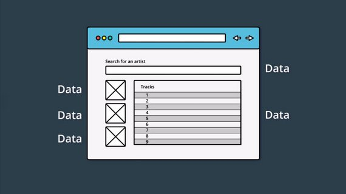](../assets/images/rr4.jpg)<br>
App data is sprinkled throughout the app.

Notice in the image above, that this simple application has a lot of state:

- There are the images in the sidebar on the left.
- There are rows of tracks in the main area.
- Each Track will have its own information that it's maintaining.
- There's the search field at the top that introduces new state to the app (the searched for artist/track information).

And this is just one, simple page of this application. In most sites you use, there is information littered throughout every single page of the entire app.

Remember that the main goal of Redux is to make the state management of an application more predictable. Let's see what that might look like:

[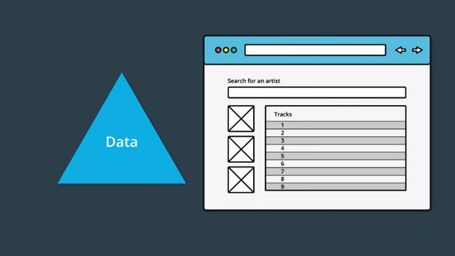](../assets/images/rr5.jpg)<br>
Application data is just referenced by the app.

In this example, the app appears exactly the same to the end user, however, it's functioning quite differently under the hood. All of the data is stored *outside of the UI code* and is just *referenced* from the UI code.

With a change like this, if the data needs to be modified at all, then all of the data is located in one place and needs to be only changed once. Then the areas of the app that are referencing pieces of data, will be updated since the source they're pulling from has changed.

#### 1.2.2 State Tree
One of the key points of Redux is that all of the data is stored in a single object called the state tree. But what does a state tree actually look like? Good question! Here's an example:

```text
{
  recipes: [
    { … },
    { … },
    { … }
  ],
  ingredients: [
    { … },
    { … },
    { … },
    { … },
    { … },
    { … }
  ],
  products: [
    { … },
    { … },
    { … },
    { … }
  ]
}
```

See how all of the data for this imaginary cooking site is stored in a single object? So all of the state (or "application data") for this site is stored in one, single location. This is what we mean when we say "state tree"...it's just all of the data stored in a single object.

Throughout this course, whenever we refer to an application's "state tree", we'll use a triangle to convey this concept.

[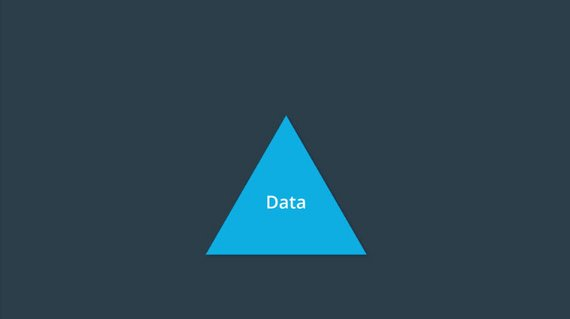](../assets/images/rr7.jpg)

Now that we've decided we're going to put all of our state into a single location called the state tree, the next thing we need to figure out, is how we'll actually interact with it.

If we're actually going to build a real application with our state tree, there are three ways in which we'll need to interface with it.

- First, we'll need a way of getting the state.
- Second, we'll need a way to listen for when the state changes.
- Third, we'll need a way to update the state.

Let's go ahead and wrap all of these things together into a single concept called the store.

[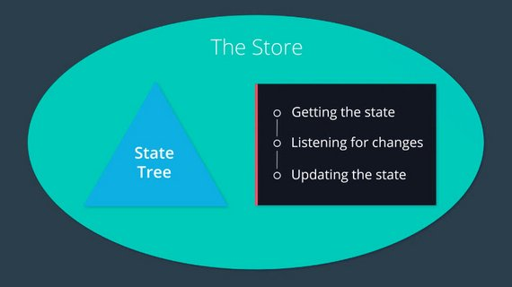](../assets/images/rr6.jpg)

So, when we talk about the store, we're talking about the state tree as well as three ways in which we'll interact with it

- Getting the state
- Listening for updates to the state
- Updating the state

#### 1.2.3 Quiz Question
What are the ways we can interact with the state tree?

- [x] Getting changes from the state
- [x] Listening for changes from the state
- [x] Updating the state

#### 1.2.4 Summary
Summary
In this lesson, we looked at the data in an application. We saw that in traditional apps, the data is mixed in with the UI and markup. This can lead to hard-to-find bugs where updating the state in one location doesn't update it in every location.

We learned that the main goal that Redux is trying to offer is predictable state management. The way that Redux tries to accomplish this is through having a *single state tree*. This state tree is an object that stores the entire state for an application. Now that all state is stored in one location, we discovered three ways to interact with it:

1. getting the state
2. listening for changes to the state
3. updating the state

Then we combine the three items above and the state tree object itself into one unit which we called *the store*. We'll look at creating this store in the next lesson.

### 1.3 Getting State & Listening for Changes
In this section, we'll be building the store. If you remember from the previous section, the store has the following information:

- the state tree
- a way to get the state tree
- a way to listen and respond to the state changing
- a way to update the state

[](../assets/images/rr6.jpg)

#### 1.3.1 Create Store from Scratch
So this is what we're going to do in this lesson - we're going to actually create the store code ourselves, from scratch.

In the following video, we'll start with a blank `index.js` file and create a factory function that creates store objects. Then we'll have the store keep track of the state, and we'll write the method to get the state from the store.

Pop open your code editor, and let's get started!

```js
function createStore() {
  // The store should have four parts
  // 1. The state
  // 2. Get the state
  // 3. Listen to changes on the state
  // 4. Update the state

  let state

  const getState = () => state;

  return {
    getState
  }
}
```

We started building out the `createStore` function. Currently, this factory function:

- takes in no arguments
- sets up a local (private) variable to hold the state
- sets up a `getState()` function
- returns an object that publicly exposes the `getState()` function

Let's take a look at the `getState()` function

> #### 1.3.2 Question 1 of 5
> Thinking about the code we just wrote, what does the `getState()` function do?
>
> - [ ] It modifies the existing state variable.
> - [ ] It logs who access the state variable.
> - [x] It returns the existing state variable
> - [ ] It formats the state object for easy parsing.

Our list of things we need to build for the store is shrinking:

- <strike>the state tree</strike>
- <strike>a way to get the state tree</strike>
- a way to listen and respond to the state changing
- a way to update the state

Our next task on the list is to make a way to listen for changes to the state.

```js
function createStore() {
  // The store should have four parts
  // 1. The state
  // 2. Get the state
  // 3. Listen to changes on the state
  // 4. Update the state

  let state;
  let listeners = [];

  const getState = () => state;

  const subscribe = listener => {
    listeners.push(listener);
  };

  return {
    getState,
    subscribe
  };
}
```

Here's an example of how we would use our `createStore()` function by creating two listeners.

```js
// Sample implementation
const store = createStore();
store.subscribe(() => {
  console.log('The new state is: ', store.getState());
})
store.subscribe(() => {
  console.log('The store changed');
})
```

Next we want to provide the user a way to unsubscribe for changes. We do this by returning a function that when invoked, filters out the listener from our array of listeners.

```js
function createStore() {
  // The store should have four parts
  // 1. The state
  // 2. Get the state
  // 3. Listen to changes on the state
  // 4. Update the state

  let state;
  let listeners = [];

  const getState = () => state;

  const subscribe = listener => {
    listeners.push(listener);
    return () => {
      listeners = listeners.filter(l => l !== listener);
    };
  };

  return {
    getState,
    subscribe
  };
}
```

Here's an example of how we would use our updated `createStore()` function with the same two listeners except now the second one is assigned to an `unsubscribe` constant that when invoked, removes the listener from the store.

```js
// Sample implementation
const store = createStore();
store.subscribe(() => {
  console.log('The new state is: ', store.getState());
})
const unsubscribe = store.subscribe(() => {
  console.log('The store changed');
})

unsubscribe();
```

> #### 1.3.3 Question 2 of 5
>
> Which of the following is true about `store.subscribe()`?
>
> - [x] It is a function.
> - [x] When called, it is passed a single function.
> - [ ] When called, it is passed multiple functions.
> - [ ] It modifies the internal state tree variable.
> - [ ] It invokes the function that was passed to it.
> - [ ] It returns an Array of listener functions.
> - [x] It returns a function.

let's review the functionality has so far.

- First, it contains the state,
- next, it has a `getState()` function, which just returns us the state,
- and finally,it has a subscribe function, which will let each of the listeners know whenever the state changes.

If you remember back to when we first talked about our store, there were four parts.

- [x] The state
- [x] getting the state
- [x] listening to changes on the state
- [ ] updating the state

As of right now, we have three of the four.

[](../assets/images/rr8.jpg)

So let's add in that fourth piece updating the state.

Now remember, the whole goal here is to increase the predictability of the state in our application. We can't just allow anything or anyone to update the state. If we did, that would drastically decrease predictability.

In fact, the only way in which we can increase predictability in terms of updating the state, is by establishing a strict set of rules for how updates can be made.

> #### NFL Analogy
> Let's look at an NFL team for example. In order for a team to maximize their chances of winning, they always have to be on the same page. They need to operate as one cohesive unit. Every miscommunication can and will lead to negative consequences.
>
> So in a sense, NFL teams have the same goals that we do. Increasing predictability. But how do they go about accomplishing this?
>
> Well, they create a Playbook, and each player must know it by heart. This way, when the team runs a play from the playbook, players will know exactly what each member of the team will be doing. Maximizing predictability.
>
> Can we take the same idea and apply it to our applications? Well, we can, and it's so fundamental that we'll call it rule number one to increasing predictability. Just like NFL teams have a collection of plays, we too can have a collection of events that can occur in our app which will change the state of our store.

We've got our first rule!

> Rule #1 - *Only an event can change the state of the store.*

Ok...well, without knowing what an "event" is, this rule is less than helpful :-\ Fear not, because we're going to look at what events are next:

#### 1.3.4 TO-DO Example
Previously, you were introduced to Rule #1 for increasing the predictability of state within the store: Have a collection of events that can occur in the application which will change the state of the store.

Now, what does this actually look like? Let's say we were building a to-do list app. One event that would change the state of the store would be when the user adds a new item to their to-do list.

[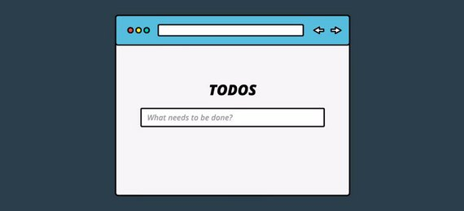](../assets/images/rr10.jpg)

How might we go about representing that as an event? What if we just use an object with a type property that describes the event taking place? So in our example, that object might look like this.

[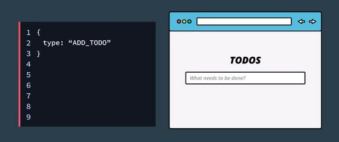](../assets/images/rr9.jpg)

It's just a plain object with a type property that indicates what type of event occurred.

Now, we could add any information we want into the event just by adding an additional property to the object. The add to-do event took place but what was the to-do that was actually added?

We can add a to-do property and include the to-do's name and information.

[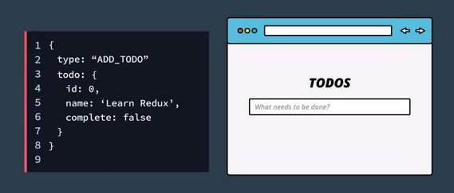](../assets/images/rr11.jpg)

If I delete that to do, what event might this be?

Well, I would probably label it a REMOVE_TODO event.

And how do we know which to do was removed?

We'll pass along the to-do items id.

[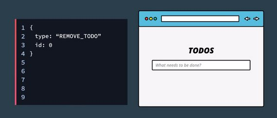](../assets/images/rr12.jpg)

Similarly, marking an item as "completed" would toggle its state. This event of toggling the state might include an id property along with the type property.

So, we have these objects that record the events that have happened. Let's give a name to these objects,
we'll call them "actions" because they're the type of actions which can occur in the app which will change the application state.

[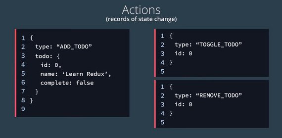](../assets/images/rr13.jpg)

Now, what if we wanted to add another feature to our app?

Let's say instead of just adding short-term to-do items, we also wanted the user to be able to add long-term goals.

The action for adding a goal might look something like this.

[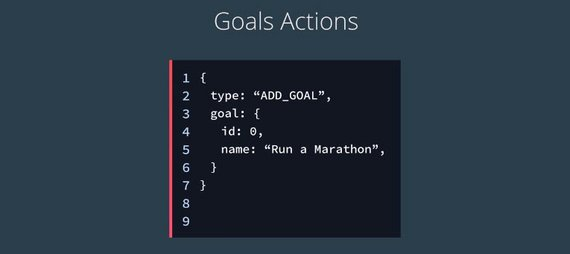](../assets/images/rr14.jpg)

Notice that the type property is ADD_GOAL, and a goal property is being passed along.

And just like deleting a to-do, we need an action to represent the event of deleting a goal.

[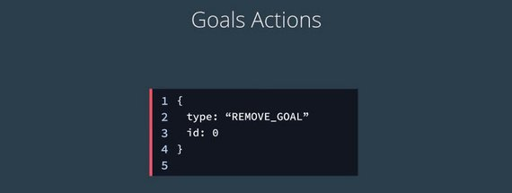](../assets/images/rr15.jpg)

See how descriptive that is? We will never be able to confuse this action with the removed to do actions.

All actions must have a type property. Now, what we've done is we've created a collection of all of the actions which can change the state of our app.

[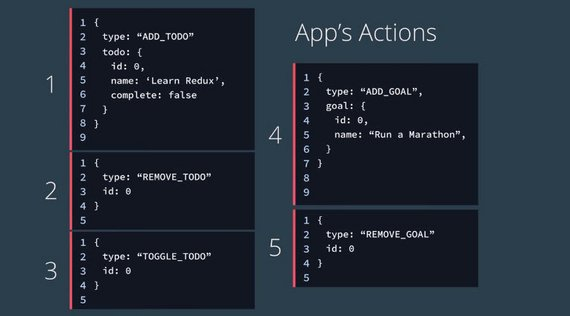](../assets/images/rr16.jpg)

If the state of our app changes, we'll know that one of those actions occurred.

#### 1.3.5 Shopping Cart Example
When an event takes place in a Redux application, we use a plain JavaScript object to keep track of what the specific event was. This object is called an **Action**.

Let's take another look at an Action:

```js
{
  type: "ADD_PRODUCT_TO_CART"
}
```

As you can see, an Action is clearly just a **plain JavaScript object**.

What makes this plain JavaScript object special in Redux, is that every Action must have a `type` property.

The purpose of the `type` property is to let our app (Redux) know *exactly* what event just took place. This Action tells us that a product was added to the cart. That's incredibly descriptive and quite helpful, isn't it?

Now, since an Action is just a regular object, we can include extra data about the event that took place:

```js
{
  type: "ADD_PRODUCT_TO_CART",
  productId: 17
}
```

In this Action, we're including the `productId` field. Now we know exactly which product was added to the store!

One more note to keep in mind as you build your Action objects: it's better practice to pass as little data as possible in each action. That is, prefer passing the index or ID of a product rather than the *entire product object* itself.

**Action Creators** are functions that create/return action objects. For example:

```js
// ES6
const addItem = item => ({
  type: ADD_ITEM,
  item
});
```

```js
// ES5
var addItem = function addItem(item) {
  return {
    type: ADD_ITEM,
    item: item
  };
};
```

> #### 1.3.6 Question 3 of 5
>
> Is it true that *every* Action must have a `type` property?
>
> - [x] Yes - Redux will throw an error if missing
> - [ ] No

> #### 1.3.7 Question 4 of 5
>
> Can an Action have three or more fields?
>
> - [x] Yes - There's no limit but it's best to keep objects as light as possible
> - [ ] No

> #### 1.3.8 Question 5 of 5
> Consider each
>
> ```js
> // A
> const receivePost = post => ({
>   type: RECEIVE_POST,
>   post
> });
> ```
>
> ```js
> // B
> const receivePost = post => ({
>   type: RECEIVE_POST,
>   post: post
> });
> ```
>
> ```js
> // C
> const clearErrors = {
>   type: CLEAR_ERRORS
> };
> ```
>
> ```js
> // D
> const addSeven = {
>   type: 'ADD_NUMBER',
>   number: 7
> };
> ```
>
> ```js
> // E
> const removeComments = {
>   comments: null
> };
> ```
>
> Which of the above are valid actions?
>
> - [x] A
> - [x] B
> - [ ] C
> - [ ] D
> - [ ] E

#### 1.3.9 Summary
In this section, we started creating our store by building out a `createStore()` function. So far, this function keeps track of the state, and provides a method to get the state and one to keep track of listener functions that will be run whenever the state changes.

In the next section, we'll add a method to handle updating the state.

### 1.4 Updating State
Let's step back one more time and think about what Redux is all about. The whole goal of Redux is to increase predictability:

> *Redux is a predictable state container for JavaScript apps.*

With this in mind, let's see dig into how we can use actions and our state tree to predictably manage an application's state.

We have the entire state of the application in the state tree. We also know about every action that can change the application state. So we have these two distinct pieces of data, but we need something to tie them together.

[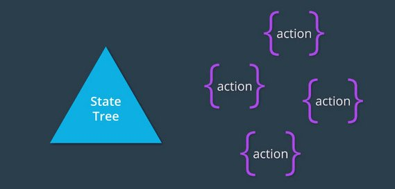](../assets/images/rr17.jpg)

Meaning, we need a way to update our state based on the current action which occurred.

What if we just used a function to do this? We could have that function taking two arguments,
the current state, and the action which occurred. Then, based off of that action, this function would be responsible for returning the new updated state.

[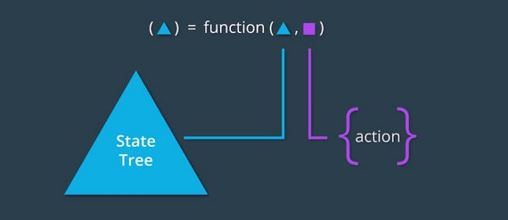](../assets/images/rr18.jpg)

That sounds pretty good but we can't forget that the whole goal here is predictability. This function has to be as predictable as possible. But, what does that actually mean?

We should be able to know what the return value will be of the function based on the input values.

Now this sounds complicated but it turns out that the functional programming community has
already solved this problem and they've given it a name. It's called pure functions.

This brings us to rule number two for increasing predictability.

> *The function that returns the new state needs to be a pure function.*

So far, our rules are:

1. Only an event can change the state of the store.
2. The function that returns the new state needs to be a pure function.

A [pure function](https://en.wikipedia.org/wiki/Pure_function) can be a bit theoretical, so we'll take it step by step and explain why a pure function is so powerful and how it helps improve predictability.

#### 1.4.1 What are Pure Functions
[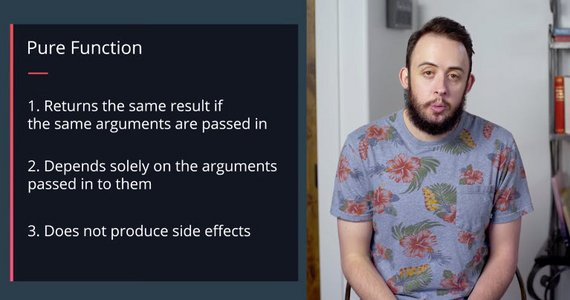](../assets/images/rr19.jpg)

**Pure functions** are integral to how state in Redux applications is updated. By definition, pure functions:

1. Return the same result if the same arguments are passed in
2. Depend solely on the arguments passed into them
3. Do not produce side effects, such as API requests and I/O operations

Let’s check out an example of a pure function, `square()`:

```js
// `square()` is a pure function

const square = x => x * x;
```

`square()` is a pure function because it outputs the same value every single time, given that the same argument is passed into it. There is no dependence on any other values to produce that result, and we can safely expect *just* that result to be returned -- no side effects (more on this in a bit!).

On the other hand, let’s check out an example of an *impure* function, `calculateTip()`:

```js
// `calculateTip()` is an impure function

const tipPercentage = 0.15;

const calculateTip = cost => cost * tipPercentage;
```

`calculateTip()` calculates and returns a number value. However, it relies on a variable (`tipPercentage`) that lives outside the function to produce that value. Since it fails one of the requirements of pure functions, `calculateTip()` is an impure function. However, we could convert this function to a pure function by passing in the outside variable, `tipPercentage`, as a second argument to this function!

```js
const calculateTip = (cost, tipPercentage = 0.15) => cost * tipPercentage;
```

#### 1.4.2 Why Pure Functions Are Great
For our purposes, the most important feature of a pure function is that it's predictable. If we have a function that takes in our state and an action that occurred, the function should (if it's pure!) return the exact same result *every single time*.

You're going to be sick of this by the end ;-) but this course (and Redux!) are all about predictability!

> #### 1.4.3 Question 1 of 4
> What is true about pure functions? Check all that apply.
>
> - [x] Pure functions do not rely on information other than the arguments passed in to them to generate an outputs
> - [ ] Pure functions can produce different outputs even with the same arguments passed in each time.
> - [x] Pure functions do not depend on external state
> - [ ] Pure functions are expected to modify shared state
> - [ ] Pure functions should modify the original arguments passed into them

> #### 1.4.4 Question 2 of 4
> Which of the following are pure functions? Please check all that apply:
>
> - [ ]
>   ```js
>   Math.random();
>   ```
> - [x]
>   ```js
>   const add = (a, b) => (
>     a + b
>   );
>   ```
> - [ ]
>   ```js
>   Date.now();
>   ```
> - [ ]
>   ```js
>   const addAndPrint = (a, b) => (
>     const sum = a + b;
>     console.log(`The sum is : ${sum}`);
>     return sum;
>   );
>   ```
> - [x]
>   ```js
>   const double = array => (
>     let doubleArray = [];
>     array.forEach(n => doubleArray.push(n * 2));
>     return doubleArray;
>   );
>   ```

#### 1.4.5 Todos App
Now, back in our Todos app, what we need is a way update the internal state of our store based on the specific action that occurred.

The way we do this is by creating a function (called a reducer) that takes two arguments.

- state - which is the internal state inside our store
- action - an object with a `type` property that describes the action.

[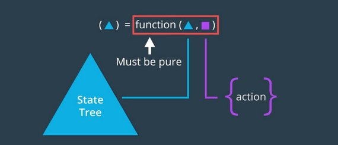](../assets/images/rr20.jpg)

For this to work properly the function needs to be a pure function. This means that it cannot directly mutate any of the data in the state object or array.

The function takes the state and the action and then returns a new copy of state with any changes made.

Our reducer will be called `todos` since this is a Todos app. It will listen for a specific event type and then create a new state object which it returns in response to that event. If no match is made it returns the state unchanged.

```js
// reducer
function todos(state = [], action) {
  if (action.type === 'ADD_TODO') {
    return state.concat([action.todo]);
  }

  return state;
}
```

In this case we add the todo item directly onto our state array using the `concat` method which is a non-mutating method. It returns a new array.

Here is how we would call the todos reducer function and what the arguments would consist of.

```js
// state array & action object
state = [];
action = {
  type: 'ADD_TODO',
  todo: { id: 0, name: 'Learn Redux', completed: false }
};

// call to reducer
const newState = todos(state, action);
console.log(newState); // [ { id: 0, name: 'Learn Redux', completed: false } ]
```

So, this gives us a preview into how we will be updating the state from our `createStore` function.

Now all we need to do is invoke our todos function (parsing current state as well as the action that occurred) to get the new state.

One other thing to note is that we are using ES6's new default value for state. This is in case we don't have a state object it will start out as an empty array.

This function is called a reducer because it follows the Array.prototype.reduce format of taking the state, an action, and then reducing that to a brand new state.

So, going back to this visual, the function here is a reducer since it takes in the state and an action, and returns the new state.

[](../assets/images/rr20.jpg)

> A reducer must ALWAYS be a pure function.

#### 1.4.6 Reducer Quiz
This quiz was crazy. It required reading the [Reducers section of the Redux docs](https://redux.js.org/basics/reducers) in order to figure out.

Here's the instructions.

```js
/* Create A Reducer
 *
 * You need to create a reducer called "appReducer" that accepts two arguments:
 * - First, an array containing information about ice cream
 * - Second, an object with a 'DELETE_FLAVOR' `type` key
 * (i.e., the object contains information to delete the flavor from the state)
 *
 * The action your reducer will receive will look like this:
 * { type: 'DELETE_FLAVOR', flavor: 'Vanilla' }
 *
 * And the initial state will look something like this:
 * [{ flavor: 'Chocolate', count: 36 }, { flavor: 'Vanilla', count: 210 }];
 */
```

Given that we have the following:

- state: `[{ flavor: 'Chocolate', count: 36 }, { flavor: 'Vanilla', count: 210 }]`
- action: `{ type: 'DELETE_FLAVOR', flavor: 'Vanilla' }`

Create a reducer that will return the new state.

```js
function appReducer(state, action) {
  if (typeof state === 'undefined') {
    return [];
  }
  if (action.type === 'DELETE_FLAVOR') {
    return Object.assign(
      [],
      state,
      state.map(iceCream => {
        if (iceCream.flavor === action.flavor) {
          return Object.assign({}, iceCream, {
            count: iceCream.count - 1
          });
        }
        return iceCream;
      })
    );
  }
  return state;
}
```

This uses [Object.assign()](https://developer.mozilla.org/en-US/docs/Web/JavaScript/Reference/Global_Objects/Object/assign) to create a new object/array (1st parameter) by copying the previous state (2nd parameter) and overwriting any keys/values/objects with the third & subsequent parameters.

The method signature is:

> Object.assign(*target*, *...sources*)

Each subsequent source will overwrite the previous source. Also, this only performs a shallow copy. If the source value is a reference to an object, it only copies that reference value.

For deep cloning we must use an alternate method such as:

- `let obj3 = JSON.parse(JSON.stringify(obj1));`.

#### 1.4.7 Todos App continued
Reviewing what we have so far, there are three parts to the app.

[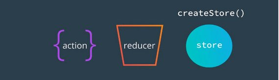](../assets/images/rr21.jpg)

- The actions represent the different events that will change the state of our store.
- The reducer is a function which takes in the current state and an action which occurred, and returns the new state.
- createStore is responsible for creating the actual store.

If you remember back to our implementation of createStore, so far we have three of the four parts.

- [x] State Tree - as a `state` variable
- [x] Getting the state - we have a `getState` function
- [x] Listening for changes - we have a `subscribe` function
- [ ] Updating the state

The last part we need to figure out, is how to update the state. To do that, we'll create a new function called `dispatch`.

`dispatch` will be responsible for updating the state inside of our actual store.

To do that it needs to receive the action which is going to tell dispatch the specific event that occurred inside of the application.

```js
  const dispatch = action => {
    state = todos(state, action);
    listeners.forEach(listener => listener());
  };
```

Now, with access to the state and to the action that occurred, `dispatch` can call our `todos` function passing it state and action and assign the result back to the state variable.

Next, because we just modified the state, we loop through the array of listener functions and invoke each one.

So, now whenever the user wants to update the state internally inside of our store, what they do is invoke dispatch, passing it the specific action which occurred.

> #### 1.4.8 Question 4 of 4
> Match the following store methods.
>
> | Functionality | Store Method |
> | --- | --- |
> | gets the current state | .getState() |
> | takes in functions that will be called when the state changes | .subscribe() |
> | the application's state | the state tree |
> | modifies the state | .dispatch() |

#### 1.4.9 Todos App add reducer function
We will now organize our app to better reflect the separation between library code and app code.

Library code would be our `createStore()` function and App code would be our `todos` function. We need to pass this function in to `createStore()`.

Here's what that would look like.

```js
// Library code
function createStore(reducer) {
  // The store should have four parts
  // 1. The state
  // 2. Get the state
  // 3. Listen for changes on the state
  // 4. Update the state

  let state;
  let listeners = [];

  const getState = () => state;

  const subscribe = listener => {
    listeners.push(listener);
    return () => {
      listeners = listeners.filter(l => l !== listener);
    };
  };

  const dispatch = action => {
    state = reducer(state, action);
    listeners.forEach(listener => listener());
  };

  return {
    getState,
    subscribe,
    dispatch
  };
}
```

Here's what the App code would look like.

```js
// App code
function todos(state = [], action) {
  if (action.type === 'ADD_TODO') {
    return state.concat([action.todo]);
  }

  return state;
}

const store = createStore(todos);
```

The new `dispatch()` method is pretty small, but is vital to our functioning store code. To briefly recap how the method functions:

- `dispatch()` is called with an Action
- the reducer that was passed to `createStore()` is called with the current state tree and the action... this updates the state tree
- because the state has (potentially) changed, all listener functions that have been registered with the `subscribe()` method are called

#### 1.4.10 Summary
In this section, we learned about a number of important points about Redux.

We learned about

- pure functions
- a Reducer function (which, itself, needs to be a pure function)
- dispatching changes in our store
- identifying which parts of our code are generic library code and which are specific to our app

### 1.5 Dispatching an Action
We now have the four parts of our store

- [x] Internal state
- [x] A way to get the state
- [x] Listen for changes on the state
- [x] Update the state

We also have a reducer function (`todos`) which specifies how the state will change based on the action that has ocurred in the application.

```js
// Library code
function createStore(reducer) {
  let state;
  let listeners = [];

  const getState = () => state;

  const subscribe = listener => {
    listeners.push(listener);
    return () => {
      listeners = listeners.filter(l => l !== listener);
    };
  };

  const dispatch = action => {
    state = reducer(state, action);
    listeners.forEach(listener => listener());
  };

  return {
    getState,
    subscribe,
    dispatch
  };
}

// App code (reducer)
function todos(state = [], action) {
  if (action.type === 'ADD_TODO') {
    return state.concat([action.todo]);
  }

  return state;
}
```

Now we can create the store with the following.

```js
// Create the store
const store = createStore(todos);

// subscribe to the listener
store.subscribe(() => {
  console.log('The new state is: ', store.getState());
});

// dispatch an action
store.dispatch({
  type: 'ADD_TODO',
  todo: { id: 0, name: 'Learn Redux', complete: false }
});
```

We pass our reducer to createStore, subscribe a listener to be notified of change events, and dispatch an action.

What's cool is now we can call dispatch as many times as we want. We do so by passing in the type and a new todo item which is added to the state.

So whenever we want to update the state of our store, all we need to do now is call dispatch add pass it the action which occurred.

[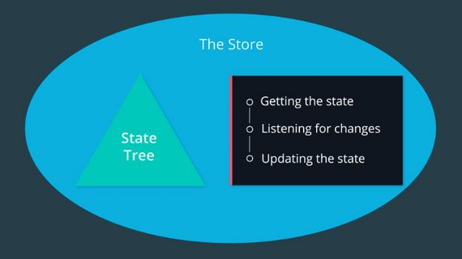](../assets/images/rr22.jpg)

We've finally finished creating the `createStore` function! Using the image above as a guide, let's break down what we've accomplished:

- we created a function called `createStore()` that returns a *store* object
- `createStore()` must be passed a "reducer" function when invoked
- the store object has three methods on it:
  - `.getState()` - used to get the current state from the store
  - `.subscribe()` - used to provide a listener function the store will call when the state changes
  - `.dispatch()` - used to make changes to the store's state
  - the store object's methods have access to the state of the store via closure

> #### 1.5.1 QUIZ QUESTION
> Which of the following are true statements about the store? Please select all that apply.
>
> - [x] Updates to the store can only be triggered by dispatching action.
> - [ ] The `createStore()` function is imported from React
> - [x] The store's subscribe() function helps connect React components to the store
> - [ ] Updates to the store can only be triggered by overwriting the store object directly (i.e., without dispatching an action)

#### 1.5.2 Summary
Up until this point, we've been building out the `createStore()` function, piece by piece. In this section, we put all of those pieces together to create a fully functioning project. Then we took that code and demoed it in the console.

We showed that subscribing to the store returned a function we could use to unsubscribe later. We also dispatched an action and saw how the state was updated as a result.

In the next section, we'll keep building up our app-specific parts of the code to handle different actions and to be more error-proof.

### 1.6 Managing More Actions
As of right now, our code is handling the ADD_TODO action. There are still a couple more actions that our app is supposed to be able to handle:

- the REMOVE_TODO action
- the TOGGLE_TODO action

#### 1.6.1 New Actions
Our app can not only handle adding todo items -- it can now handle removing a todo item, as well as toggling a todo item (as complete or incomplete)! To make this all possible, we updated our `todos` reducer to be able to respond to actions of the `type` REMOVE_TODO and TOGGLE_TODO.

Before moving on, let's make sure we're on the same page on how this was all implemented. Our `todos` reducer originally looked like the following:

```js
function todos (state = [], action) {
  if (action.type === 'ADD_TODO') {
    return state.concat([action.todo]);
  }

  return state;
}
```

To resolve additional action types, we added a few more conditions to our reducer logic:

```js
function todos (state = [], action) {
  if (action.type === 'ADD_TODO') {
    return state.concat([action.todo]);
  } else if (action.type === 'REMOVE_TODO') {
    // ...
  } else if (action.type === 'TOGGLE_TODO') {
    // ...
  } else {
    return state;
  }
}
```

Note that just like the original `todos` reducer, we simply return the original state if the reducer receives an action type that it's not concerned with.

To remove a todo item, we called `filter()` on the state. This returns a new state (an array) with only todo items whose id's do not match the id of the todo we want to remove:

```js
function todos (state = [], action) {
  if (action.type === 'ADD_TODO') {
    return state.concat([action.todo]);
  } else if (action.type === 'REMOVE_TODO') {
    return state.filter((todo) => todo.id !== action.id);
  } else if (action.type === 'TOGGLE_TODO') {
    // ...
  } else {
    return state;
  }
}
```

To handle toggling a todo item, we want to change the value of the `complete` property on whatever `id` is passed along on the action. We mapped over the entire state, and if `todo.id` matched `action.id`, we used `Object.assign()` to return a new object with merged properties:

```js
function todos (state = [], action) {
  if (action.type === 'ADD_TODO') {
    return state.concat([action.todo]);
  } else if (action.type === 'REMOVE_TODO') {
    return state.filter((todo) => todo.id !== action.id);
  } else if (action.type === 'TOGGLE_TODO') {
    return state.map(todo =>
      todo.id !== action.id
        ? todo
        : Object.assign({}, todo, { complete: !todo.complete })
    );
  } else {
    return state;
  }
}
```

We then refactored our entire `todos` reducer to use a `switch` statement rather than multiple `if`/`else` statements:

```js
function todos(state = [], action) {
  switch (action.type) {
    case 'ADD_TODO':
      return state.concat([action.todo]);
    case 'REMOVE_TODO':
      return state.filter(todo => todo.id !== action.id);
    case 'TOGGLE_TODO':
      return state.map(todo =>
        todo.id !== action.id
          ? todo
          : Object.assign({}, todo, { complete: !todo.complete })
      );
    default:
      return state;
  }
}
```

In the above snippet, we matched `cases` against an expression (i.e., `action.type`), and executed statements associated with that particular `case`.

Let's now extend our app with some additional functionality!

#### 1.6.2 Adding Goals to our App
Currently, the app keeps track of a single piece of state - a list of todo items.

Let's make the app a bit more complicated and add in a second piece of state for our app to track - goals.

We now are going to add a goals reducer to track goals as well.

```js
function goals(state = [], action) {
  switch (action.type) {
    case 'ADD_GOAL':
      return state.concat([action.todo]);
    case 'REMOVE_GOAL':
      return state.filter(goal => goal.id !== action.id);
    default:
      return state;
  }
}
```

Now have two reducer functions:

- todos
- goals

However, the `createStore()` function we built can only handle a single reducer function:

```js
// createStore takes one reducer function as an argument
const store = createStore(todos);
```

We can't call createStore() passing it two reducer functions:

```js
// this will not work
const store = createStore(todos, goals);
```

So we've got a problem...

#### 1.6.3 Multiple Reducers

At this point, we now have two reducers, our Todos Reducer and our Goals Reducer. Each is responsible for handling their specific slice of the state tree.

[](../assets/images/rr25.jpg)

This introduces a new problem though. When we called createStore we passed it our single Todos reducer.

```js
const store = createStore(todos);
```

Whenever dispatch was called, we'd call this reducer, passing it the current state and the action which was dispatched, and we get back the new state.

Well, now we not only have our Todos reducer, we also have our Goals reducer and each are expected to receive their specific slice of the state tree whenever an action is dispatched.

[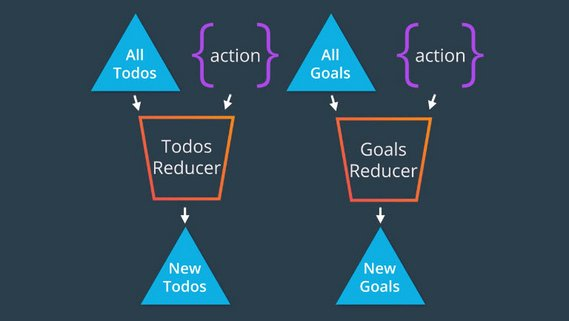](../assets/images/rr23.jpg)

What we need to do is instead of passing createStore our single Todos reducer, we want to create almost like a root reducer function, which will be responsible for calling the correct reducer whenever specific actions are dispatched.

[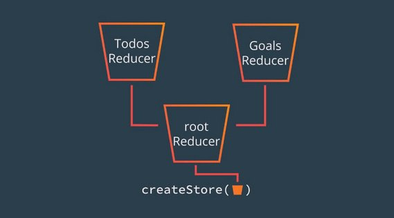](../assets/images/rr24.jpg)

What we need is our app to now work with both our to Todos reducer as well as our Goals reducer.

Let's see what that will look like.

```js
function todos(state = [], action) {
  switch (action.type) {
    case 'ADD_TODO':
      return state.concat([action.todo]);
    case 'REMOVE_TODO':
      return state.filter(todo => todo.id !== action.id);
    case 'TOGGLE_TODO':
      return state.map(todo =>
        todo.id !== action.id
          ? todo
          : Object.assign({}, todo, { complete: !todo.complete })
      );
    default:
      return state;
  }
}

function goals(state = [], action) {
  switch (action.type) {
    case 'ADD_GOAL':
      return state.concat([action.goal]);
    case 'REMOVE_GOAL':
      return state.filter(goal => goal.id !== action.id);
    default:
      return state;
  }
}

function app(state = {}, action) {
  return {
    todos: todos(state.todos, action),
    goals: goals(state.goals, action)
  };
}

// Create the store passing the root reducer.
const store = createStore(app);
```

The app started out with one piece of state, `todos`, when we added in the `goals` state, we now had two separate pieces of state. Each piece of state needed its own reducer.

Since the create store function can only take in one reducer, we had to create a reducer that acts as the main reducer, commonly called the root reducer, that in turn calls both of the other reducers to get each piece of state to build the final state of the app.

> #### 1.6.4 Quiz Question
> Select all statements that are true.
>
> [x] Reducers must be pure
> [x] Though each reducer handles a different slice of state, we must combine reducers into a single reducer to pass to the store
> [x] `createStore()` takes only one `reducer` argument
> [x] Reducers are typically named after the slices of state they manage.

#### 1.6.5 Summary
In this section, we bolstered our application to handle a number of different actions as well as an entirely new piece of state! In addition to our app handling the ADD_TODO action, it now handles:

- the REMOVE_TODO action
- the TOGGLE_TODO action

We also created the goals reducer which handles:

- an ADD_GOAL action
- a REMOVE_GOAL action

So our application can now manage the state of our todos and goals, and it can do all of this, predictably!

In the next and final section of this lesson, we'll look at how we can convert some of our existing functionality to follow best practices.

### 1.7 Better Practices
The next thing for us to do is implement constants in place of strings. This is a less error-prone way of programming.

```js
// App code (reducer)
const ADD_TODO = 'ADD_TODO';
const REMOVE_TODO = 'REMOVE_TODO';
const TOGGLE_TODO = 'TOGGLE_TODO';
const ADD_GOAL = 'ADD_GOAL';
const REMOVE_GOAL = 'REMOVE_GOAL';

function todos(state = [], action) {
  switch (action.type) {
    case ADD_TODO:
      return state.concat([action.todo]);
    case REMOVE_TODO:
      return state.filter(todo => todo.id !== action.id);
    case TOGGLE_TODO:
      return state.map(todo =>
        todo.id !== action.id
          ? todo
          : Object.assign({}, todo, { complete: !todo.complete })
      );
    default:
      return state;
  }
}

function goals(state = [], action) {
  switch (action.type) {
    case ADD_GOAL:
      return state.concat([action.goal]);
    case REMOVE_GOAL:
      return state.filter(goal => goal.id !== action.id);
    default:
      return state;
  }
}
```

> #### 1.7.1 Question 1 of 2
> Why prefer constants over strings in action types?
>
> - [ ] Constants are more serializable
> - [x] We can ensure an error will be thrown for misspelled action types
> - [ ] There is no difference between using constants versus strings

#### 1.7.2 Action Creators
Next we want to write code so we don't have to repeat ourselves on each dispatch invocation.

Here are each of the dispatch calls. We can see that we are repeating ourselves quite a bit.

```js
store.dispatch({
  type: ADD_TODO,
  todo: { id: 0, name: 'Wash the car', complete: false }
});
store.dispatch({
  type: ADD_TODO,
  todo: { id: 1, name: 'Walk the dog', complete: true }
});
store.dispatch({
  type: ADD_TODO,
  todo: { id: 2, name: 'Go to the gym', complete: true }
});
store.dispatch({
  type: TOGGLE_TODO,
  id: 0
});
store.dispatch({
  type: REMOVE_TODO,
  id: 0
});
store.dispatch({
  type: ADD_GOAL,
  goal: { id: 0, name: 'Learn Redux' }
});
store.dispatch({
  type: ADD_GOAL,
  goal: { id: 1, name: 'Learn Python' }
});
store.dispatch({
  type: ADD_GOAL,
  goal: { id: 2, name: 'Learn Vue' }
});
store.dispatch({
  type: REMOVE_GOAL,
  id: 0
});
```

What we are going to do is write Action Creators which will build the action that will be passed to our store on dispatch.

```js
// Action creators
function addTodoAction(todo) {
  return {
    type: ADD_TODO,
    todo
  };
}

function removeTodoAction(id) {
  return {
    type: REMOVE_TODO,
    id
  };
}

function toggleTodoAction(id) {
  return {
    type: TOGGLE_TODO,
    id
  };
}

function addGoalAction(goal) {
  return {
    type: ADD_GOAL,
    goal
  };
}

function removeGoalAction(id) {
  return {
    type: REMOVE_GOAL,
    id
  };
}
```

Now we can have a much more concise dispatch invocation.

```js
// dispatch an action
store.dispatch(addTodoAction({ id: 0, name: 'Wash the car', complete: false }));
store.dispatch(addTodoAction({ id: 1, name: 'Walk the dog', complete: true }));
store.dispatch(addTodoAction({ id: 2, name: 'Go to the gym', complete: true }));
store.dispatch(toggleTodoAction(0));
store.dispatch(removeTodoAction(0));
store.dispatch(addGoalAction({ id: 0, name: 'Learn Redux' }));
store.dispatch(addGoalAction({ id: 1, name: 'Learn Python' }));
store.dispatch(addGoalAction({ id: 2, name: 'Learn Vue' }));
store.dispatch(removeGoalAction(0));
```

#### 1.7.3 Question 2 of 2

```js
/* Create An Action Creator
 *
 * You need to create an action creator called 'mealCreator' that should:
 *   - Accept an id
 *   - Return a Redux action with a 'type' property that has a value
 *      of 'CREATE_MEAL'
 *   - Include the id passed to the action creator
*/
const CREATE_MEAL = 'CREATE_MEAL';
> function mealCreator(id) {
  return {
    type: CREATE_MEAL,
    id
  };
}
```

#### 1.7.4 Summary
In this section, we converted our actions to use JavaScript constants instead of strings. We also refactored our `.dispatch()` calls from passing in unique objects directly to them, to calling special functions that create the action objects - these special functions that create action objects are called Action Creators.

### 1.8 Lesson Summary
We've now covered the most important parts of the state management library.

- The Store
  - Internal state
  - getting state
  - listening for changes
  - updating state
- Actions
- Reducers

## 2. UI + Redux
### 2.1 Introduction
In the previous lesson, we learned how to improve the predictability of the state in our application by building our own state management library.

[](../assets/images/rr26.jpg)

In this lesson, we'll take that state management library and add some UI to it. This will allow us to take a closer look at how our custom library can manage the state of an actual application.

### 2.2 UI
#### 2.2.1 Move code to HTML
What we will do is host our javascript in html. We create index.html with the following code.

```html
<!DOCTYPE html>
<html lang="en">
<head>
  <meta charset="UTF-8">
  <meta name="viewport" content="width=device-width, initial-scale=1.0">
  <meta http-equiv="X-UA-Compatible" content="ie=edge">
  <title>Udacity Todos Goals</title>
</head>
<body>
  
  <script>
    // copy store code into here
  </script>
</body>
</html>
```

We now want make sure to copy our JavaScript into this html and delete index.js.

#### 2.2.2 What We're Going to Build
Now that we have an index.html file and all of the JavaScript code has been transferred over to script tags, let's start adding in a User Interface. Since our project has two pieces of state, we'll need two areas:

1. Todo list area
2. Goals area

[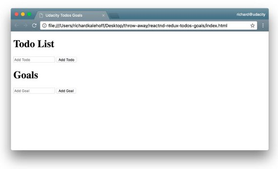](../assets/images/rr27.jpg)

So this is what we're going for. It's not the best looking website ever created, but this isn't a course on CSS ;-). If you want to make it stunningly beautiful, feel free to add some CSS to your project 👍🏼

We already have the Redux portion of our application working, but so far, we've just been manually running snippets of code to interact with the Redux Store. Let's create the UI above so that we can interact with the store using the browser.

#### 2.2.3 Basic UI
So, now what the eventual goal here, is we want to show both our Todo list, as well as our goals list. We want to give the user an option to add new items to both lists via the UI right now.

So basically, our library code is going to manage the state of our application and the DOM or the view, is just going to be a representation of that state.

What we need to do is to add some actual UI to our app, so we could hook that UI up to our library code in order to get the state of our application.

```html
<body>
  <div>
    <h1>Todo List</h1>
    <form id="todoForm">
      <input id='todo' type='text' placeholder='Add Todo' required />
      <button id='todoBtn'>Add Todo</button>
    </form>
    <ol id='todos'></ol>
  </div>
  <div>
    <h1>Goals</h1>
    <form id="goalForm">
      <input id='goal' type='text' placeholder='Add Goal' required />
      <button id='goalBtn'>Add Goal</>
    </form>
    <ul id='goals'></ul>
  </div>
  <script>
    // store code here
  </script>
</body>
```

Here's what the UI looks like right now.

[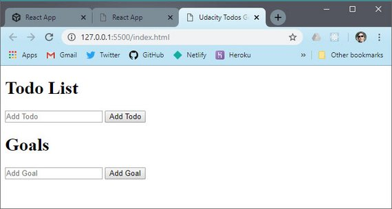](../assets/images/rr28.jpg)<br>
GitHub Repo: [reactnd-redux-todos-goals@11-build-ui](https://github.com/james-priest/reactnd-redux-todos-goals/tree/11-build-ui)

#### 2.2.4 Summary
In this section, we added some minimal UI to our application. The actually state of our app hasn't changed at all, though.

In the next section, we'll hook up our shiny new UI to our state so that entering content via the UI will update the application's state.

### 2.3 UI + State
The changes we'll add will make is so whenever the Todo input field is submitted, it will add a Todo item to the state...and whenever the Goal input field is submitted, it will add a new Goal item to the state.

Let's break this down into the steps that happen. First, we need to listen for when the buttons are clicked; we did this with the plain DOM .addEventListener() method:

```js
document.getElementById('todoForm').addEventListener('submit', addTodo)
document.getElementById('goalForm').addEventListener('submit', addGoal)
```

Pressing the #todoBtn will call addTodo which will add the new item to the state:

```js
function generateId() {
  return (
    Math.random()
      .toString(36)
      .substr(2) + new Date().getTime().toString(36)
  );
}

// DOM code
function addTodo (e) {
  e.preventDefault();
  const input = document.getElementById('todo')
  const name = input.value
  input.value = ''

  store.dispatch(
    addTodoAction({
      name,
      complete: false,
      id: generateId()
    })
  );
  input.value = '';
}
function addGoal(e) {
  e.preventDefault();
  const input = document.getElementById('goal');
  const name = input.value;
  store.dispatch(
    addGoalAction({
      id: generateId(),
      name
    })
  );
  input.value = '';
}
```

This method will extract the information from the input field, reset the input field, and then dispatch an addTodoAction Action Creator with the text that the user typed into the input field.

So we're using the UI to change the state of our store, but these changes are not reflecting the new state visually in the UI. Let's do that, now.

Here are some of the DOM manipulations we're using.

- accessing elements with document.getElementById()
- adding listeners with .addEventListener()
- accessing the .value property on an element
- creating a new element with .createElement()
- adding new content with.appendChild()

#### 2.3.1 Display added item in UI
Next we add code to display to the DOM whenever an item is added.

```js
function addTodoToDOM(todo) {
  const node = document.createElement('li');
  const text = document.createTextNode(todo.name);
  node.appendChild(text);

  document.getElementById('todos').appendChild(node);
}

function addGoalToDOM(goal) {
  const node = document.createElement('li');
  const text = document.createTextNode(goal.name);
  node.appendChild(text);

  document.getElementById('goals').appendChild(node);
}
```

We trigger these functions within our subscribe method of the store.

```js
store.subscribe(() => {
  // console.log('The new state is: ', store.getState());
  const { todos, goals } = store.getState();

  document.getElementById('goals').innerHTML = '';
  document.getElementById('todos').innerHTML = '';

  todos.forEach(addTodoToDOM); // todos.forEach(todo => addTodoToDOM(todo));
  goals.forEach(addGoalToDOM); // goals.forEach(goal => addGoalToDOM(goal));
});
```

We add some styling to our UI.

```html
  <style>
    body {
      display: flex;
      justify-content: space-around;
    }
    ul, ol {
      padding: 0 0 0 20px;
    }
    input[type='checkbox'] {
      margin-right: 10px;
    }
  </style>
```

Here's the updated UI.

[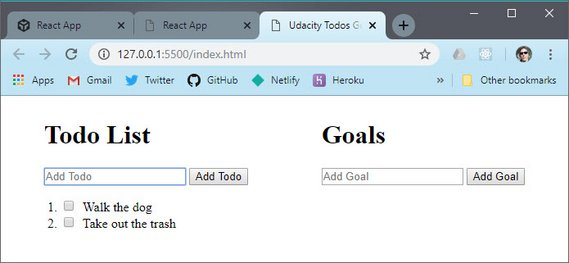](../assets/images/rr29.jpg)<br>
GitHub Repo: [reactnd-redux-todos-goals@12-dispatch-from-ui](https://github.com/james-priest/reactnd-redux-todos-goals/tree/12-dispatch-from-ui)

#### 2.3.2 Add Toggle item to UI
Next we update the UI with the ability to click a todo and mark it as complete.

```js
function addTodoToDOM(todo) {
  const li = document.createElement('li');
  const checkbox = document.createElement('input');
  checkbox.id = todo.id;
  checkbox.setAttribute('type', 'checkbox');
  checkbox.addEventListener('click', () => {
    store.dispatch(toggleTodoAction(todo.id));
  });

  const label = document.createElement('label');
  const text = document.createTextNode(todo.name);
  label.htmlFor = todo.id;
  label.appendChild(text);
  li.appendChild(checkbox);
  li.appendChild(label);
  if (todo.complete) {
    label.classList.add('strike');
    checkbox.checked = true;
  }

  document.getElementById('todos').appendChild(li);
}
```

Here's the style we added.

```html
  <style>
    .strike {
      text-decoration: line-through;
    }
  </style>
```

Now the updated UI looks like this.

[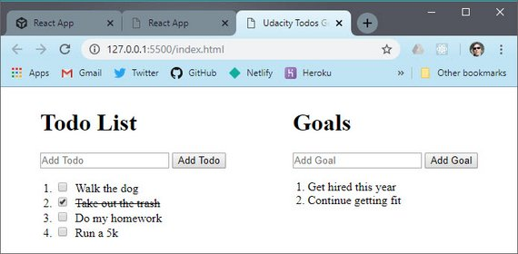](../assets/images/rr30.jpg)<br>
GitHub Repo: [reactnd-redux-todos-goals@13-dispatch-toggle](https://github.com/james-priest/reactnd-redux-todos-goals/tree/13-dispatch-toggle)

#### 2.3.3 Add Remove items from UI
Lastly we add the remove functionality.

```js
function createRemoveButton(onClick) {
  const removeBtn = document.createElement('button');
  removeBtn.classList.add('removeBtn');
  removeBtn.innerHTML = 'X';
  removeBtn.addEventListener('click', onClick);
  return removeBtn;
}

function addTodoToDOM(todo) {
  // todo item code

  const removeBtn = createRemoveButton(() => {
    store.dispatch(removeTodoAction(todo.id));
  });
  li.appendChild(removeBtn);

  document.getElementById('todos').appendChild(li);
}

function addGoalToDOM(goal) {
  // goal item code

  const removeBtn = createRemoveButton(() => {
    store.dispatch(removeGoalAction(goal.id));
  });
  node.appendChild(removeBtn);

  document.getElementById('goals').appendChild(node);
}
```

The additional style looks like this.

```html
<style>
  .removeBtn {
    margin-left: 10px;
  }
</style>
```

Here's the updated UI.

[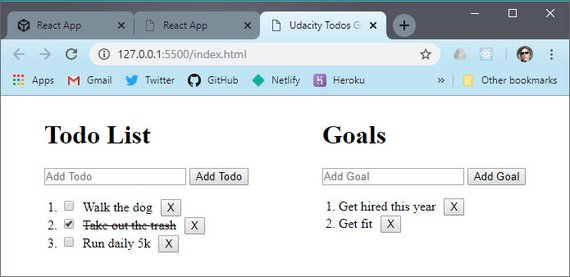](../assets/images/rr31.jpg)<br>
GitHub Repo: [reactnd-redux-todos-goals@14-dispatch-remove-items](https://github.com/james-priest/reactnd-redux-todos-goals/tree/14-dispatch-remove-items)

#### 2.3.4 Summary
In this section, we connected our functioning state application with a front-end UI. We added some form fields and buttons to our UI that can be used to add new Todo items and Goal items to the state. Updating the state will also cause the entire application to re-render so that the visual representation of the application matches that of the info stored in the state object.

Now, we wrote all of this code ourselves. In the next section, we'll convert from using our custom library to using Redux.

### 2.4 Introducing Redux
Up until now we haven't worked with Redux directly.  What we did was create our own  version of Redux that follows the Redux API exactly.

[](../assets/images/rr32.jpg)

Just like the library we built ourselves, Redux has a state management library that has a store, actions, and reducers.

Let's go ahead and replace our own implementation with the real Redux, so you can see just how similar they are.

#### 2.4.1 Replacing Library code with Redux
We're going to transition away from our custom code to using the actual Redux library.

We first link to the hosted version of the Redux library with the following line.

```html
<script src="https://cdnjs.cloudflare.com/ajax/libs/redux/3.7.2/redux.min.js">
</script>
```

Then we remove the library code from index.html.

```js
/* Removed...
// Library code
function createStore(reducer) {
  // The store should have four parts
  // 1. The state
  // 2. Get the state
  // 3. Listen for changes on the state
  // 4. Update the state

  let state;
  let listeners = [];

  const getState = () => state;

  const subscribe = listener => {
    listeners.push(listener);
    return () => {
      listeners = listeners.filter(l => l !== listener);
    };
  };

  const dispatch = action => {
    state = reducer(state, action);
    listeners.forEach(listener => listener());
  };

  return {
    getState,
    subscribe,
    dispatch
  };
}
*/
```

Then we remove our root reducer and custom createStore function. Those are replaced with `Redux.createStore` and `Redux.combineReducers` methods.

```js
/* Removed...
function app(state = {}, action) {
  return {
    todos: todos(state.todos, action),
    goals: goals(state.goals, action)
  };
}

// Create the store
const store = createStore(app);
*/

const store = Redux.createStore(
  Redux.combineReducers({
    todos,
    goals
  })
);
```

#### 2.4.2 Reducer composition

Reducer composition sounds intimidating, but it's simpler than you might think. The idea is that you can create a reducer to manage not only each section of your Redux store, but also any nested data as well.

Let's say we were dealing with a state tree like had this structure.

```js
{
  users: {},
  setting: {},
  tweets: {
    btyxlj: {
      id: 'btyxlj',
      text: 'What is a jQuery?',
      author: {
        name: 'Tyler McGinnis',
        id: 'tylermcginnis',
        avatar: 'twt.com/tm.png'
      }
    }
  }  
}
```

We have three main properties on our state tree: *users*, *settings*, and *tweets*. Naturally, we'd create individual reducers for each and then create a single root reducer using Redux's combineReducers method.

```js
const reducer = combineReducers({
  users,
  settings,
  tweets
})
```

`combineReducers`, under the hood, is our first look at reducer composition.

combineReducers is responsible for invoking all the other reducers, passing them the portion of their state that they care about. We're making one root reducer, by composing a bunch of other reducers together.

With that in mind, let's take a closer look at our tweets reducer and how we can leverage reducer composition again to make it more compartmentalized. Specifically, let's look how a user might change their avatar with the way our store is currently structured. Here's the skeleton with what we'll start out with.

```js
function tweets (state = {}, action) {
  switch(action.type){
      case ADD_TWEET :
        ...
      case REMOVE_TWEET :
        ...
      case UPDATE_AVATAR :
        ???
  }
}
```

What we're interested in is that last one, UPDATE_AVATAR. This one is interesting because we have some nested data - and remember, reducers have to be pure and can't mutate any state. Here's one approach.

```js
function tweets (state = {}, action) {
  switch(action.type){
      case ADD_TWEET :
        ...
      case REMOVE_TWEET :
        ...
      case UPDATE_AVATAR :
        return {
          ...state,
          [action.tweetId]: {
            ...state[action.tweetId],
            author: {
              ...state[action.tweetId].author,
              avatar: action.newAvatar
            }
          }
        }
  }
}
```

That's a lot of spread operators. The reason for that is because, for every layer, we're wanting to spread all the properties of that layer on the new objects we're creating (because, immutability). What if, just like we separated our tweets, users, and settings reducers by passing them the slice of the state tree they care about, what if we do the same thing for our tweets reducer and its nested data. Doing that, the code above would be transformed to look like this

```js
function author (state, action) {
  switch (action.type) {
      case : UPDATE_AVATAR
        return {
          ...state,
          avatar: action.newAvatar
        }
      default :
        state
  }
}

function tweet (state, action) {
  switch (action.type) {
      case ADD_TWEET :
        ...
      case REMOVE_TWEET :
        ...
      case : UPDATE_AVATAR
        return {
          ...state,
          author: author(state.author, action)
        }
      default :
        state
  }
}

function tweets (state = {}, action) {
  switch(action.type){
      case ADD_TWEET :
        ...
      case REMOVE_TWEET :
        ...
      case UPDATE_AVATAR :
        return {
          ...state,
          [action.tweetId]: tweet(state[action.tweetId], action)
        }
      default :
        state
  }
}
```

All we've done is separated out each layer of our nested tweets data into their own reducers. Then, just like we did with our root reducer, we're passing those reducers the slice of the state they care about.

#### 2.4.3 Quiz Question
What is wrong with the following root reducer?

```js
import { combineReducers } from 'redux';
import booksReducer from './books_reducer';
import userReducer from './user_reducer';

const rootReducer = combineReducers(booksReducer, userReducer);

export default rootReducer;
```

- [x] An object that maps state keys to reducers should be passed into `combineReducers()`

The correct code should look like this.

```js
import { combineReducers } from 'redux';
import booksReducer from './books_reducer';
import userReducer from './user_reducer';

const rootReducer = combineReducers({
    books: booksReducer,
    users: userReducer
});

export default rootReducer;
```

Here is a version of the app on CodeSandbox.

[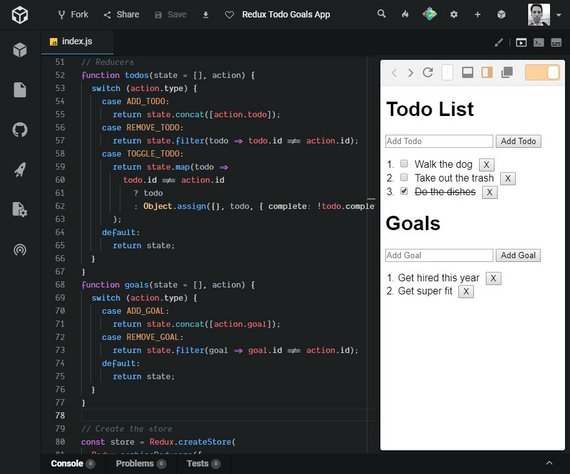](../assets/images/rr33.jpg)<br>
**Live Demo:** [Redux Todo Goals App](https://codesandbox.io/s/42zkzvrn14?fontsize=14) on CodeSandbox

#### 2.4.4 Summary
In this section, we replaced the code we wrote in the previous lesson with the actual Redux library code. We saw that swapping out our code with Redux's code didn't change anything with how our application functions or how our app-specific code works. Redux is just a predictable state container.

What's key to understand is that you've already learned 90% of Redux! Everything else from here on out will be handling specific use cases (combining Redux with a React application, how to work with asynchronous data modification, etc.).

We'll be adding more concepts on top of what you know now, so if you feel comfortable with your understanding of Redux, then keep going. If you're a bit hazy on how a specific part works, I definitely recommend you get the hazy bits nailed down now before proceeding on to more complicated content. Feel free to return to the first lesson to review specific Redux functionalities to iron out any confusing parts before moving on.

### 2.5 Articles & Questions

Read these articles:

- [The what and why of Redux](https://blog.pusher.com/the-what-and-why-of-redux/)
- [Leveling Up with React: Redux](https://css-tricks.com/learning-react-redux/)

#### 2.5.1 Question 1 of 2
What are the advantages of using Redux?

- State is managed in one place
- Less error prone since components don't track state separately
- State is kept out of the DOM
  
#### 2.5.2 Question 2 of 2
Describe the 3 principles Redux follows.

1. Single source of truth
   - State for the whole application is stored in an object tree within a single store.
2. State is read-only
   - The only way to change the state is to emit an action - an object describing what happened.
3. Changes are made with pure function
   - To specify how the state tree is transformed by actions, you write pure reducers.

## 3. Redux Middleware
### 3.1 Introduction
[](../assets/images/rr34.jpg)

The next thing we are going to do is intercept dispatch actions in order to filter out tasks that contain words which we don't want to add.

For instance, my accountant has warned me NOT to buy Bitcoin. So, I want to filter that out prior to dispatching my actions.

What we can do is create a new function to do this.

```js
// Middleware
function checkAndDispatch(store, action) {
 if (
   action.type === ADD_TODO &&
   action.todo.name.toLowerCase().includes('bitcoin')
 ) {
   return alert("Nope, that's a bad idea.");
 }

 if (
   action.type === ADD_GOAL &&
   action.goal.name.toLowerCase().includes('bitcoin')
 ) {
   return alert("Nope, that's a bad idea.");
 }

 return store.dispatch(action);
}
```

What this does is show an alert if an attempt to add the word "bitcoin" is made. Otherwise the passed in action is dispatched.

What we also need to do is update all the `store.dispatch` calls with a call to `checkAndDispatch`.

```js
function addTodo(e) {
  e.preventDefault();
  const input = document.getElementById('todo');
  const name = input.value;
  // store.dispatch(
  //   addTodoAction({
  //     name,
  //     complete: false,
  //     id: generateId()
  //   })
  // );
  checkAndDispatch(
    store,
    addTodoAction({
      name,
      complete: false,
      id: generateId()
    })
  );
  input.value = '';
}
```

We make this change to all instances of `store.dispatch`.

### 3.2 Redux Middleware
Normally, when we call `store.dispatch` this signals the reducer to run with the action we passed dispatch.

When we added a `checkAndDispatch` function this required us to manually insert a function ahead of each store.dispatch call.

[](../assets/images/rr35.jpg)

Wouldn't it be nice if we could insert code in-between `store.dispatch` and the reducer without having to change all the calls?

[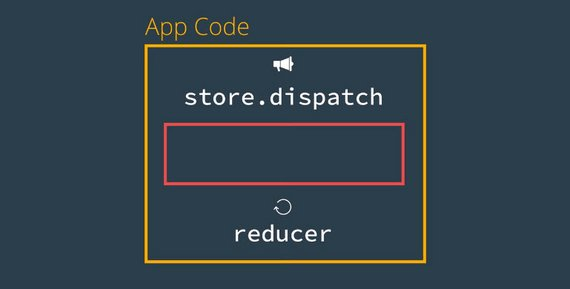](../assets/images/rr36.jpg)

Well this what middleware does.

You’ve learned how Redux makes state management more predictable: in order to change the store’s state, an action describing that change must be dispatched to the reducer. In turn, the reducer produces the new state. This new state replaces the previous state in the store. So the next time `store.getState()` is called, the new, most up-to-date state is returned.

Between the dispatching of an action and the reducer running, we can introduce code called **middleware** to intercept the action before the reducer is invoked. The [Redux docs](http://redux.js.org/docs/advanced/Middleware.html) describe middleware as:

> a third-party extension point between dispatching an action, and the moment it reaches the reducer.

What's great about middleware is that once it receives the action, it can carry out a number of operations, including:

- producing a side effect (e.g., logging information about the store)
- processing the action itself (e.g., making an asynchronous HTTP request)
- redirecting the action (e.g., to another piece of middleware)
- dispatching supplementary actions

or even some combination of the above! Middleware can do any of these before passing the action along to the reducer.

Here's what we do to add in real Redux middleware.

Create a function with this pattern. This is a [currying pattern](http://codekirei.com/posts/currying-with-arrow-functions/) that for better or worse is what was adopted when this was built.

It passes a function to a function. Here's the ES5 pattern which we will update below.

```js
// Middleware
function checker(store) {
  return function(next) {
    return function(action) {
      // do work

    };
  };
}
```

Now we move our code from checkAndDispatch and delete checkAndDispatch.

```js
// Middleware
function checker(store) {
  return function(next) {
    return function(action) {
      // do work
      if (
        action.type === ADD_TODO &&
        action.todo.name.toLowerCase().includes('bitcoin')
      ) {
        return alert("Nope, that's a bad idea.");
      }

      if (
        action.type === ADD_GOAL &&
        action.goal.name.toLowerCase().includes('bitcoin')
      ) {
        return alert("Nope, that's a bad idea.");
      }
      return next(action);
    };
  };
}
```

Next we make a modification to our createStore method to add in the middleware component as the second argument to createStore.

```js
const store = Redux.createStore(
  Redux.combineReducers({
    todos,
    goals
  }),
  Redux.applyMiddleware(checker)
);
```

The last change has to do with the currying middleware function. This will be updated to use ES6. Here is the pattern.

```js
const checker = store => next => action => {

}
```

The full function looks like this.

```js
const checker = store => next => action => {
  if (
    action.type === ADD_TODO &&
    action.todo.name.toLowerCase().includes('bitcoin')
  ) {
    return alert("Nope, that's a bad idea.");
  }

  if (
    action.type === ADD_GOAL &&
    action.goal.name.toLowerCase().includes('bitcoin')
  ) {
    return alert("Nope, that's a bad idea.");
  }
  return next(action);
}
```

#### 3.2.1 Middleware Code Explained
The way we had to structure our code originally, our `checkAndDispatch()` function *had* to run *before* `store.dispatch()`. Why is this? Because when `store.dispatch()` is invoked, it immediately calls the reducer that was passed in when `createStore()` was invoked.

If you remember back to the first lesson, this is what our dispatch() function looked like (and is very similar to the real Redux dispatch() function):

```js
const dispatch = (action) => {
  state = reducer(state, action)
  listeners.forEach((listener) => listener())
}
```

So you can see that calling `store.dispatch()` will *immediately* invoke the `reducer()` function. There's no way to run anything in between the two function calls. So that's why we had to make our `checkAndDispatch()` so that we can run verification code *before* calling `store.dispatch()`.

However, this isn't maintainable. If we wanted to add another check, then we'd need to write *another* preceding function, that then calls `checkAndDispatch()` that *then* calls `store.dispatch()`. Not maintainable at all.

With Redux's middleware feature, we can run code *between* the call to `store.dispatch()` and `reducer()`. The reason this works, is because Redux's version of dispatch() is a bit more sophisticated than ours was, and because we provide the middleware functions when we create the store.

```js
const store = Redux.createStore( <reducer-function>, <middleware-functions> )
```

Redux's `createStore()` method takes the reducer function as its first argument, but then it can take a second argument of the middleware functions to run. Because we set up the Redux store with knowledge of the middleware function, it runs the middleware function between `store.dispatch()` and the invocation of the reducer.

#### 3.2.2 Applying Middleware
Just as we saw, we can implement middleware into a Redux app by passing it in when creating the store. More specifically, we can pass in the `applyMiddleware()` function as an optional argument into `createStore()`. Here's the `applyMiddleware()` signature:

```js
applyMiddleware(...middlewares)
```

Note the spread operator on the `middlewares` parameter. This means that we can pass in as many different middleware as we want! Middleware is called in the order in which they were provided to `applyMiddleware()`.

We currently have the `checker` middleware applied to our app, but we'll soon add a new `logger` middleware as well. To create a Redux store that uses our `checker` middleware, we can do the following:

```js
const store = Redux.createStore(rootReducer, Redux.applyMiddleware(checker))
```

> #### 💡Functions Returning Functions 💡
> Redux middleware leverages a concept called **higher-order functions**. A higher-order function is a function that either:
>
> - *accepts* a function as an argument
> - *returns* a function
>
> Higher-order functions are a powerful programming technique that allow functions to be significantly more dynamic. You've actually already written a higher-order function in this course.
>
> The `createRemoveButton()` function is a higher-order function because the `onClick` parameter is expected to be a function (because `onClick` is set up as an event listener callback function.
>
> ```js
> function createRemoveButton(onClick) {          // <- here
>   const removeBtn = document.createElement('button');
>   removeBtn.classList.add('removeBtn');
>   removeBtn.innerHTML = 'X';
>   removeBtn.addEventListener('click', onClick); // <- here
>   return removeBtn;
> }
>
> const removeBtn = createRemoveButton(() => {
>   store.dispatch(removeTodoAction(todo.id));
> });
> li.appendChild(removeBtn);
>
> const removeBtn = createRemoveButton(() => {
>   store.dispatch(removeGoalAction(goal.id));
> });
> node.appendChild(removeBtn);
> ```
>
> For a refresher on higher-order functions, feel free to check out Lesson 2 in [Object-Oriented JavaScript](https://www.udacity.com/course/object-oriented-javascript--ud711).

#### 3.2.3 Question 1 of 2
Which of the following are true statements about middleware? Select all that apply.

- [x] Middleware intercepts a dispatched action *before* it reaches the reducer.
- [ ] The concept of "middleware" is exclusive to Redux apps.
- [ ] Using middleware lets you create a Redux store without a reducer.

#### 3.2.4 A New Middleware: Logging
Currently, our application is making use of a single middleware: `checker`. Because we can use multiple middleware functions in a single application, let's create a new middleware function called `logger` that will log out information about the state and action.

The benefits of this `logger()` middleware function are huge while developing the application. We'll use this middleware to intercept all dispatch calls and log out what the action is that's being dispatched and what the state changes to *after* the reducer has run.

Being able to see this kind of information will be immensely helpful while we're developing our app. We can use this info to help us know what's going on in our app and to help us track down any pesky bugs that creep in.

Here's the logger middleware code addition.

```js
const logger = store => next => action => {
  console.group(action.type);
  console.log('The action:', action);
  const result = next(action);
  console.log('The new state:', store.getState());
  console.groupEnd();
  return result;
};
```

Then we add it to our createStore invocation.

```js
// Create the store
const store = Redux.createStore(
  Redux.combineReducers({
    todos,
    goals
  }),
  Redux.applyMiddleware(checker, logger)
);
```

This creates a log entry whenever a dispatch action takes place.

[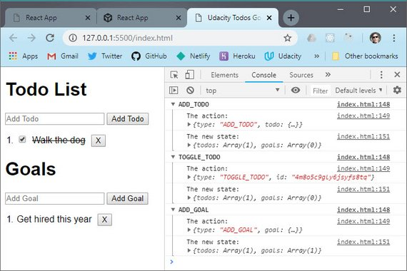](../assets/images/rr37.jpg)

Here's the app on CodeSandbox

[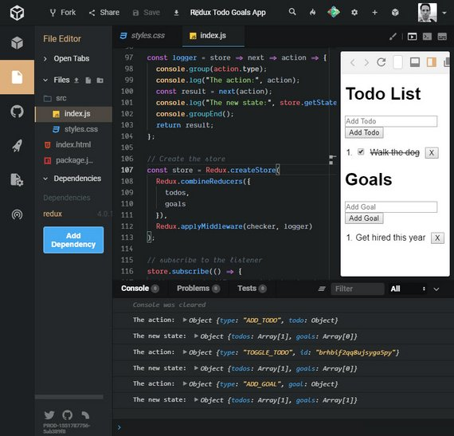](../assets/images/rr39.jpg)<br>
**Live Demo:** [Redux Todo Goals App](https://codesandbox.io/s/42zkzvrn14?fontsize=14) on CodeSandbox

#### 3.2.5 Question 2 of 2
Which of the following are true statements about middleware? Select all that apply.

- [ ] Redux apps can only apply one type of middleware to the store.
- [x] `Redux.applyMiddleware()` can accept multiple arguments.
- [x] Middleware is optional.
- [x] Middleware can be considered a third-party extension point between dispatching and having the action reach the reducer.

#### 3.2.6 Lesson Challenge
Write middleware to achieve the following behavior:

- Display an alert "That's a great goal!" whenever a new goal is added.
- Display "Don't forget to [name of your todo item]!" whenever a new todo item is added.

Make sure that the rest of the application works as intended (you see a list of your newly added goals and todo items).

The middleware looks like this.

```js
const goalAffirmation = store => next => action => {
  if (action.type === ADD_GOAL) {
    alert("That's a great goal!");
  }
  return next(action);
};

const reminder = state => next => action => {
  if (action.type === ADD_TODO) {
    action.todo.name = `Don't forget to ${action.todo.name}`;
  }
  return next(action);
};
```

We add the middleware like this.

```js
// Create the store
const store = Redux.createStore(
  Redux.combineReducers({
    todos,
    goals
  }),
  Redux.applyMiddleware(checker, logger, goalAffirmation, reminder)
);
```

Here's the UI update.

[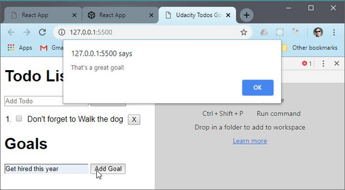](../assets/images/rr38.jpg)

### 3.3 Summary
In this section, we looked at using middleware. According to the Redux docs:

> Middleware is the suggested way to extend Redux with custom functionality.

Middleware is added to the Redux store using `Redux.applyMiddleware()`. You can only add middleware when you initially create the store:

```js
const store = Redux.createStore(
  <reducer-function>,
  Redux.applyMiddleware(<middleware-functions>)
)
```

#### 3.3.1 Further Research
The following might be a bit advanced at this point, but give them a quick read through right now and definitely bookmark them to come back and read later:

- [Middleware Docs](https://redux.js.org/advanced/middleware)
- [API for Redux's Middleware](https://redux.js.org/api-reference/applymiddleware)

## 4. Redux with React
### 4.1 Introduction

[](../assets/images/rr40.jpg)

Redux is UI and framework agnostic. This means that it can be hooked up to any front end UI including:

- React apps
- Vue apps
- plain HTML apps
- vanilla JavaScript apps

This lesson will focus on hooking Redux up to React.

### 4.2 React as our UI
In this lesson, we're going to move away from our application being plain HTML and convert it to being powered by React. To do that, we'll need to add a number of libraries:

- [react](https://www.npmjs.com/package/react)
- [react-dom](https://www.npmjs.com/package/react-dom)
- [babel](https://www.npmjs.com/package/babel)

Here are the packages that we add into the head section:

- `<script src="https://unpkg.com/react@16.3.0-alpha.1/umd/react.development.js"></script>`
- `<script src="https://unpkg.com/react-dom@16.3.0-alpha.1/umd/react-dom.development.js"></script>`
- `<script src="https://unpkg.com/babel-standalone@6.15.0/babel.min.js"></script>`

The additions to the html file are as follows.

```html
// add-in-react
<head>
  <meta charset="UTF-8">
  <meta name="viewport" content="width=device-width, initial-scale=1.0">
  <meta http-equiv="X-UA-Compatible" content="ie=edge">
  <title>Udacity Todos Goals</title>
  <script src='https://cdnjs.cloudflare.com/ajax/libs/redux/3.7.2/redux.min.js'>
    </script>
  <script src="https://unpkg.com/react@16.3.0-alpha.1/umd/react.development.js">
    </script>
  <script src="https://unpkg.com/react-dom@16.3.0-alpha.1/umd/react-dom.develop
    ment.js"></script>
  <script src="https://unpkg.com/babel-standalone@6.15.0/babel.min.js"></script>
</head>
<body>
  <div>
    <!-- HTML UI -->
  </div>

  <hr />

  <div id='app'></div>

  <script type="text/javascript">
    // Redux code
  </script>

  <script type="text/babel">
    const List = props => {
      return (
        <ul>
          <li>List</li>
        </ul>
      );
    };

    class Todos extends React.Component {
      render() {
        return (
          <div>
            Todos
            <List />
          </div>
        );
      }
    }

    class Goals extends React.Component {
      render() {
        return (
          <div>
            Goals
            <List />
          </div>
        );
      }
    }

    class App extends React.Component {
      render() {
        return (
          <div>
            <Todos />
            <Goals />
          </div>
        );
      }
    }

    ReactDOM.render(<App />, document.getElementById('app'));
  </script>
</body>
</html>
```

The changes we've just implemented should look pretty familiar - they were just converting parts of our app from HTML to being powered by React Components.

#### 4.2.1 Combining React and Redux
Alright, so you've learned React. You've built Redux and used it in a regular HTML application. But now we've started converting that HTML to a React application.

Next we're going to start connecting the React Components to the Redux store. Pay attention to the following.

- where the `store.dispatch()` code goes in a React component
- how a React component is passed the Redux store as a prop

```jsx
// dispatch-todos-with-react
class Todos extends React.Component {
  addItem = e => {
    e.preventDefault();
    const name = this.input.value;
    this.props.store.dispatch(
      addTodoAction({
        name,
        complete: false,
        id: generateId()
      })
    );
    this.input.value = '';
  };
  render() {
    return (
      <div>
        <h1>Todo List</h1>
        <form onSubmit={this.addItem}>
          <input
            type="text"
            placeholder="Add Todo"
            required
            ref={input => (this.input = input)}
          />
          <button>Add Todo</button>
        </form>
        <List />
      </div>
    );
  }
}

class App extends React.Component {
  render() {
    return (
      <div className="row">
        <Todos store={this.props.store} />
        <Goals />
      </div>
    );
  }
}

ReactDOM.render(<App store={store} />, document.getElementById('app'));
```

Store is passed as props from App to the Todos component. In order to save time, we used an uncontrolled component for our input field.

#### 4.2.2 `ref`
> Refs provide a way to access DOM nodes or React elements created in the render method. [Here's the documentation on Callback Refs](https://reactjs.org/docs/refs-and-the-dom.html#callback-refs)

The docs outline a few good use cases for refs:

- Managing focus, text selection, or media playback.
- Triggering imperative animations.
- Integrating with third-party DOM libraries.

Let's take a look at a similar example:

```jsx
class Color extends React.Component {
  alertTextInput = e => {
    e.preventDefault();
    alert(this.colorElement.value);
  };

  render() {
    return (
      <div>
        <input
          type="text"
          placeholder="Add Input"
          ref={(inputElement) => this.colorElement = inputElement}
        />

        <button onClick={this.alertTextInput}>Alert Input</button>
      </div>
    );
  }
}
```

In the line `ref={(inputElement) => this.colorElement = inputElement}`, `inputElement` is a reference to the `input` DOM element.

We are storing a reference to the `input` DOM element in the `colorElement` instance property of the `Color` class.

Please note:

> React will call the ref callback with the DOM element when the component mounts, and call it with `null` when it unmounts.
>
> Refs are guaranteed to be up-to-date before `componentDidMount` or `componentDidUpdate` fires.

Next we'll finish the Goals component.

```jsx
// dispatch-goals-with-react
class Goals extends React.Component {
  addGoal = e => {
    e.preventDefault();
    const name = this.input.value;
    this.props.store.dispatch(
      addGoalAction({
        name,
        id: generateId()
      })
    );
    this.input.value = '';
  };
  render() {
    return (
      <div>
        <h1>Goals</h1>
        <form onSubmit={this.addGoal}>
          <input
            type="text"
            placeholder="Add Goal"
            required
            ref={input => (this.input = input)}
          />
          <button>Add Goal</button>
        </form>
        <List />
      </div>
    );
  }
}

class App extends React.Component {
  render() {
    return (
      <div className="row">
        <Todos store={this.props.store} />
        <Goals store={this.props.store} />
      </div>
    );
  }
}
```

Next we add the state into the App component and forceUpdate on state change.

```jsx
// force-load-app
class App extends React.Component {
  componentDidMount() {
    const { store } = this.props;

    store.subscribe(() => this.forceUpdate());
  }
  render() {
    const { store } = this.props;
    const { todos, goals } = store.getState();
    return (
      <div className="row">
        <Todos todos={todos} store={this.props.store} />
        <Goals goals={goals} store={this.props.store} />
      </div>
    );
  }
}
```

#### 4.2.3 `componentDidMount()`
> componentDidMount() is invoked immediately after a component is mounted (inserted into the tree)
>
> If you need to load data from a remote endpoint, this is a good place to instantiate the network request. [Here are the docs](https://reactjs.org/docs/react-component.html#componentdidmount)

#### 4.2.4 `forceUpdate()`
> By default, when your component’s state or props change, your component will re-render.
>
> If your render() method depends on some other data, you can tell React that the component needs re-rendering by calling forceUpdate(). [These are the docs.](https://reactjs.org/docs/react-component.html#forceupdate)
>
> Calling forceUpdate() will cause render() to be called on the component, skipping shouldComponentUpdate(). This will trigger the normal lifecycle methods for child components, including the shouldComponentUpdate() method of each child. React will still only update the DOM if the markup changes.

```jsx
// lists-with-react-redux
const List = props => {
  return (
    <ul>
      {props.items.map(item => (
        <li key={item.id}>
          <span>{item.name}</span>
          <button onClick={() => props.remove(item)}>X</button>
        </li>
      ))}
    </ul>
  );
};

class Todos extends React.Component {
  removeItem = todo => {
    this.props.store.dispatch(removeTodoAction(todo.id));
  };
  render() {
    return (
      <div>
        <List items={this.props.todos} remove={this.removeItem} />
      </div>
    );
  }
}

class Goals extends React.Component {
  removeItem = goal => {
    this.props.store.dispatch(removeGoalAction(goal.id));
  };
  render() {
    return (
      <div>
        <List items={this.props.goals} remove={this.removeItem} />
      </div>
    );
  }
}
```

The last part we'll add in is the toggle ability for todo items. Since this uses the same list control for both we'll use some ternary conditionals.

```jsx
const List = props => {
  return (
    <ol>
      {props.items.map(item => (
        <li key={item.id}>
          {props.toggle ? (
            <span>
              <input
                type="checkbox"
                id={item.id}
                onClick={() => props.toggle && props.toggle(item.id)}
                readOnly // required for uncontrolled component
                checked={item.complete ? 'checked' : ''}
              />
              <label
                htmlFor={item.id}
                style={{
                  textDecoration: item.complete ? 'line-through' : 'none'
                }}
              >
                {item.name}
              </label>
            </span>
          ) : (
            <span
              onClick={() => props.toggle && props.toggle(item.id)}
              style={{
                textDecoration: item.complete ? 'line-through' : 'none'
              }}
            >
              {item.name}
            </span>
          )}
          <button className="removeBtn" onClick={() => props.remove(item)}>
            X
          </button>
        </li>
      ))}
    </ol>
  );
};

 class Todos extends React.Component {
  toggleItem = id => {
    this.props.store.dispatch(toggleTodoAction(id));
  };
  render() {
    return (
      <div>
        <List
          items={this.props.todos}
          remove={this.removeItem}
          toggle={this.toggleItem}
        />
      </div>
    );
  }
}
```

#### 4.2.5 Summary
In this section, we converted our plain HTML application to one using React Components.

We didn't implement any new features. Instead, we just improved the code's organization by breaking out separate parts into reusable chunks.

### 4.3 Lesson Summary
In this lesson, we learned about how we can add react to a Redux application by passing down the Redux Store as props.

At this point, all of the data in our app is local. That isn't really realistic.

In the next lesson, we'll take a look at how Redux handles asynchronous data by moving our local data to an external API.

#### 4.3.1 Articles
Read these articles.

- [Component State vs Redux Store](https://medium.com/netscape/component-state-vs-redux-store-1eb0c929277)
- [React + Redux Architecture : Separation of Concerns](https://medium.com/prod-io/react-redux-architecture-part-1-separation-of-concerns-812da3b08b46).

## 5. Asynchronous Redux
### 5.1 Introduction
At this point our app is coming together nicely. We can add and remove different todos and goals, and that data is living inside of Redux.

However, at this point, all of our data lives locally within the app itself. That isn't really realistic. In the real-world, that data would likely exist in a database and you'd interact with it through an API.

[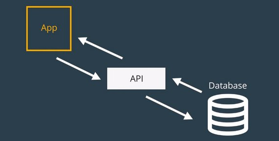](../assets/images/rr41.jpg)

That's what we're going to do in this lesson. We'll move all of our data to an external API, then we'll see how Redux changes once our data becomes asynchronous.

#### 5.1.1 Lesson Overview
In this lesson, we're going to be working with a (simulated) remote database. We'll use a provided API to interact with this database.

The important skill that you'll be learning in this lesson is how to make *asynchronous requests* in Redux. If you recall, the way Redux works right now is:

- store.dispatch() calls are made
- if the Redux store was set up with any middleware, those functions are run
- then the reducer is invoked

But how do we handle the case where we need to interact with an external API to fetch data. For example, what if our Todos app had a button that would load existing Todos from a database? If we dispatch that action, we currently do not have a way to wait for the list of remote Todo items to be returned.

After going through this lesson, you'll be able to make asynchronous requests and work with remote data in a Redux application.

### 5.2 External Data
We're going to use a database to interact with our Todos application. We're simulating the database to keep that aspect of the project less complex. This is the HTML script tag you need to add the database to your application which we'll use in the following video:

- `<script src="https://tylermcginnis.com/goals-todos-api/index.js"></script>`

```js
// https://tylermcginnis.com/goals-todos-api/index.js
(function () {
  window.API = {}

  function fail () {
    return Math.floor(Math.random()*(5-1)) === 3
  }

  function generateId () {
    return Math.random().toString(36).substring(2);
  }

  var goals = [
    {
      id: generateId(),
      name: 'Learn Redux',
    },
    {
      id: generateId(),
      name: 'Read 50 books this year',
    },
  ];
  var todos = [
    {
      id: generateId(),
      name: 'Walk the dog',
      complete: false,
    },
    {
      id: generateId(),
      name: 'Wash the car',
      complete: false,
    },
    {
      id: generateId(),
      name: 'Go to the gym',
      complete: true,
    }
  ];

  API.fetchGoals = function () {
    return new Promise((res, rej) => {
      setTimeout(function () {
        res(goals)
      }, 2000)
    })
  }

  API.fetchTodos = function () {
    return new Promise((res, rej) => {
      setTimeout(function () {
        res(todos)
      }, 2000)
    })
  }

  API.saveTodo = function (name) {
    return new Promise((res, rej) => {
      setTimeout(() => {
        const todo = {
          id: generateId(),
          name: name,
          complete: false,
        }
        todos = todos.concat([todo]);
        fail() ? rej(todo) : res(todo);
      }, 300)
    })
  }

  API.saveGoal = function (name) {
    return new Promise((res, rej) => {
      setTimeout(() => {
        const goal = {
          id: generateId(),
          name: name,
        }
        goals = goals.concat([goal]);
        fail() ? rej(goal) : res(goal);
      }, 300)
    })
  }

  API.deleteGoal = function (id) {
    return new Promise((res, rej) => {
      setTimeout(() => {
        goals = goals.filter((goal) => goal.id !== id);
        fail() ? rej(): res(goals);
      }, 300)
    });
  }

  API.deleteTodo = function (id) {
    return new Promise((res, rej) => {
      setTimeout(() => {
        todos = todos.filter((todo) => todo.id !== id);
        fail() ? rej(): res(todos);
      }, 300)
    });
  }

  API.saveTodoToggle = function (id) {
    return new Promise((res, rej) => {
      setTimeout(() => {
        todos = todos.map((todo) => todo.id !== id ? todo :
          Object.assign({}, todo, {complete: !todo.complete})
        );

        fail() ? rej(): res(todos);
      }, 300)
    });
  }
})()
```

#### 5.2.1 🔨Task
Add the following behavior to the project:

- When the app loads, `console.log` all of the todos and all of the goals that reside in our fake database.

```js
class App extends React.Component {
  componentDidMount() {
    const { store } = this.props;
  Promise.all([API.fetchTodos(), API.fetchGoals()])
    .then(([todos, goals]) => {
      console.log('Todos:', todos);
      console.log('Goals:', goals);
    })
    .catch(err => console.log(err));
  }
```

#### 5.2.2 Promise-Based API
The methods in the provided API are all Promise-based. Let's take a look at the `.fetchTodos()` method:

```js
API.fetchTodos = function () {
  return new Promise((res, rej) => {
    setTimeout(function () {
      res(todos);
    }, 2000);
  });
};
```

See how we're creating and returning a new `Promise()` object?

In the task above, you could've just fetched all of our todos and then all of our Goals, but that's serial and is just making the user wait an unnecessarily long amount of time. Since the API is Promise-based, we can use `Promise.all()` to wait until all Promises have resolved before displaying the content to the user.

Promises are asynchronous, and this lesson is all about working with asynchronous data and asynchronous requests. If you're feeling a little unsure about Promises, check out [the Promise documentation on MDN](https://developer.mozilla.org/en-US/docs/Web/JavaScript/Reference/Global_Objects/Promise) or check out our [JavaScript Promises course](https://www.udacity.com/course/javascript-promises--ud898).

#### 5.2.2 Handle remote API data
The next additions we make are to add in handling for remote api data

```js
// Constants
const RECEIVE_DATA = 'RECEIVE_DATA';

// Action creators
function receiveDataAction(todos, goals) {
  return {
    type: RECEIVE_DATA,
    todos,
    goals
  };
}
// Reducers
function todos(state = [], action) {
  switch (action.type) {
    //...
    case RECEIVE_DATA:
      return action.todos;
    default:
      return state;
  }
}
function goals(state = [], action) {
  switch (action.type) {
    // ...
    case RECEIVE_DATA:
      return action.goals;
    default:
      return state;
  }
}

// App
class App extends React.Component {
  componentDidMount() {
    const { store } = this.props;

    store.subscribe(() => this.forceUpdate());

    Promise.all([API.fetchTodos(), API.fetchGoals()])
      .then(([todos, goals]) => {
        // console.log('Todos:', todos);
        // console.log('Goals:', goals);
        store.dispatch(receiveDataAction(todos, goals));
      })
      .catch(err => console.log(err));
  }
  render() {
    // ...
  }
}
```

#### 5.2.3 Loading state with Redux
Here we add in ability to display loading message until data is available.

```jsx
// Reducers
function loading(state = true, action) {
  switch (action.type) {
    case RECEIVE_DATA:
      return false;
    default:
      return state;
  }
}

// Create the store
const store = Redux.createStore(
  Redux.combineReducers({
    todos,
    goals,
    loading
  }),
  Redux.applyMiddleware(checker, logger)
);

// App
class App extends React.Component {
  componentDidMount() {
    // ...
  }
  render() {
    const { store } = this.props;
    const { todos, goals, loading } = store.getState();

    if (loading === true) {
      return <h3>Loading...</h3>;
    }
    return (
      <div className="row">
        <Todos todos={todos} store={this.props.store} />
        <Goals goals={goals} store={this.props.store} />
      </div>
    );
  }
}
```

Here's a screenshot of the app so far.

[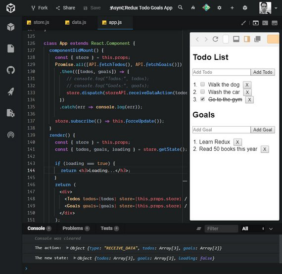](../assets/images/rr42.jpg)<br>
**Live Demo:** [Async Redux Todo Goals App](https://codesandbox.io/s/0pkwq6o26l?fontsize=14) on CodeSandbox

#### 5.2.4 Summary
In this section, we looked at how to work with an external API. We added a new action (RECEIVE_DATA), created a new action creator, and built a new reducer...all to handle the different states our app can be in while getting our remote data:

- before the app has the data
- while the app is fetching the data
- after the data has been received

In the next section, we'll look at how to optimistically update the UI based on the API actions that are performed.

### 5.3 Optimistic Updates
When dealing with asynchronous requests, there will always be some delay involved. If not taken into consideration, this could cause some weird UI issues.

For example, when a user wants to delete a todo item, the process from when the user clicks “delete” to when that item is removed from the database takes two seconds.

If you designed the UI to wait for the confirmation from the server to remove the item from the list on the client, your user would click “delete” and then would have to wait for two seconds to see that update in the UI. That’s not the best experience.

Instead what you can do is a technique called **optimistic updates**. Instead of waiting for confirmation from the server, just remove the todo from the UI immediately when the user clicks “delete”, then, if the server responds back with an error that the todo wasn’t actually deleted, you can add the information back in. This way your user gets that instant feedback from the UI, but, under the hood, the request is still asynchronous.

Here is that technique in action.

```jsx
// optimistic-updates
const connectionAlert = () => {
  alert('Connection error occurred. Please try again.');
};
class Todos extends React.Component {
  removeItem = todo => {
    this.props.store.dispatch(removeTodoAction(todo.id));

    return API.deleteTodo(todo.id).catch(() => {
      connectionAlert();
      this.props.store.dispatch(addTodoAction(todo));
    });
  };
```

We immediately remove the item from the store and then if the API call fails then an alert is triggered and the item is added back into the store.

We do the same for goals.

```jsx
// optimistic-updates
class Goals extends React.Component {
  removeItem = goal => {
    this.props.store.dispatch(removeGoalAction(goal.id));

    return API.deleteGoal(goal.id).catch(() => {
      connectionAlert();
      this.props.store.dispatch(addGoalAction(goal));
    });
  };
```

Next we'll use this optimistic update pattern for todo toggle item.

```jsx
// optimistic-updates
class Todos extends React.Component {
  toggleItem = id => {
    this.props.store.dispatch(toggleTodoAction(id));

    return API.saveTodoToggle(id).catch(() => {
      connectionAlert();
      this.props.store.dispatch(toggleTodoAction(id));
    });
```

Next we make API calls for both saving todo and goal items. In this case we will NOT do optimistic updates because the id and other record fields are being generated on the server.

In this case we will want to wait until the server returns the updated record which we'll use to update the store.

```jsx
// optimistic-updates
class Todos extends React.Component {
  addItem = e => {
    e.preventDefault();

    return API.saveTodo(this.input.value)
      .then(todo => {
        this.props.store.dispatch(addTodoAction(todo));
        this.input.value = '';
      })
      .catch(() => {
        connectionAlert();
      });
  };

class Goals extends React.Component {
  addGoal = e => {
    e.preventDefault();

    return API.saveGoal(this.input.value)
      .then(goal => {
        this.props.store.dispatch(addGoalAction(goal));
        this.input.value = '';
      })
      .catch(() => {
        showConnectionError();
      });
  };
```

#### 5.3.1 Summary
In this section, swapped more functionality over to using the API. We now use the database to:

- remove Todos and Goals
- toggle the state of a Todos
- save a new Todo or Goal

What's important is that for the removing and toggling, we're doing these actions optimistically. So we're assuming the change will succeed correctly on the server, so we update the UI immediately, and then only roll back to the original state if the API returns an error. Doing optimistic updates is better because it provides a more realistic and dynamic experience to the user.

[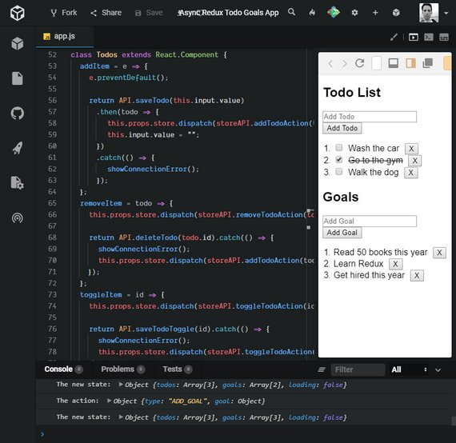](../assets/images/rr43.jpg)<br>
**Live Demo:** [Async Redux Todo Goals App](https://codesandbox.io/s/0pkwq6o26l?fontsize=14) on CodeSandbox

### 5.4 Thunk
Right now our app is working fine. It's been updated to work with asynchronous data coming from an external API.

However, the way the code is organized, we've mixed all of our data fetching logic with our component UI logic.

[](../assets/images/rr44.jpg)

Right now the component that should be focused just on how the UI looks is also responsible for fetching data. It would be nice if we could keep those separate.

Instead of calling our API and then passing that data to our action creator, what if we move the data fetching logic from the component to our action creator?

By calling our API in an action creator, we make the action creator responsible for fetching the data it needs to create the actual action.

[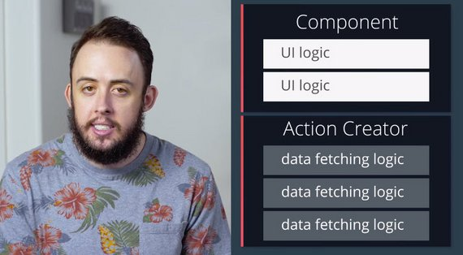](../assets/images/rr45.jpg)

Moving the data fetching code here, we'll build a cleaner separation between our UI logic and our data fetching logic. Let's see what this actually looks like.

Currently, our code for removing a todo item looks like this:

```jsx
removeItem(item) {
  const { dispatch } = this.props.store

  dispatch(removeTodoAction(item.id))

  return API.deleteTodo(item.id)
    .catch(() => {
      dispatch(addTodoAction(item))
      alert('An error occurred. Try again.')
    })
  }
}
```

Do you see how we are mixing our component-specific code with the API-specific code? If we move the data-fetching logic from our component to the action creator, our final `removeItem()` method might look like this:

```jsx
removeItem(item) {
  const { dispatch } = this.props.store

  return dispatch(handleDeleteTodo(item))
}
```

This is much better! The `removeItem()` function only has one task; dispatching that a specific item needs to be deleted.

However, we need to make it so our `handleDeleteTodo` action creator makes an asynchronous request before it returns the action. What if we just return a promise from `handleDeleteTodo` that resolves with the action once we get the data? Well, that won't quite work; as of right now, every action creator needs to return an object, not a promise:

```jsx
function asyncActionCreator (id) {
  return {
    type: ADD_USER,
    user: ??
  };
}
```

What if we used our knowledge of functional programming along with our knowledge of Redux middleware to solve this? **Remember that middleware sits *between* the dispatching of an action, and the running of the reducer.** The reducer expects to receive an action object, but what if, instead of returning an object, we have our action creator return a function?

We could use some middleware to check if the returned action is either a function or an object. If the action is an object, then things will work as normal - it will call the reducer passing it the action. However, if the action is a function, it can invoke the function and pass it whatever information it needs (e.g. a reference to the `dispatch()` method). This function could do anything it needs to do, like making asynchronous network requests, and can then dispatch a *different* action (that returns a regular object) when its finished.

An action creator that returns a function might look something like this:

```jsx
function asyncActionCreator (id) {
  return (dispatch) => {
    return API.fetchUser(id)
    .then((user) => {
      dispatch(addUser(user));
    });
  };
}
```

Notice that we’re no longer returning the action itself! Instead, we’re returning a function that is being passed dispatch. We then call this function when we have the data.

Now, this won’t work out of the box, but there's some good news: we can add some middleware to our app to support it! Let’s go ahead and see what that actually looks like.

#### 5.4.1 Adding Thunk
First we create a new action that returns a function rather than an object. Our action creators up until this point have returned objects only.

This allows us to move the logic from our component to the action creator.

```jsx
// New action creator
function handleDeleteTodo(todo) {
  return dispatch => {
    // API logic goes here.
  };
}
```

Our `removeItem` method in the Todos component should now just have a single dispatch to our new `handleDeleteTodo` action creator.

```jsx
class Todos extends React.Component {
  removeItem = todo => {
    // this.props.store.dispatch(removeTodoAction(todo.id));

    // return API.deleteTodo(todo.id).catch(() => {
    //   showConnectionError();
    //   this.props.store.dispatch(addTodoAction(todo));
    // });
    this.props.store.dispatch(handleDeleteTodo(todo));
  };
```

We take the API logic that was commented out above and drop it into our `handleDeleteTodo` action creator.

```js
function handleDeleteTodo(todo) {
  return dispatch => {
    dispatch(removeTodoAction(todo.id));

    return API.deleteTodo(todo.id).catch(() => {
      showConnectionError();
      this.props.store.dispatch(addTodoAction(todo));
    });
  };
}
```

Lastly, in order for this to work properly, we need to introduce some middleware code and add it to our `createStore` method.

Here's a custom thunk middleware example.

```js
// custom thunk middleware...
const thunk = store => next => action => {
  if (typeof action === 'function') {
    return action(store.dispatch)
  }
  return next(action)
}
```

Here's the addition to `createStore`.

```jsx
// Create the store
const store = Redux.createStore(
  Redux.combineReducers({
    todos,
    goals,
    loading
  }),
  Redux.applyMiddleware(thunk, checker, logger)
);
```

Without this we will get the following error message.

> Uncaught Error: Actions must be plain objects. Use custom middleware for async actions.

#### Adding in redux-thunk
Fortunately, we don't need to write custom thunk middleware code because we can just import this ourselves.

We'll be adding the [redux-thunk](https://github.com/gaearon/redux-thunk) library so you'll need this:

- `<script src="https://unpkg.com/redux-thunk@2.2.0/dist/redux-thunk.min.js"></script>`

Now we make one additional change to `createStore` for this to work.

```jsx
// Create the store
const store = Redux.createStore(
  Redux.combineReducers({
    todos,
    goals,
    loading
  }),
  Redux.applyMiddleware(ReduxThunk.default, checker, logger)
);
```

💫Remember middleware executes in the order it is listed in the applyMiddleware() function.

#### 5.4.2 Benefits of Thunks
Out of the box, the Redux store can only support the *synchronous* flow of data. Middleware like thunk helps support asynchronicity in a Redux application.

You can think of thunk as a wrapper for the store’s `dispatch()` method; rather than returning action objects, we can use thunk action creators to dispatch functions (or even or Promises).

Without thunks, synchronous dispatches are the default. We could still make API calls from React components (e.g., using the componentDidMount() lifecycle method to make these requests) -- but using thunk middleware gives us a cleaner separation of concerns.

Components don't need to handle what happens after an asynchronous call, since API logic is moved away from components to action creators. This also lends itself to greater predictability, since **action creators will become the source of every change in state**.

With thunks, we can dispatch an action only when the server request is resolved!

#### 5.4.3 Question 1 of 2
What are the benefits of using thunk middleware?

- [x] Asynchronicity
- [ ] UI logic and data-fetching logic are together in one place
- [ ] API logic remains in components
- [x] Components don't need to handle what happens after asynchronous calls

Thunk middleware can then be used to delay an action dispatch, or to dispatch only if a certain condition is met (e.g., a request is resolved). This logic lives inside action creators rather than inside components.

#### 5.4.4 Question 2 of 2
Take a look at this example:

```js
export const fetchTodos = () => dispatch => (
  TodoAPIUtil
    .fetchTodos()
    .then(todos => dispatch(receiveTodos(todos)))
);
```

Please place the following events in order of execution:

| Order | Event |
| --- | --- |
| 1 | API request occurs |
| 2 | API request is resolved |
| 3 | Thunk middleware invokes the function with `dispatch` |
| 4 | The action returned by `receiveTodos` is dispatched |

We expect the API request to occur first. TodoAPIUtil.fetchTodos() needs to be resolved before anything else can be done. Once the request is resolved, thunk middleware then invokes the function with dispatch(). Keep in mind: the action is only ever dispatched after the API request is resolved.

#### 5.4.5 Summary
If a web application requires interaction with a server, applying middleware such as **thunk** helps solve the issue of asynchronous data flow. Thunk middleware allows us to write action creators that return functions rather than objects.

By calling our API in an action creator, we make the *action creator* responsible for fetching the data it needs to create the action. Since we move the data-fetching code to action creators, we build a cleaner separation between our UI logic and our data-fetching logic. As a result, thunks can then be used to delay an action dispatch, or to dispatch only if a certain condition is met (e.g., a request is resolved).

##### 5.4.5 Further Research

- [Redux Thunk on GitHub](https://github.com/gaearon/redux-thunk)
- [Async Flow from the Redux docs](http://redux.js.org/docs/advanced/AsyncFlow.html)
- [Dan Abramov's Stack Overflow on Asynchronicity in Redux](http://stackoverflow.com/questions/35411423/how-to-dispatch-a-redux-action-with-a-timeout/35415559#35415559)

### 5.5 Thunks in our App
The next set of changes will be to our goals fetch requests. We'll move the goals fetch code to a new set of action creators that can be dispatched from our UI.

```jsx
// Action Creators in ES6
const handleAddGoal = (name, callback) => dispatch => {
  return API.saveGoal(name)
    .then(goal => {
      dispatch(addGoalAction(goal));
      callback();
    })
    .catch(() => showConnectionError());
};
const handleDeleteGoal = goal => dispatch => {
  dispatch(removeGoalAction(goal.id));

  return API.deleteGoal(goal.id).catch(() => {
    showConnectionError();
    dispatch(addGoalAction(goal));
  });
};

// Component UI
class Goals extends React.Component {
  addItem = e => {
    e.preventDefault();

    return this.props.store.dispatch(
      handleAddGoal(this.input.value, () => (this.input.value = ''))
    );
  };
  removeItem = goal => {
    this.props.store.dispatch(handleDeleteGoal(goal));
  };
```

When we dispatch our actions we call our action creators and in the case of `handleAddGoal` we pass in a function callback.

Next we handle the todo API requests.

```jsx
// Action Creators using es5/6 syntax
function handleAddTodo(name, callback) {
  return dispatch => {
    return API.saveTodo(name)
      .then(todo => {
        dispatch(addTodoAction(todo));
        callback();
      })
      .catch(() => {
        showConnectionError();
      });
  };
}
function handleToggleTodo(id) {
  return dispatch => {
    dispatch(toggleTodoAction(id));

    return API.saveTodoToggle(id).catch(() => {
      showConnectionError();
      dispatch(toggleTodoAction(id));
    });
  };
}

// Component UI
class Todos extends React.Component {
  addItem = e => {
    e.preventDefault();
    this.props.store.dispatch(
      handleAddTodo(this.input.value, () => (this.input.value = ''))
    );
  };
  removeItem = todo => {
    this.props.store.dispatch(handleDeleteTodo(todo));
  };
  toggleItem = id => {
    this.props.store.dispatch(handleToggleTodo(id));
  };
```

Lastly we move our initial fetch of data out of our App UI's `componentDidMount` method.

```js
// Action Creators in ES5
function handleInitialData() {
  return dispatch => {
    return Promise.all([API.fetchTodos(), API.fetchGoals()])
      .then(([todos, goals]) => {
        dispatch(receiveDataAction(todos, goals));
      })
      .catch(err => console.log(err));
  };
}

// Component UI
class App extends React.Component {
  componentDidMount() {
    const { store } = this.props;

    store.dispatch(handleInitialData());

    store.subscribe(() => this.forceUpdate());
  }
```

Converting to thunks improves the responsibilities of the code and better separates concerns.

#### 5.5.1 More Asynchronous Options
The most common requests I get for this course are around more advanced data-fetching topics with Redux. I've resisted because typically they bring in *a lot* of complexity, while the benefits aren't seen until your data-fetching needs become large enough.

With that said, now that you have a solid foundation on Redux and specifically, asynchronous Redux, you'll be in a good position to read up on the different options to decide if any would work best for the type of application you're working on. I encourage to read up on both of the other (popular) options.

- [Redux Promise](https://github.com/redux-utilities/redux-promise) - FSA-compliant promise middleware for Redux.
- [Redux Saga](https://github.com/redux-saga/redux-saga) - An alternative side effect model for Redux apps

#### 5.5.2 Summary
In this section, we used the thunk library that we installed in the previous section to make our code more singularly-focused and maintainable. We converted the:

- Goals code to use thunks
- Todos code to use thunks
- Initial data fetching to use thunks

### 5.6 Lesson Summary
Read the following articles:

- [Redux Thunk](https://blog.nojaf.com/2015/12/06/redux-thunk/)
- [Why do we need middleware for async flow in Redux?](https://stackoverflow.com/questions/34570758/why-do-we-need-middleware-for-async-flow-in-redux)
- [Understanding how redux-thunk works](https://medium.com/@gethylgeorge/understanding-how-redux-thunk-works-72de3bdebc50)

Answer the following questions and share your answers with your classmates:

1) Why do we use middleware to perform asynchronous tasks in Redux apps?

2) How do we use `redux-thunk` to make API requests in Redux apps?

## 6. Using react-redux
### 6.1 Introduction
At this point, it's hopefully pretty clear that Redux is not coupled to React at all.

You can build a fully-fledged app using Redux at any Vue, Angular, or straight JavaScript library. With that said, Redux was built with React in mind, and there are some steps we can take in our app to make the experience between the two technologies a little more seamless.

### 6.2 React's Context API
As you've seen, Redux has no relation to React. React just like any other UI library, can leverage Redux for more predictable state management.

Looking at our own implementation of React and Redux together, the real key is that we're passing down our store as a prop, and utilizing it to get **state**, **dispatch**, or **subscribe** whenever we need to.

If you were tasked with building a library to extract some of the rough patches in our implementation between React and Redux, how might you do it?

When we wrote the createStore function, our store was responsible for three things.

- getting state
- updating state
- listening for changes

The whole goal of our abstraction should be making
these three things work as seamlessly with react as possible.

#### 6.2.1 Getting the Store to Each Component
The first thing we want to do is improve how each component gets access to the store. If it's tough for a component to access the store, whether it's to get the state, listen to the state, or update the state, nothing else we do will matter.

Right now we’re just passing the store down as a prop. It works fine enough in our small app, but what if we had a larger app with more layers to it? Passing the store down ten components deep wouldn't scale very well. One of the main points of having a store is to avoid passing props down through a bunch of components.

One reason React (talking about React for a moment, not Redux) is so popular is because it's very efficient. It's efficient in keeping state localized to a component, it's efficient in keeping UI confined to a component, and it's efficient in knowing when something has changed and re-rendering just that component.

So the second thing we need need to figure out is how to re-render components only if the data they depend on (from the store) changes. Right now, we're solving this by calling `getState` at the root of our application and then passing the data down. Again, this won't scale well as our app grows.

If we can find a nice abstraction for getting the store to any component that needs it and only re-rendering components when the exact data they need change, we'll improve every aspect of our current codebase.

#### 6.2.2 React's Context API
We have our App component. Our app has some data; specifically a name constant.

We render the Parent component. Parent then renders Child, Child renders Grandchild, and Grandchild renders the `name` prop.

```jsx
import React from 'react';
import ReactDOM from 'react-dom';

function Parent({ name }) {
  return (
    <div>
      <h1>Parent</h1>
      <Child name={name} />
    </div>
  );
}

function Child({ name }) {
  return (
    <div>
      <h1>Child</h1>
      <Grandchild name={name} />
    </div>
  );
}

function Grandchild({ name }) {
  return (
    <div>
      <h1>Grandchild</h1>
      <h3>Name: {name}</h3>
    </div>
  );
}

class App extends React.Component {
  render() {
    const name = 'James';
    return <Parent name={name} />;
  }
}

ReactDOM.render(<App />, document.getElementById('root'));
```

So the whole idea of this kind of contrived example is that we want to get `name` all the way down to our Grandchild function or our Grandchild component.

Typically how we would do this is to pass the `name` variable as props through the hierarchy.

- App -> Parent -> Child -> Grandchild

If you're familiar with React then this is a use-case you've probably seen before.

We have data living in one part of our application, we want to get it to some Child component, but in order to get it there, we have to parse it through a few other components.

Well, this is the exact problem that `Context` in React solves.

So, I'm going to go back to what we initially had. And now using Context, I'm going to get the `name` variable down to Grandchild without actually having to parse it through the Parent and Child components.

```jsx
import React from 'react';
import ReactDOM from 'react-dom';

const Context = React.createContext();

function Parent() {
  return (
    <div>
      <h1>Parent</h1>
      <Child />
    </div>
  );
}

function Child() {
  return (
    <div>
      <h1>Child</h1>
      <Grandchild />
    </div>
  );
}

function Grandchild() {
  return (
    <Context.Consumer>
      {({ name }) => (
        <div>
          <h1>Grandchild</h1>
          <h3>Name: {name}</h3>
        </div>
      )}
    </Context.Consumer>
  );
}

class App extends React.Component {
  render() {
    const name = 'James';
    return (
      <Context.Provider value={name}>
        <Parent />
      </Context.Provider>
    );
  }
}

ReactDOM.render(<App />, document.getElementById('root'));
```

That's why Context exists because it allows us to get data to our Child component without having to plum it through all of the other components above that component.

So now that we've seen how Context works, what we're going to do is we're going to use it in our abstraction that we're creating over React and Redux in order to get our redux store (as well as any data that the components need) down to those components without having to pass our store all the way down the component tree.

#### 6.2.3 Context
Before we add the Context API into our app, let's make sure we're on the same page as to how it all works.

Recall that in one of the previous screencasts, passing data from one component to another component was a bit cumbersome. We had to pass data from component to component:

```jsx
import React from 'react';
import { render } from 'react-dom';

function Parent ({ name }) {
  return (
    <div>
      <h1>Parent</h1>
      <Child name={name}/>
    </div>
  );
}

function Child ({ name }) {
  return (
    <div>
      <h1>Child</h1>
      <Grandchild name={name}/>
    </div>
  );
}

function Grandchild ({ name }) {
  return (
    <div>
      <h1>Grandchild</h1>
      <h3>Name: {name}</h3>
    </div>
  );
}

class App extends React.Component {
  render() {
    const name = 'Tyler';

    return (
      <Parent />
    );
  }
}

render(<App />, document.getElementById('root'));
```

The `App` component renders `Parent`, which renders `Child`, which renders `Grandchild`. However, what's important to notice here is that the Grandchild component wants to render `name` -- but the data for name lives inside the `App` component.

Because Grandchild is so deeply nested, we have to pass the `name` prop one-by-one from App through all the components until it reaches Grandchild. What's more: we must do this even if any of the components along the way (Parent and Child) aren't even concerned with the name data!

This process of "threading props" to send data to a child component can be tiresome, and perhaps even error-prone. Luckily, we can avoid it with React's Context API. To begin, we'll use React's `createContext()` function to return an object with a Provider as well as a Consumer.

```jsx
const Context = React.createContext();
```

Let's now check out how `Context.Provider` and `Context.Consumer` make these interactions between components possible.

#### 6.2.4 Context.Provider
The `Provider` component is used in the upper level of the component tree; that is, the component from which the data to be passed is held. In our case, this was the `App` component. We passed the `name` data as the value of `Provider`'s `value` prop:

```jsx
class App extends React.Component {
  render() {
  const name = 'Tyler';

  return (
    <Context.Provider value={name}>
      <Parent />
    </Context.Provider>
    );
  }
}
```

Note that the `Provider` component simply wraps around the entire component to be rendered!

#### 6.2.5 Context.Consumer
On the receiving end (i.e., a component "under" the `Provider` in the component hierarchy), we use the `Consumer` component. In our example, we passed `Consumer` a function as a child. This function accepts a value and returns some JSX:

```jsx
function Grandchild ({ name }) {
  return (
    <Context.Consumer>
      {(name) => (
        <div>
          <h1>Grandchild</h1>
          <h3>Name: {name}</h3>
        </div>
      )}
    </Context.Consumer>
  );
}
```

As a result, we were able to render the Grandchild component with the correct name data without ever having to pass that data down the entire component thread!

That's a lot less code than the previous way we had to do it. So React's `Context` API provides a terse, approachable way to easily communicate information from one component to another.

Now, let's go ahead and utilize Context in our todos app.

> *Context provides a way to pass data through the component tree without having to pass props down manually at every level.*
>
> See [React.createContext API docs](https://reactjs.org/docs/context.html#reactcreatecontext)

[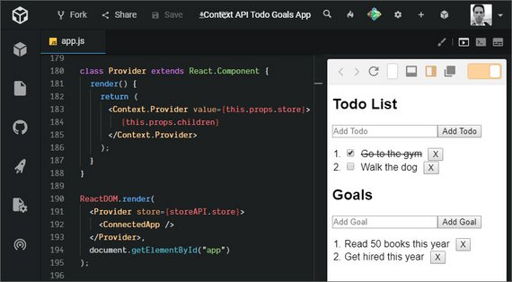](../assets/images/rr48.jpg)<br>
**Live Demo:** [Context API Todo Goals App](https://codesandbox.io/s/l5m5n58rx7?fontsize=14) on CodeSandbox

### 6.3 Add Context to Todos

Next we add Context API to our App. We instantiate the `Context` variable and create an abstraction called `Provider` that will wrap `Context.Provider`.

```jsx
const Context = React.createContext();

class Provider extends React.Component {
  render() {
    return (
      <Context.Provider value={this.props.store}>
        {this.props.children}
      </Context.Provider>
    )
  }
}
```

Now we are going to create a Connected or Container component to wrap any component that needs to access the `store` as props.

[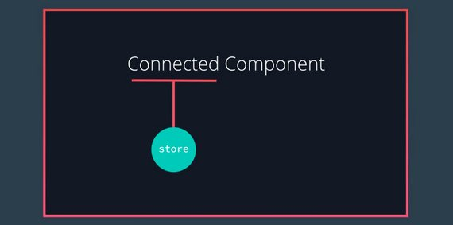](../assets/images/rr46.jpg)

```jsx
class ConnectedApp extends React.Component {
  render() {
    return (
      <Context.Consumer>{store => <App store={store} />}</Context.Consumer>
    );
  }
}
```

Lastly, we update our `ReactDOM.render` method to use `Provider` and reference `ConnectedApp` instead of `App`.

```jsx
ReactDOM.render(
  <Provider store={store}>
    <ConnectedApp />
  </Provider>,
  document.getElementById('app')
);
```

#### 6.3.1 Container Components
*Connected Component* and *Container Component* are different names that really mean the same thing - a component that is connected to the store. This is in contrast to a component that is just responsible for rendering UI content. We call those *Presentation Components*.

The point of these names are to help explain what the purpose of the component is for:

- A connected component is connected to the Redux store and is responsible for getting data from the store.
- A presentational component should not access the store. It should receive any information it needs as props and then just render a UI.

Dan Abramov (the creator of Redux!) wrote a post about this very thing. Check it out if to get his take on these concepts: [Presentational and Container Components](https://medium.com/@dan_abramov/smart-and-dumb-components-7ca2f9a7c7d0)

[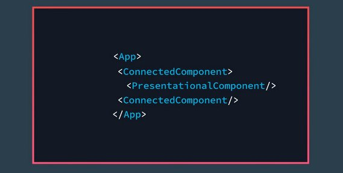](../assets/images/rr47.jpg)

#### 6.3.2 Connected Goals & Todos
Next we create a ConnectedGoals component that uses `Context.Consumer` which then gives us access to the store component.

```jsx
class ConnectedGoals extends React.Component {
  render() {
    return (
      <Context.Consumer>
        {store => {
          const { goals } = store.getState();
          return <Goals goals={goals} dispatch={store.dispatch} />;
        }}
      </Context.Consumer>
    );
  }
}
```

Here we do the same for `ConnectedTodos`.

```jsx
class ConnectedTodos extends React.Component {
  render() {
    return (
      <Context.Consumer>
        {store => {
          const { todos } = store.getState();
          return <Todos todos={todos} dispatch={store.dispatch} />;
        }}
      </Context.Consumer>
    );
  }
}
```

Next, we update the App component to use the new Connected components.

```jsx
class App extends React.Component {
  componentDidMount() {
    const { store } = this.props;

    store.dispatch(handleInitialData());
    store.subscribe(() => this.forceUpdate());
  }
  render() {
    const { store } = this.props;
    const { loading } = store.getState();

    if (loading === true) {
      return <h3>Loading...</h3>;
    }
    return (
      <div className="row">
        <ConnectedTodos />
        <ConnectedGoals />
      </div>
    );
  }
}
```

Lastly, we need to change our references to dispatch in `Todos` and `Goals` from `this.props.store.dispatch` to `this.props.dispatch`.

#### 6.3.3 Quiz Question
Please check all statements that are true.

- [x] `Context` function connects components to the store
- [x] `Provider` provides the store globally to all subcomponents
- [ ] `Provider` provides action creators to the store
- [x] `Provider` is a React component that wraps the application

`Provider` is really just a React component that we use to wrap the entire application. It takes in the store as a prop, then sets the store context, passing it down to all its subcomponents.

All components wrapped by Provider will receive the store context.

What differentiates containers from presentational components?

### 6.4 Build Custom connect()
We will now build out a customized connect() function that allows us to pass in state context through currying.

```jsx
const Context = React.createContext();

function connect(mapStateToProps) {
  return Component => {
    class Receiver extends React.Component {
      componentDidMount() {
        const { subscribe } = this.props.store;
        this.unsubscribe = subscribe(() => {
          this.forceUpdate();
        });
      }
      componentWillUnmount() {
        this.unsubscribe();
      }
      render() {
        const { dispatch, getState } = this.props.store;
        const state = getState();
        const stateNeeded = mapStateToProps(state);
        return <Component {...stateNeeded} dispatch={dispatch} />;
      }
    }
    class ConnectedComponent extends React.Component {
      render() {
        return (
          <Context.Consumer>
            {store => <Receiver store={store} />}
          </Context.Consumer>
        );
      }
    }
    return ConnectedComponent;
  };
}
```

Next we remove unnecessary store and subscribe references from `App` which leaves us with the following.

```jsx
class App extends React.Component {
  componentDidMount() {
    const { dispatch } = this.props;

    dispatch(handleInitialData());
  }
  render() {
    if (this.props.loading === true) {
      return <h3>Loading...</h3>;
    }
    return (
      <div className="row">
        <ConnectedTodos />
        <ConnectedGoals />
      </div>
    );
  }
}
```

Now we update our `ConnectedApp` component to use our new `connect()` function.

```jsx
const ConnectedApp = connect(store => ({
  loading: store.loading
}))(App);
```

We do the same for `ConnectedGoals` and `ConnectedTodos`.

```jsx
const ConnectedGoals = connect(state => ({
  goals: state.goals
}))(Goals);

const ConnectedTodos = connect(state => ({
  todos: state.todos
}))(Todos);
```

[](../assets/images/rr48.jpg)<br>
**Live Demo:** [Context API Todo Goals App](https://codesandbox.io/s/l5m5n58rx7?fontsize=14) on CodeSandbox

### 6.5 react-redux Bindings
Let's take a moment to recap the changes we've made to our app in this Lesson, because we've updated quite a bit!

Previously, we leveraged the standard `redux` library to build our app. This allowed us to create a Redux store with the `createStore()` function, giving us an API to listen (`subscribe()`), get updates (`getState()`), and make updates (`dispatch()`) to state.

We then created our own `Provider` component to efficiently pass the store to components that needed it, as well as our own `connect()` function so that our components can access "slices" of state as props.

We can build a fully-functional React and Redux app without Provider or connect(), but since they greatly simplify how React components interact with the Redux store, the creators of redux have included them in the `react-redux` package!

#### 6.5.1 Provider
With `react-redux`, rather than creating and using our own `Provider` which looks like this:

```jsx
const Context = React.createContext()

class Provider extends React.Component {
  render () {
  return (
    <Context.Provider value={this.props.store}>
      {this.props.children}
    </Context.Provider>
    );
  }
}

ReactDOM.render(
  <Provider store={store}>
    <ConnectedApp />
  </Provider>,
  document.getElementById('app')
);
```

...we can simply use the `Provider` component defined by the `react-redux` package! This allows us to wrap our entire app with `Provider`, effectively passing the store to even the most deeply nested components.

```jsx
import { Provider } from 'react-redux';

ReactDOM.render(
  <Provider store={store}>
    <ConnectedApp />
  </Provider>,
  document.getElementById('app')
);
```

#### 6.5.2 connect()
Similarly, we can also leverage `react-redux`'s `connect()` function right out of the box. `connect()` is a higher-order function that takes in two arguments (as well as a few [optional arguments](https://github.com/reactjs/react-redux/blob/master/docs/api.md#connectmapstatetoprops-mapdispatchtoprops-mergeprops-options)) and *returns a function*. Check out its signature below:

```js
import { connect } from 'react-redux';

const buildConnectedComponent = connect(mapStateToProps, mapDispatchToProps);
const ConnectedComponent = buildConnectedComponent(MyComponent);
```

What's vital to understand is that `buildConnectedComponent` is a function. `buildConnectedComponent` will take a regular (presentational) React component and return a new, "connected" component.

`ConnectedComponent` renders `MyComponent`, passing it the `props` as defined by `mapStateToProps` and `mapDispatchToPros`.

We can avoid having the intermediary `buildConnectedComponent` variable and just call the functions back-to-back:

```js
import { connect } from 'react-redux';

const ConnectedComponent = connect(mapStateToProps,
  mapDispatchToProps)(MyComponent)
```

Notice the double set of parentheses!

#### 6.5.3 Question 1 of 2
`connect()` connects which two items?

- [ ] Action
- [ ] Action creator
- [x] Store
- [ ] Reducer
- [ ] API util
- [x] Component

Using `connect()`, we can conveniently access the `store` context set by `Provider`. We pass in parts of the state as well as action-dispatches to the components as `props`.

#### 6.5.4 Question 2 of 2
Assume that `MyComponent` is a simple React component. How can `MyComponent` access state?

- [ ] The entire store is passed in to connect(), which is curried along with MyComponent
- [ ] The only way is to pass the store down from parent to child component until it reaches MyComponent
- [x] A container component connects the store to MyComponent, giving MyComponent slices of state accessible via props
  ```js
  const ConnectedComponent = connect(mapStateToProps,
    mapDispatchToProps)(MyComponent);
  ```
- [ ] MyComponent can access state via `this.state`, since all state should always be stored in the component itself in Redux apps.

`mapStateToProps` is a function that lets `connect()` know how to map `state` into the component’s list of `props`.

Here is the signature of the `connect()` function:

```js
connect([mapStateToProps], [mapDispatchToProps], [mergeProps], [options])
```

#### 6.5.5 Summary
React often leverages Redux for more predictable state management via the `react-redux` bindings. These bindings give us an API that simplifies the most common interactions between React and Redux.

`Provider` makes it possible for Redux to pass data from the store to any React components that need it. It uses React's [context](https://facebook.github.io/react/docs/context.html) feature to make this work.

`connect()` connects a React component to the Redux store. The `mapStateToProps()` function allows us to specify which state from the store you want passed to your React component, while the `mapDispatchToProps()` function allows us to bind dispatch to action creators before they ever hit the component.

### 6.6 Folder Structure
Right now, all of our app's code is located in a single file. It's an unwieldy and unrealistic way to build an app, though.

To fix this, we're going to use Create React App to scaffold out a React app for us.

We will then structure the code according to the [Rails-style pattern](https://redux.js.org/faq/code-structure) which defines the following folder structure within `src/`.

- `actions`
- `constants`
- `reducers`
- `containers`
- `components`

We start by issuing the following command.

```bash
npx create-react-app reactnd-redux-todos-goals
```

Once complete we can start the development server.

```bash
npm start
```

This will launch the app on the following URL.

- [http://localhost:3000](http://localhost:3000)

Next we install each of the dependency libraries.

```bash
npm install --save goals-todos-api react-redux redux redux-thunk
```

Then we delete unnecessary files in `src/`.

- App.css
- App.js
- App.test.js
- logo.svg
- serviceWorker.js

In `src/index.js` we remove service worker code and update the file to look like this.

```jsx
// index.js
import React from 'react';
import ReactDOM from 'react-dom';
import './index.css';
import App from './components/App';

ReactDOM.render(<App />, document.getElementById('root'));
```

Then we create a `src/components/App.js`.

```jsx
// App.js
import React, { Component } from 'react';

class App extends Component {
  render() {
    return <div>Hello World</div>;
  }
}

export default App;
```

The next we'll do is split up our code according to the folder structure specified above.

#### 6.6.1 Actions
Next we create the following files in `src/actions/`.

- `goals.js`
- `shared.js`
- `todos.js`

##### 6.6.1 goals.js

```js
// goals.js
import API from 'goals-todos-api';

// constants
export const ADD_GOAL = 'ADD_GOAL';
export const REMOVE_GOAL = 'REMOVE_GOAL';

const showConnectionError = () => {
  alert('Connection error occurred. Please try again.');
};

// action creators
function addGoal(goal) {
  return {
    type: ADD_GOAL,
    goal
  };
}
function removeGoal(id) {
  return {
    type: REMOVE_GOAL,
    id
  };
}

// Thunk action creators
export const handleAddGoal = (name, callback) => dispatch => {
  return API.saveGoal(name)
    .then(goal => {
      dispatch(addGoal(goal));
      callback();
    })
    .catch(() => showConnectionError());
};
export const handleDeleteGoal = goal => dispatch => {
  dispatch(removeGoal(goal.id));

  return API.deleteGoal(goal.id).catch(() => {
    showConnectionError();
    dispatch(addGoal(goal));
  });
};
```

##### 6.6.1 shared.js

```js
// shared.js
import API from 'goals-todos-api';

// constants
export const RECEIVE_DATA = 'RECEIVE_DATA';

// action creators
function receiveData(todos, goals) {
  return {
    type: RECEIVE_DATA,
    todos,
    goals
  };
}

// Thunk action creators
export function handleInitialData() {
  return dispatch => {
    return Promise.all([API.fetchTodos(), API.fetchGoals()])
      .then(([todos, goals]) => {
        dispatch(receiveData(todos, goals));
      })
      .catch(err => console.log(err));
  };
}

```

##### 6.6.1 todos.js

```js
// todos.js
import API from 'goals-todos-api';

// constants
export const ADD_TODO = 'ADD_TODO';
export const REMOVE_TODO = 'REMOVE_TODO';
export const TOGGLE_TODO = 'TOGGLE_TODO';

const showConnectionError = () => {
  alert('Connection error occurred. Please try again.');
};

// action creators
function addTodo(todo) {
  return {
    type: ADD_TODO,
    todo
  };
}
function removeTodo(id) {
  return {
    type: REMOVE_TODO,
    id
  };
}
function toggleTodo(id) {
  return {
    type: TOGGLE_TODO,
    id
  };
}

// Thunk action creators
export function handleAddTodo(name, callback) {
  return dispatch => {
    return API.saveTodo(name)
      .then(todo => {
        dispatch(addTodo(todo));
        callback();
      })
      .catch(() => {
        showConnectionError();
      });
  };
}
export function handleDeleteTodo(todo) {
  return dispatch => {
    dispatch(removeTodo(todo.id));

    return API.deleteTodo(todo.id).catch(() => {
      showConnectionError();
      dispatch(addTodo(todo));
    });
  };
}
export function handleToggleTodo(id) {
  return dispatch => {
    dispatch(toggleTodo(id));

    return API.saveTodoToggle(id).catch(() => {
      showConnectionError();
      dispatch(toggleTodo(id));
    });
  };
}
```

#### 6.6.2 Reducers
Next we create the following files in `src/reducers/`.

- `goals.js`
- `loading.js`
- `todos.js`
- `index.js`

##### 6.6.2 goals.js

```js
// goals.js
import { ADD_GOAL, REMOVE_GOAL } from '../actions/goals';
import { RECEIVE_DATA } from '../actions/shared';

export default function goals(state = [], action) {
  switch (action.type) {
    case ADD_GOAL:
      return state.concat([action.goal]);
    case REMOVE_GOAL:
      return state.filter(goal => goal.id !== action.id);
    case RECEIVE_DATA:
      return action.goals;
    default:
      return state;
  }
}
```

##### 6.6.2 loading.js

```js
// loading.js
import { RECEIVE_DATA } from '../actions/shared';

export default function loading(state = true, action) {
  switch (action.type) {
    case RECEIVE_DATA:
      return false;
    default:
      return state;
  }
}
```

##### 6.6.2 todos.js

```js
// todos.js
import { ADD_TODO, REMOVE_TODO, TOGGLE_TODO } from '../actions/todos';
import { RECEIVE_DATA } from '../actions/shared';

export default function todos(state = [], action) {
  switch (action.type) {
    case ADD_TODO:
      return state.concat([action.todo]);
    case REMOVE_TODO:
      return state.filter(todo => todo.id !== action.id);
    case TOGGLE_TODO:
      return state.map(todo =>
        todo.id !== action.id
          ? todo
          : Object.assign({}, todo, { complete: !todo.complete })
      );
    case RECEIVE_DATA:
      return action.todos;
    default:
      return state;
  }
}
```

##### 6.6.2 index.js

```js
// index.js
import { combineReducers } from 'redux';

import todos from './todos';
import loading from './loading';
import goals from './goals';

export default combineReducers({
  todos,
  loading,
  goals
});
```

#### 6.6.3 Middleware
Next we create the following files in `src/middleware/`.

- `checker.js`
- `logger.js`
- `index.js`

##### 6.6.3 checker.js

```js
// checker.js
import { ADD_TODO } from '../actions/todos';
import { ADD_GOAL } from '../actions/goals';

const checker = store => next => action => {
  // do work
  if (
    action.type === ADD_TODO &&
    action.todo.name.toLowerCase().includes('bitcoin')
  ) {
    return alert("Nope, that's a bad idea.");
  }

  if (
    action.type === ADD_GOAL &&
    action.goal.name.toLowerCase().includes('bitcoin')
  ) {
    return alert("Nope, that's a bad idea.");
  }
  return next(action);
};

export default checker;
```

##### 6.6.3 logger.js

```js
// logger.js
const logger = store => next => action => {
  console.group(action.type);
  console.log('The action:', action);
  const result = next(action);
  console.log('The new state:', store.getState());
  console.groupEnd();
  return result;
};

export default logger;
```

##### 6.6.3 index.js

```js
// index.js
import checker from './checker';
import logger from './logger';
import thunk from 'redux-thunk';
import { applyMiddleware } from 'redux';

export default applyMiddleware(thunk, checker, logger);
```

#### 6.6.4 Components
Next we create the following files in `src/components`.

- `List.js`
- `Todos.js`
- `Goals.js`
- `App.js`

##### 6.6.4 List.js

```jsx
// List.js
import React from 'react';

export default function List(props) {
  return (
    <ol>
      {props.items.map(item => (
        <li key={item.id}>
          {props.toggle ? (
            <span>
              <input
                type="checkbox"
                id={item.id}
                onClick={() => props.toggle && props.toggle(item.id)}
                readOnly // required for uncontrolled component
                checked={item.complete ? 'checked' : ''}
              />
              <label
                htmlFor={item.id}
                style={{
                  textDecoration: item.complete ? 'line-through' : 'none'
                }}
              >
                {item.name}
              </label>
            </span>
          ) : (
            <span
              onClick={() => props.toggle && props.toggle(item.id)}
              style={{
                textDecoration: item.complete ? 'line-through' : 'none'
              }}
            >
              {item.name}
            </span>
          )}
          <button className="removeBtn" onClick={() => props.remove(item)}>
            X
          </button>
        </li>
      ))}
    </ol>
  );
}
```

##### 6.6.4 Todos.js

```jsx
// Todos.js
import React from 'react';
import { connect } from 'react-redux';
import List from './List';
import {
  handleAddTodo,
  handleDeleteTodo,
  handleToggleTodo
} from '../actions/todos';

class Todos extends React.Component {
  addItem = e => {
    e.preventDefault();
    this.props.dispatch(
      handleAddTodo(this.input.value, () => (this.input.value = ''))
    );
  };
  removeItem = todo => {
    this.props.dispatch(handleDeleteTodo(todo));
  };
  toggleItem = id => {
    this.props.dispatch(handleToggleTodo(id));
  };
  render() {
    return (
      <div>
        <h1>Todo List</h1>
        <form onSubmit={this.addItem}>
          <input
            id="todo"
            type="text"
            placeholder="Add Todo"
            required
            ref={input => (this.input = input)}
          />
          <button>Add Todo</button>
        </form>
        <List
          items={this.props.todos}
          remove={this.removeItem}
          toggle={this.toggleItem}
        />
      </div>
    );
  }
}

export default connect(state => ({
  todos: state.todos
}))(Todos);
```

##### 6.6.4 Goals

```jsx
// Goals.js
import React from 'react';
import { connect } from 'react-redux';
import List from './List';
import { handleAddGoal, handleDeleteGoal } from '../actions/goals';

class Goals extends React.Component {
  addItem = e => {
    e.preventDefault();

    return this.props.dispatch(
      handleAddGoal(this.input.value, () => (this.input.value = ''))
    );
  };
  removeItem = goal => {
    this.props.dispatch(handleDeleteGoal(goal));
  };
  render() {
    return (
      <div>
        <h1>Goals</h1>
        <form onSubmit={this.addItem}>
          <input
            id="goal"
            type="text"
            placeholder="Add Goal"
            required
            ref={input => (this.input = input)}
          />
          <button>Add Goal</button>
        </form>
        <List items={this.props.goals} remove={this.removeItem} />
      </div>
    );
  }
}

export default connect(state => ({
  goals: state.goals
}))(Goals);
```

##### App.js

```jsx
// App.js
import React, { Component } from 'react';
import ConnectedTodos from './Todos';
import ConnectedGoals from './Goals';
import { connect } from 'react-redux';
import { handleInitialData } from '../actions/shared';

class App extends Component {
  componentDidMount() {
    const { dispatch } = this.props;

    dispatch(handleInitialData());
  }
  render() {
    if (this.props.loading === true) {
      return <h3>Loading...</h3>;
    }
    return (
      <div className="row">
        <ConnectedTodos />
        <ConnectedGoals />
      </div>
    );
  }
}

export default connect(store => ({
  loading: store.loading
}))(App);
```

#### 6.6.5 The Store
The last piece of the puzzle is to move over the `createStore()` invocation as well as provide the store to our Provider component.

We do that inside of our main `src/index.js` file.

##### index.js

```jsx
// index.js
import React from 'react';
import ReactDOM from 'react-dom';
import './index.css';
import App from './components/App';
import reducer from './reducers';
import middleware from './middleware';
import { Provider } from 'react-redux';
import { createStore } from 'redux';

const store = createStore(reducer, middleware);

ReactDOM.render(
  <Provider store={store}>
    <App />
  </Provider>,
  document.getElementById('root')
);
```

Lastly, we update `src/index.css`.

```css
/* index.css */
body {
  font-family: sans-serif;
}
ul, ol {
  padding: 0 0 0 20px;
}
input[type='checkbox'] {
  margin-right: 10px;
}
.row {
  display: flex;
  justify-content: space-around;
}
.strike {
  text-decoration: line-through;
}
.removeBtn {
  margin-left: 10px;
}

@media screen and (max-width: 400px) {
  .row {
    display: block;
  }
}
```

#### 6.6.6 "Rails-style" Organization
To recap, we've organized the individual elements of our app with a ["Rails-style" approach](https://redux.js.org/faq/code-structure). That means assets are grouped by "type" or "capability": any action will be found in the *Actions* folder, any reducer will be found in *Reducers*, and so on.

In fact, the “real world” example from [Redux on GitHub](https://github.com/reactjs/redux/tree/master/examples/real-world) structures the app this very way. Under this directory structure, if we wanted to import all actions into a component, we can get them all in a single import!

```bash
Frontend
   - Components
      - component1.js
      - component2.js
      - component3.js
   - Actions
      - action1.js
      - action2.js
   - Reducers
      - reducer1.js
   - Util
   - Store
```

#### 6.6.7 Other Patterns
Along with the "Rails style" of organizing your folder structure, you may find other approaches that developers use to build their directory more to your liking. An alternative way to structure the same application, then, is by feature:

```bash
├── dashboard
│ ├── actions.js
│ ├── index.js
│ └── reducer.js
└── nav
 ├── actions.js
 ├── index.js
 └── reducer.js
```

This form of organization groups assets by their common feature or “concept.” That is, all assets related to a navigation component are all together in a single, modular folder. It’s a great way to visually express what the application is all about. However, if the app contains several hundred components, it can become more difficult to navigate through.

What's more: you might even see that some developers prefer a ["duck" style](https://medium.freecodecamp.org/scaling-your-redux-app-with-ducks-6115955638be) approach, where Redux and state management files are completely separated from files that render UI.

Ultimately, the choice is yours. Whichever way you choose to organize your directory structure, just be sure that it’s something that makes sense for your app, and it’s something you’re comfortable with!

#### 6.6.8 Summary
This section didn't accomplish anything with React or Redux. All we did here was improve the structure and organization of our app by moving each portion of the app to a specific folder structure.

To say it one more time, there's no "right" way to build out the folder structure for you app. However, doing it this way is handy because we're using the structure provided by Create React App. Using this structure, it's easy to convert a plain React application over to one that includes Redux. Another benefit is that other React developers will already be comfortable with this file/folder organization.

### 6.7 Redux Architecture
The following links and articles describe how to structure and organize Redux code around large-scale implementations.

These best-practices are geared toward scalability, clarity, & maintainability.

- Redux Docs - [Organizing State](https://redux.js.org/faq/organizing-state)
- Redux Docs - [Normalizing State Shape](https://redux.js.org/recipes/structuring-reducers/normalizing-state-shape)
- Medium - [Redux for state management in large web apps](https://blog.mapbox.com/redux-for-state-management-in-large-web-apps-c7f3fab3ce9b) - Sub-stores, slice reducers, data structures with [Immutable-js library](https://facebook.github.io/immutable-js/), and selector functions
- Medium - [Five Tips for Working with Redux in Large Applications](https://techblog.appnexus.com/five-tips-for-working-with-redux-in-large-applications-89452af4fdcb) - Data indexes, separate canonical and UI state, and selectors functions.
- egghead.io - [Getting Started with Redux](https://egghead.io/courses/getting-started-with-redux) - Comprehensive video tutorial series on Redux by Dan Abramov.
- egghead.io - [Building React Applications with Idiomatic Redux](https://egghead.io/courses/building-react-applications-with-idiomatic-redux) - Part 2 of Dan Abramov's EXCELLENT video tutorial series.

Answer these questions.

1. How should state be organized in Redux applications?
2. Where is the concept of data immutability applicable in React?
3. What does state normalization mean?

## 7. Real World Redux
### 7.1 Introduction
Up until this point, we've covered all of the features of Redux by building out a simple To-do's App.

This project was great for learning purposes, but it's somewhat rudimentary and isn't representative of the complexities of a real-world project.

So, using all of the topics we learned so far

- Redux-React
- React-Redux bindings
- Middleware

we'll build a more complex real-world application.

[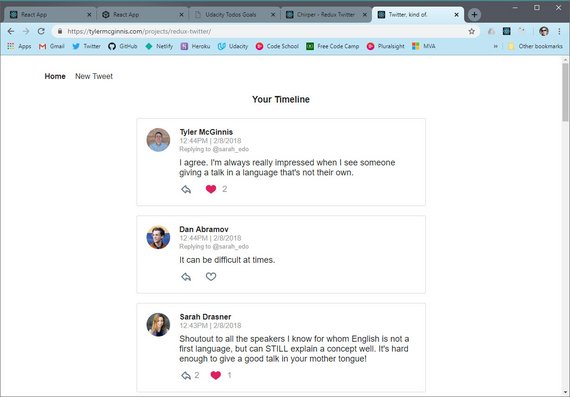](../assets/images/rr49.jpg)

- Hosted project: [https://tylermcginnis.com/projects/redux-twitter/](https://tylermcginnis.com/projects/redux-twitter/)
- GitHub starter code: [https://github.com/udacity/reactnd-chirper-app](https://github.com/udacity/reactnd-chirper-app)

### 7.2 Project Walkthrough
To help solidify your understanding of React and Redux, we'll do a project walkthrough. The project we'll be building is called “Chirper”. It's a Twitter clone that will help you practice

- Improving the predictability of an application's state
- Establishing strict rules for getting, listening, and updating the store
- Identifying what state should live inside of Redux and what state should live inside of React components.

As with most things, there's more than one correct way to achieve a successful result. We'll be discussing one approach to building a React/Redux project. We encourage you to come up with an approach that works for you.

Regardless of the approach you choose, make sure always to plan out your project's architecture *before* starting to code.

#### 7.2.1 The Importance of Planning Your Project
Many developers make the mistake of starting to code before they've put any thought into figuring out precisely what their app's architecture should be. This approach results in spending an incredible amount of time debugging, restructuring the code, and sometimes even starting over, completely!

Trust us, planning out your project before starting to code will save you a lot of time later on.

In this Chirper project walkthrough, we'll go over the planning stages as well as the coding stages of the project.

#### 7.2.2 Planning Stage
In the Planning Stage, we will go over 4 steps that will help you come up with your app's architecture, which is often the trickiest part.

These consist of:

- **Step 1** - Identify What Each View Should Look Like
- **Step 2** - Break Each View Into a Hierarchy of Components
- **Step 3** - Determine What Events Happen in the App
- **Step 4** - Determine What Data Lives in the Store

We'll be coding in stages but before we code, the first thing we we'll do is take a look at the different views the final project should have.

### 7.3 Step 1 - Views
The first step of the Planning Stage is to identify what each view should look like and how it should function.

One of the best approaches is to draw each view on paper so that you can flush out what information and data is required for each page.

Alternatively, you can use [software for creating mockups](https://codingsans.com/blog/mockup-tools). If you were given project specifications, you'll need to check your mockups against them to make sure that you have all of the required features.

#### 7.3.1 View for the Dashboard Page

[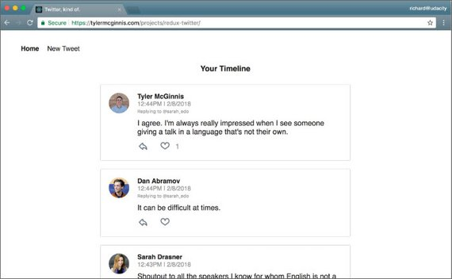](../assets/images/rr50.jpg)<br>
<span class="center bold">Dashboard view</span>

Dashboard View Requirements:

- is located at the home route (`/`)
- shows tweets sorted from most recently added at the top, to oldest at the bottom
- each tweet will show:
  - the author
  - the time stamp
  - who the author is replying to
  - the text of the tweet
  - a reply button - with the number of replies (if higher than 0)
  - a like button - with the number of likes (if higher than 0)

#### 7.3.2 View for the Tweet Page

[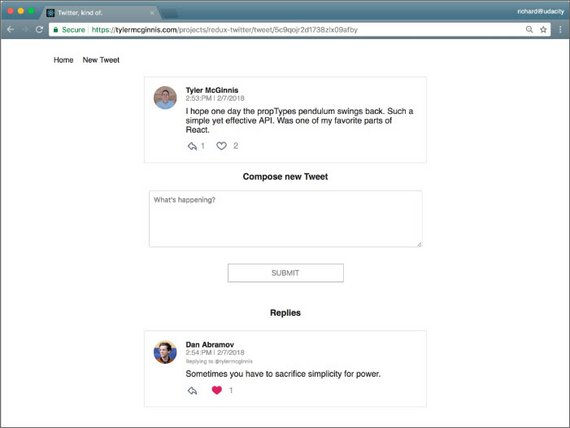](../assets/images/rr51.jpg)<br>
<span class="center bold">Single tweet view</span>

Tweet Page View Requirements:

- is located at `/tweet/:id`
- shows an individual tweet
  - the author
  - the time stamp
  - a reply button - with the number of replies (if higher than 0)
  - a like button - with the number of likes (if higher than 0)
- has a reply form
- shows all replies

#### 7.3.3 View for Creating a New Tweet

[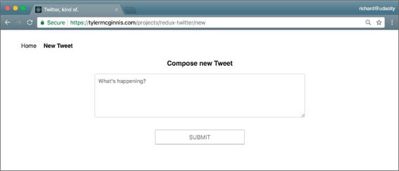](../assets/images/rr52.jpg)<br>
<span class="center bold">New tweet view</span>

New Tweet View Requirements:

- is located at `/new`
- has a textbox for adding a new tweet

#### 7.3.4 View Recap
So these are the 3 views we need in our app:

- Dashboard
- Tweet
- New Tweet

Now that we have a clear idea of what we're trying to build we can be confident that our views meet all of the provided requirements.

### 7.4 Step 2 - Components
This is where we make a conceptual skeleton of our app and break each view into a hierarchy of components.

We do 2 things to achieve this:

- draw boxes around every component
- arrange our components into a hierarchy

How do we know when something should be a component in a React app?

According to [Thinking in React docs](https://reactjs.org/docs/thinking-in-react.html#step-1-break-the-ui-into-a-component-hierarchy):

>...a component should ideally only do one thing. If it ends up growing, it should be decomposed into smaller subcomponents.

> #### Components Quiz Question
> Which of the following are true?
>
> - [x] Components let you split the UI into independent, reusable chunks.
> - [x] Each view typically has a component that represents that view
> - [x] Presentational Components don't know where their data comes from.
> - [x] Components that are connected to the store are called

Let's get started by drawing boxes around all of the components and giving them all names. Remember that we have three views:

- Dashboard
- Tweet
- New Tweet

#### 7.4.1 Dashboard View Components

[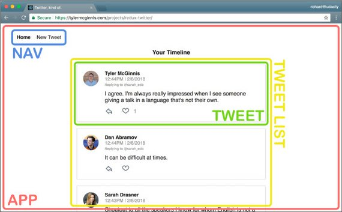](../assets/images/rr53.jpg)<br>
<span class="center bold">Dashboard view components</span>

This view is broken down into the following React Components:

- **App** - the overall container for the project
- **Navigation** - displays the navigation
- **Tweets List** - responsible for the entire list of tweets
- **Tweet** - in charge of display the content for a single tweet

#### 7.4.2 Tweet View Components

[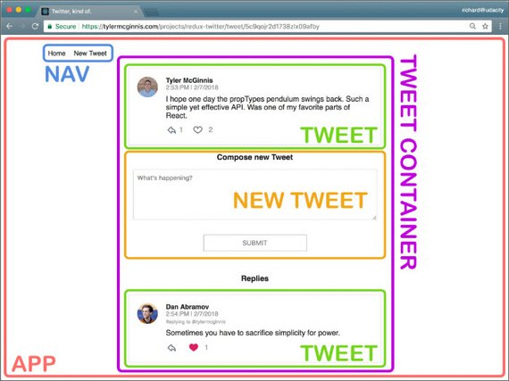](../assets/images/rr54.jpg)<br>
<span class="center bold">Tweet view components</span>

I broke this view into the following React Components:

- **App** - the overall container for the project
- **Navigation** - displays the navigation
- **Tweet Container** - displays a list of tweets
- **Tweet** - displays the content for a single tweet
- **New Tweet** - display the form to create a new tweet (reply)

#### 7.4.3 New Tweet View Components

[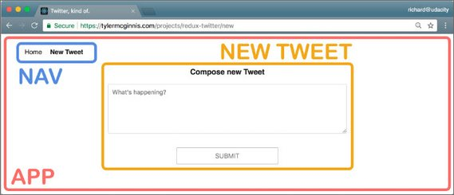](../assets/images/rr55.jpg)<br>
<span class="center bold">New tweet view components</span>

I broke this view into the following React Components:

- **App** - the overall container for the project
- **Navigation** - displays the navigation
- **New Tweet** - display the form to create a new tweet

#### 7.4.4 Master List of Components
Once we did a break down of components across each view of our app we were able to determine the following master list.

- **App**
- **Navigation**
- **Tweets List**
- **Tweet Container**
- **Tweet**
- **New Tweet**

The component hierarchies tells us which components will be used inside of other components. It gives us the skeleton of our app.

One thing to bear in mind is that each of these components are **presentational components**.

Right now, we don't care which components will be upgraded to containers. As we start building out the store, we'll create additional components that will become **container components**.

Remember that container components get data from the store and pass it to the presentational components that need the data.

Thus far, we haven't done anything that's special to Redux; all of the steps above are applicable and useful for React applications that do not use Redux.

Also remember that Redux doesn't care about *how* our app looks or what components it uses. Instead, it gives a way to manage the state of the application in a predictable way.

When we talk about state, we're really talking about data and not just any kind of data inside the app, but data that can change based on the events in the app.

Step 3 is where we'll start thinking about the data in this app.

### 7.5 Step 3 - App Events
This is where we determine what events happen in the app.

We do this by taking a look at what can happen in each component. Specifically, what actions the app or user is performing *on the data* in each component.

Is the data being set, modified, or deleted? If so, we'll need an action to keep track of that event!

We'll do the following in the analysis of of each component:

- *italicize* the action
- **bold** the data

#### 7.5.1 Tweets List Component

[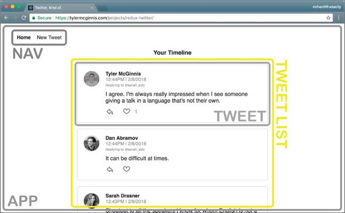](../assets/images/rr56.jpg)<br>
<span class="center bold">Tweets List component</span>

Action and data:

- *get* the **tweets**

The action type might be something like `GET_LIST_OF_TWEETS` or `GET_DATA`.

#### 7.5.2 Tweet Component

[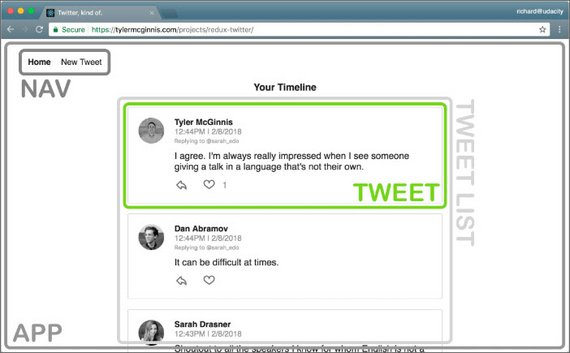](../assets/images/rr57.jpg)<br>
<span class="center bold">Tweet component</span>

Action and data:

- *get* a particular tweet from a list of **tweets**.
- *get* the **authedUser (user that is currently logged in)** so the user can *toggle* the likes on each **tweet**.
- *get* the **authedUser** so the user can *reply* to a **tweet**.

#### 7.5.3 Tweet Container Component

[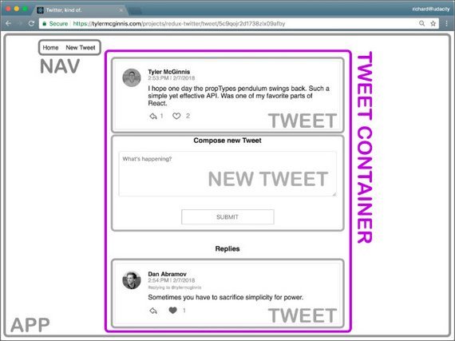](../assets/images/rr58.jpg)<br>
<span class="center bold">Tweet Container component</span>

Action and data:

- *get* a specific tweet from a list of **tweets**.
- *get* the replies to a specific tweet from a list of **tweets**.

#### 7.5.4 New Tweet Component

[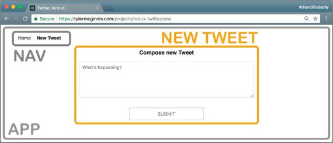](../assets/images/rr59.jpg)<br>
<span class="center bold">New Tweet component</span>

Action and data:

- *get* the **authedUser** so the user can create a new tweet.
- *set* the **text** of the new tweet.

Let's move on to Step 4, where we'll determine which of the data above will live in the store.

<!-- 
### 7.6 Step 4 - Store Data
The next step is to determine what data lives in the store and what should live in the component.

Remember that the main problems that Redux (and react-redux bindings) was meant to solve were:

- Propagation of props through the entire component tree.
- Ensuring consistency and predictability of the state across the app.

According to Dan Abramov, the creator of Redux, we should use the following principle for determining whether to store a piece of data in the store or in a React component:

> "Use Redux for state that matters globally or is mutated in complex ways… The rule of thumb is: do whatever is less awkward."

See the following for more information on this.

- [Organizing State](https://redux.js.org/faq/organizing-state)
- [How to choose between Redux's store and React's state?](https://github.com/reactjs/redux/issues/1287)

For each piece of data from Step 3, let's see whether it's used by multiple components or mutated in a complex way.

#### 7.6.1 Text data (for new tweet)
***Text of the new tweet Used by:* New Tweet Component**

This piece of data is not used by multiple components and is not mutated in a complex way. That means that it's a great candidate for component state instead of app state that resides in the store.

#### 7.6.2 Tweet data
***Tweets Used by:* Dashboard Component, Tweet Page Component, Tweet Component**

In the Tweet Page Component, we need to show the reply tweets. Let's take a look at our starter code in the `_Data.js` file. This is how the tweets are stored in the database:

```jsx
let tweets = {
  tweetId: {
    id: tweetId,
    text: tweetText,
    author: userId,
    timestamp: timestamp,
    likes: [userId1, userId2],
    replies: [tweetId1, tweetId2],
    replyingTo: tweetId_OR_null
  }
};
```

To get the reply tweets, we can get the tweet with a specific id from the list of all of the tweets and access its `replies` property.

In the **Dashboard Component**, we need to access the current list of tweets. If the Dashboard component knows the ID of the tweet that needs to be displayed, it can just pass that ID to the Tweet Component, which will render the tweet.

In the **Tweet Component**, we need to pick out a tweet with a specific id from the current list of tweets.

That means that we can store the tweets in the store and make the **Tweet Page Component**, the **Dashboard Component**, and the **Tweet Component** into containers (components that have access to the store via the `connect` function).

As soon as that data changes — if someone likes the tweet, for example — all of the components that use that data will update.

[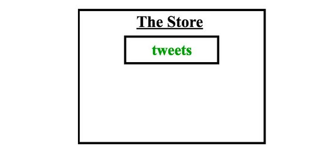](../assets/images/rr60.jpg)<br>
<span class="center bold">The Store contains a `tweets` property.</span>

Keep in mind that each tweet contains the author's name and the author's avatar. One way we could model our state is:

```js
// Flat structure repeats data, doesn't scale well, & makes lookups difficult
tweets: {
  tweetId: {tweetId, authorId, authorName, authorAvatar, timestamp, text, likes,
    replies, replyingTo},
  tweetId: {tweetId, authorId, authorName, authorAvatar, timestamp, text, likes,
    replies, replyingTo}
}
```

Modeling the state this way is inconvenient if, for instance, we want to extend the functionality of our application to find tweets made by a particular author.

Moreover, this way of storing the data mixes the two types of objects:

- tweets data
- user data

This goes against [Redux documentation recommendations](https://redux.js.org/recipes/structuring-reducers/normalizing-state-shape) to normalize our state according to the following normalization principles.

- Each type of data gets its own "table" in the state.
- Each "data table" should store the individual items in an object, with the IDs of the items as keys and the items themselves as the values.
- Any references to individual items should be done by storing the item's ID.
- Arrays of IDs should be used to indicate ordering.

```js
{
  tweets: {
    tweetId: { tweetId, authorId, timestamp, text, likes, replies, replyingTo},
    tweetId: { tweetId, authorId, timestamp, text, likes, replies, replyingTo}
  },
  users: {
    userId: {userId, userName, avatar, tweetsArray},
    userId: {userId, userName, avatar, tweetsArray}
  }
}
```

Our store at this point:

[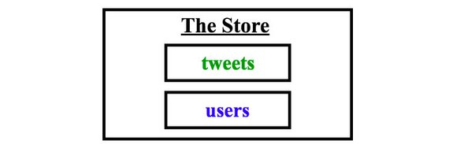](../assets/images/rr62.jpg)<br>
<span class="center bold">The Store contains `tweets` & `users` properties.</span>

#### 7.6.3 AuthedUser data

***authedUser Used by:* Tweet Component, New Tweet Component**

Each **Tweet Component** needs to show whether the logged in used has liked a tweet. In order to do that, we need to know who the logged in user is. From looking at our Component Hierarchy from Step 2, we know that the **Tweet Component** gets used by multiple components. Therefore, we need to upgrade this component to a container so it could access the `authedUser` piece of data from the store to see whether to show a red heart.

We also know that for every new tweet, we'll have to record the tweet's author (`authedUser`). The React way of storing state is to put the state in the most parent component and then pass it down to all the children that need it. In this app, that would mean storing in the **App Component**.

While this works, it's inconvenient. It would be much simpler to just store the authedUser in the store and then provide the **Tweet Component** access to the store.

The **New Tweet Component** could then just dispatch an action with the text of the new tweet and the id of the tweet we're replying to as parameters in order to save the new tweet.

Saving a tweet is an asynchronous operation and we could use redux thunks to do that. Thunks give us access to the store, so we could have the following action creator:

```js
function handleAddTweet(text, replyingTo) {
  return (dispatch, getState) => {
    const { authedUser } = getState();

    return saveTweetToDatabase({
      text,
      author: authedUser,
      replyingTo
    }).then(tweet => dispatch(addTweet(tweet)));
  };
}
```

Generally, accessing the store from an action creator is [considered an anti-pattern](https://stackoverflow.com/questions/35667249/accessing-redux-state-in-an-action-creator/35674575#35674575). Dan Abramov says that the few use cases where it's acceptable to do that are:

> to check cached data before you make a request or to check whether you are authenticated (in other words, doing a conditional dispatch).

Another reason we would want to keep the `authedUser` piece of data in the store is that if we extend our application to include the ability to sign in and sign out, this functionality would be easy to manage with Redux.

The **New Tweet Component** doesn't need to access the `authedUser` piece of state, but it *does* need to be able to dispatch an action to let the reducers know that a new tweet has been made.

In order to have access to the `dispatch` method, a component must be connected to the store. In other words, **it must be a container**.

So, we know that both the **Tweet Component** and the **New Tweet Component** will be upgraded to containers.

[](../assets/images/rr61.jpg)<br>
<span class="center bold">The Store contains `tweets`, `users`, & `authedUsers` properties.</span>

We are done making our store! While we were making our store, we also determined which components will be upgraded to containers, so our skeleton app is now even more complete.

We are now at a good point to start coding. We will go view by view and fill in the details of our skeleton along the way. -->
